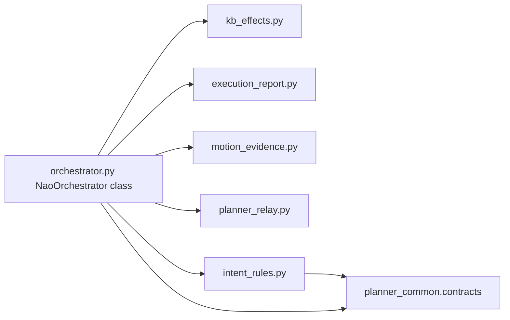

# Orchestrator Deslop Refactor + Config Cleanup

Mirror the successful `chatbot_llm` two-phase approach on `nao_orchestrator`: behavior-preserving structural deslop first (Phase 1), then a small SkillOpt-gated contract alignment (Phase 2), a chatbot config cleanup (Phase 3), and a staged runtime review (Phase 4). Implementation first; live testing after you rebuild the container.

## Scope and invariants

- Targets: [orchestrator.py](src/nao_orchestrator/nao_orchestrator/orchestrator.py) (3447 lines), [intent_rules.py](src/nao_orchestrator/nao_orchestrator/intent_rules.py) (1014 lines). Touch [planner_gate.py](src/nao_orchestrator/nao_orchestrator/planner_gate.py) and [contracts.py](src/planner_common/planner_common/contracts.py) only as needed for consolidation.
- Preserve architectural ownership (per `AGENTS.md` + `iiia-ros4hri-check`): orchestrator stays a downstream-only deterministic executor / planner-dialogue relay. No new LLM/dialogue policy, no bypassing skill seams.
- Preserve the **external API surface** the tests depend on. `NaoOrchestrator`, the intent_rules public helpers (used by `scan_skill_server.py`), and the private helpers imported by tests (`_plan_outcome_summary`, `_kb_effects_from_result_payload`, `_group_kb_effect_statements`, `_binding_value`, `_statement_from_binding`, `_statement_parts`, `_single_entity_statement`, `_dedupe_statements`, `_motion_result_payload`, `_execution_report_dialogue_context`, `_normalize_execution_mode`, `_report_text_from_result_payload`, `_planner_dialogue_act_signature`, `_RuntimeStats`, `_ExecutionReportResult`) must keep importing from `orchestrator` via re-export.
- Preserve lifecycle/PAL wiring: `run_app.py` entrypoint, `MultiThreadedExecutor`, lifecycle transitions, PAL module yaml.

## Phase 1 — Behavior-preserving deslop + structural split

### 1a. Remove dead / no-op code
- `intent_rules.resolve_ack_text` (352-365): unused at runtime (only a self-referential test imports it). Remove function + its test case; the orchestrator already no-ops ack dispatch.
- `orchestrator._maybe_dispatch_acknowledgement` (1446-1457): deliberate no-op stub still called at ~1399. Remove the method and the call site.
- `intent_rules.scan_step_should_auto_report` (687-698): the trailing `return step_index >= len(plan) - 1` is unreachable after the loop. Simplify to the single correct condition.

### 1b. Fix the `Intent` symbol collision
- `orchestrator.py` imports the ROS msg `hri_actions_msgs.msg.Intent` while `intent_rules.py` aliases `IntentLabels as Intent`. Rename the ROS-msg import in orchestrator (e.g. `Intent as IntentMsg`) so message-type vs label-constant usage is unambiguous. Update in-file references only (behavior-preserving).

### 1c. Consolidate duplicated registries (single source of truth)
- Scan-skill fallback names, fake-skill aliases, and `_ASK_USER_STEP_NAMES` are duplicated across `orchestrator.py` (71-88), `intent_rules.py` (133-191), and `contracts.py` (33-42). Route them through the existing `planner_common.skill_registry_bridge` / `contracts` constants so runtime dispatch and import-time validation cannot drift.

### 1d. Consolidate plan normalization onto planner_common (per your choice)
- `intent_rules._normalize_plan_step` (841-875) and `_normalize_look_at_step_args` (878-916) are near-verbatim copies of `contracts.normalize_plan_steps` (1391-1434) and `_normalize_look_at_args` (416). Make `intent_rules.parse_execution_plan` (584) delegate to `planner_common.contracts` normalization, keeping the intent_rules public API (`parse_execution_plan`, `validate_execution_plan`, `parse_plan_envelope`) stable but backed by the canonical owner.
- Keep `validate_execution_plan` / `_plan_step_validation_error` in intent_rules (orchestrator-specific admission), but source the supported-skill sets from the shared registry so validation matches what the planner is told to emit.

### 1e. Structural split of orchestrator.py (turn_engine-style)
Extract the pure module-level helpers (99-488) and small dataclasses into cohesive new modules under `src/nao_orchestrator/nao_orchestrator/`, then re-export from `orchestrator.py` to preserve test imports:

- `kb_effects.py` - KB statement/binding/effects helpers.
- `execution_report.py` - report-text + plan-outcome helpers (`_plan_outcome_summary`, `_report_text_from_*`, `_target_from_*`, `_execution_report_dialogue_context`, `_first_non_empty_*`).
- `motion_evidence.py` - `_motion_result_payload`, `_motion_summary_text`.
- `planner_relay.py` - `_planner_dialogue_act_signature` + dedupe helpers.

### 1f. Collapse in-class duplication
- Triplicated motion dispatch: `_execute_motion_plan_step` (2367), `_dispatch_motion_payload` (3295), `_start_direct_motion_dispatch` (3312) share `classify_motion_target` + branch dispatch. Collapse onto one internal dispatch helper.
- Look-at dispatch appears twice in `_dispatch_plan_step` (step_type vs step_name paths ~1747/1762). Collapse to one guard.
- Turn the `_dispatch_plan_step` skill-name if-ladder into a name->handler dispatch table.
- `__init__` (~292 lines) declares then reads ~40 params in parallel. Convert to a data-driven param-spec helper (declare+read from one table). Behavior-preserving.

### 1g. Validate Phase 1
- `python3 -m py_compile` on every touched file.
- Run focused package tests: `nao_orchestrator` unit tests + `planner_common` contract tests (`test_contracts.py`).
- `python3 scripts/check_skill_registry_consistency.py` (registry touched).
- `python3 scripts/ros4hri_change_audit.py --mode working`.

## Phase 2 — SkillOpt-gated planner_prompt_pack alignment (only if a real contradiction surfaces)

If Phase 1 exposes a mismatch between orchestrator validation and [planner_prompt_pack.yaml](src/planner_llm/config/planner_prompt_pack.yaml) (`output_contract` 133 / `examples` 305 / `orchestrator_validation_retry` 343) - e.g. supported skill-step vocabulary, `ask_user` failure policy, or `look_at` reset semantics - run a bounded SkillOpt loop:
- Lock target/objective/train/holdout/acceptance-gate.
- Max 3 edits / ~12 changed lines; generalize (no hardcoded fixture names).
- Baseline -> mutate -> holdout gate -> accept/reject, logged in a dated ledger under `docs/artifacts/`.
- If no genuine contradiction is found, record "no change needed" and skip - do not invent prompt churn.

## Phase 3 — chatbot 00-defaults.yml dead-key cleanup

Confirmed dead (never declared/read; `chat_prompt_pack.yaml` is canonical via `prompt_pack_path`): remove from [00-defaults.yml](src/chatbot_llm/config/00-defaults.yml):
- `system_prompt` (8-10), `response_prompt_addendum` (25-40), `intent_prompt_addendum` (41-51), `environment_description` (52).
- Add one short comment pointing prompt policy to `config/chat_prompt_pack.yaml`.
- Keep live params: `persona_prompt_path` (24), `identity_reminder_every_n_turns` (53), `prompt_pack_path` (56).
- Verify no PAL launch/other consumer reads the removed keys before deleting. Behavior-preserving.

## Phase 4 — Staged runtime review (after you rebuild the container)

Deferred per "implementation first, test later". When you rebuild + relaunch, run `robot-runtime-performance-review`: runtime snapshot, then `--case-set smoke` and `main`, plus `fake_deep` (`all_success` + `fail_once_navigation`), focusing on planner-gate admission, exactly-once speech, `report_result` wording, KB mutation, and replan. Emit the scored report.

## Deliverable — supervisor docs (matching the chatbot refactor)

Produce `docs/plans/ORCHESTRATOR_REFACTOR_REPORT.md` + synchronized `.html` covering the seams (module split, registry/normalization consolidation, dead-code removals), why, how, before/after line counts, and residual seams - visually complete for SV presentation.
