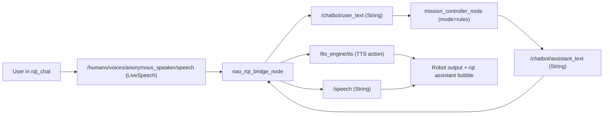
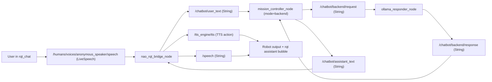

# NAO ROS4HRI Bridge

ROS 2 Jazzy workspace for NAO + ROS4HRI + modular chatbot orchestration.

This repository is now configured with `src/` as the canonical source tree used by Docker builds.

## Architecture Summary

- `nao_rqt_bridge_node`: bridge between ROS4HRI chat topics and robot outputs
- `mission_controller_node`: intent extraction and routing policy
- `ollama_responder_node`: optional Ollama backend responder
- `ollama_node`: legacy entrypoint for compatibility (bridge + mission controller)

```text
User -> rqt_chat -> /humans/voices/anonymous_speaker/speech (LiveSpeech)
   -> nao_rqt_bridge_node -> /chatbot/user_text
   -> mission_controller_node (mode=rules|backend)
      -> /chatbot/assistant_text
         -> nao_rqt_bridge_node
            -> /tts_engine/tts (for rqt_chat robot message bubble)
            -> /speech (for naoqi_driver TTS bridge)

backend mode:
/chatbot/backend/request -> ollama_responder_node -> /chatbot/backend/response
```

### Message Flow Diagrams

Rules mode:



Backend mode (Ollama):



## Repository Layout

```text
.
├── docker/
│   ├── Dockerfile
│   └── ros_entrypoint.sh
├── scripts/
│   └── build_docker.sh
├── src/
│   └── nao_chatbot/
│       ├── launch/nao_chatbot_stack.launch.py
│       ├── nao_chatbot/
│       │   ├── nao_rqt_bridge.py
│       │   ├── mission_controller.py
│       │   ├── ollama_responder.py
│       │   └── ollama_node.py
│       ├── package.xml
│       └── setup.py
└── README.md
```

## Docker Build

Build the image:

```bash
./scripts/build_docker.sh
```

This builds tag:

```bash
iiia:nao
```

The Dockerfile now:

- uses workspace `/home/ubuntu/ws`
- installs ROS4HRI chat dependencies from SocialMinds apt repo:
  - `socialminds-ros-jazzy-rqt-chat`
  - `socialminds-ros-jazzy-tts-msgs`
  - `socialminds-ros-jazzy-hri-msgs`
  - `socialminds-ros-jazzy-hri-actions-msgs`
- builds `src/` content into `/home/ubuntu/ws/install`

## Run Container

On host:

```bash
xhost +SI:localuser:root
```

Start container:

```bash
docker run -it --rm --network host \
  --name nao_ros2 \
  -e DISPLAY=$DISPLAY \
  -e LIBGL_ALWAYS_SOFTWARE=1 \
  -e QT_X11_NO_MITSHM=1 \
  -v /tmp/.X11-unix:/tmp/.X11-unix \
  iiia:nao bash
```

Inside container:

```bash
source /opt/ros/jazzy/setup.bash
source /home/ubuntu/ws/install/setup.bash
```

When done on host:

```bash
xhost -SI:localuser:root
```

## Launch Stack

Show available launch arguments:

```bash
ros2 launch nao_chatbot nao_chatbot_stack.launch.py --show-args
```

Start stack with NAO driver:

```bash
ros2 launch nao_chatbot nao_chatbot_stack.launch.py \
  start_naoqi_driver:=true \
  nao_ip:=10.10.200.149 \
  nao_port:=9559 \
  network_interface:=wlp1s0 \
  mission_mode:=rules \
  ollama_enabled:=false
```

Start stack with Ollama backend mode:

```bash
ros2 launch nao_chatbot nao_chatbot_stack.launch.py \
  start_naoqi_driver:=true \
  nao_ip:=10.10.200.149 \
  nao_port:=9559 \
  network_interface:=wlp1s0 \
  mission_mode:=backend \
  ollama_enabled:=true
```

Important args:

- `start_naoqi_driver` (`false` by default)
- `nao_ip`
- `nao_port`
- `network_interface` (example: `wlp1s0`, `enx...`; avoid non-existing `eth0`)
- `qi_listen_url`
- `mission_mode` (`rules` or `backend`)
- `ollama_enabled` (`true` or `false`)

## Launch rqt_chat

Inside container (after sourcing ROS):

```bash
export LIBGL_ALWAYS_SOFTWARE=1
export QT_X11_NO_MITSHM=1
ros2 run rqt_gui rqt_gui --standalone rqt_chat.chat.ChatPlugin --force-discover
```

If you see `could not connect to display :0`, fix host X11 auth first:

```bash
xhost +SI:localuser:root
```

## Development Loop

For normal development, edit files directly under:

```text
src/nao_chatbot/
```

Then rebuild container image or rebuild package in a running container:

```bash
docker exec -it nao_ros2 bash -lc \
  'source /opt/ros/jazzy/setup.bash && cd /home/ubuntu/ws && colcon build --symlink-install --packages-select nao_chatbot'
```

Optional snapshot of a validated running container:

```bash
docker commit nao_ros2 iiia:nao
```

## Troubleshooting

### Launch file or package appears missing

- Confirm container was started from latest image:
  - `docker ps --no-trunc`
  - `docker images`
- Recreate container from current `iiia:nao` if needed.

### `ros2 topic pub /cmd_vel ...` waits for subscribers

- `naoqi_driver` is not subscribed yet (not running or not connected).
- Ensure launch includes:
  - `start_naoqi_driver:=true`
  - correct `nao_ip`
  - valid `network_interface` for your host/container

### NAO IP changes

- Pass updated IP at launch:
  - `nao_ip:=<current_ip>`

