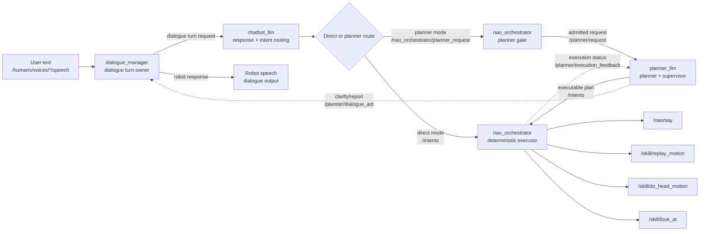
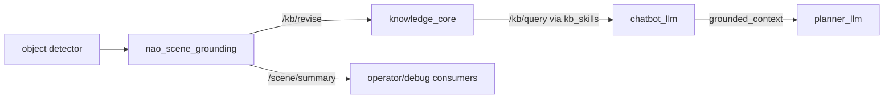

# NAO ROS4HRI Bridge

ROS 2 Jazzy workspace for a NAO-centered ROS4HRI thesis stack. The repo is
organized around one architectural idea: user language, symbolic scene state,
LLM planning, and robot execution should remain separate enough to inspect,
test, and replace independently.

The current focus is the planner loop:

```text
/humans/voices/*/speech -> dialogue_manager <-> chatbot_llm
chatbot_llm -> /intents -> nao_orchestrator -> robot or mock skills
chatbot_llm -> /planner/request -> planner_llm
planner_llm -> /intents -> nao_orchestrator -> robot or mock skills
nao_orchestrator -> /planner/execution_feedback -> planner_llm
planner_llm -> /planner/dialogue_act -> dialogue/speech owner
```

The root README is intentionally self-contained. The docs under `docs/` are the
richer reference set, and `docs/artifacts/` holds older handoffs and ledgers.

## Package Responsibilities

| Package | Owns | Notes |
| --- | --- | --- |
| `dialogue_manager` | Dialogue lifecycle and speaking ownership | Nested/upstream-sensitive |
| `chatbot_llm` | LLM dialogue backend, intent declaration, planner routing, KB snapshot injection | Editable in this repo's planner work |
| `planner_common` | Shared planner, plan, feedback, scene, and world-model JSON helpers | Contract source of truth |
| `planner_llm` | Goal supervision, plan generation, replanning, planner dialogue acts | Does not execute robot skills |
| `nao_orchestrator` | Deterministic `/intents` validation, ordered execution, planner feedback | Downstream only |
| `kb_skills` | KnowledgeCore query/revise client boundary | Keeps KB transport out of planner/chatbot internals |
| `nao_scene_grounding` | Detector-to-KB object grounding and `/scene/summary` | Object-centric, not person-manager replacement |
| `nao_chatbot` | Launch profiles and operator utilities | Main launch surface |
| `nao_say_skill` | NAO speech execution through `/nao/say` and `/tts_engine/tts` compatibility | Robot-side speech hook |
| `nao_replay_motion` | Replay/posture/head-motion skill implementations | Current head-motion path is not demo-reliable |
| `nao_look_at` | NAO implementation of upstream `interaction_skills/look_at` | Gaze/action adapter |
| `nao_skills` | NAO-specific action interfaces | Interface package only |
| `asr_vosk` | Transitional local Vosk ASR lifecycle node | Not final upstream ASR contract |
| `simple_audio_capture` | Local microphone source for ASR | Utility package |

Upstream-style or imported packages such as `motions_skills`, `std_skills`,
`communication_skills`, `interaction_skills`, and `dialogue_manager` should be
changed narrowly, if at all. Prefer first-party adapter packages for local
integration work.

## Runtime Architecture

### Dialogue And Planner


```mermaid
flowchart LR
    user["User text<br/>/humans/voices/*/speech"] --> dm["dialogue_manager<br/>dialogue turn owner"]
    dm -->|dialogue turn request| chatbot["chatbot_llm<br/>response + intent routing"]
    chatbot --> route{"Direct or planner route"}
    route -->|direct mode<br/>/intents| orch["nao_orchestrator<br/>deterministic executor"]
    route -->|planner mode<br/>/nao_orchestrator/planner_request| gate["nao_orchestrator<br/>planner gate"]
    gate -->|admitted request<br/>/planner/request| planner["planner_llm<br/>planner + supervisor"]
    planner -->|executable plan<br/>/intents| orch
    orch -.->|execution status<br/>/planner/execution_feedback| planner
    planner -.->|clarify/report<br/>/planner/dialogue_act| dm
    dm -->|robot response| speech_out["Robot speech<br/>dialogue output"]
    orch --> say["/nao/say"]
    orch --> replay["/skill/replay_motion"]
    orch --> head["/skill/do_head_motion"]
    orch --> look["/skill/look_at"]
```

### Grounded Scene


```mermaid
flowchart LR
    detector["object detector"] --> grounding["nao_scene_grounding"]
    grounding -->|/kb/revise| kb["knowledge_core"]
    grounding -->|/scene/summary| summary["operator/debug consumers"]
    kb -->|/kb/query via kb_skills| chatbot["chatbot_llm"]
    chatbot -->|grounded_context| planner["planner_llm"]
```

Important distinction:

- `knowledge_snapshot` is chatbot-facing prompt context from `/kb/query`.
- `/scene/summary` is detector-grounded object summary for operators and future consumers.
- `state_t0` is the compact planner-facing world state assembled from current
  grounded scene facts.

## Core Contracts

All planner contracts currently travel as JSON strings in standard ROS messages.
`planner_common` owns the normalization helpers.

### `/planner/request`

Published by `chatbot_llm` as `hri_actions_msgs/msg/Intent`.

```json
{
  "request_id": "turn_123",
  "goal_id": "goal_turn_123",
  "request_kind": "new_goal",
  "goal_text": "inspect the cup and report completion",
  "normalized_intents": ["inspect_scene"],
  "scene_targets": ["cup"],
  "requested_plan": [],
  "grounded_context": {
    "knowledge_snapshot": {
      "schema_version": "knowledge_snapshot_v2",
      "captured_at_sec": 1777040000.0,
      "references": [
        {"normalized_name": "cup", "id": "cup_1", "type": "Cup"},
        {"normalized_name": "person", "id": "person_1", "type": "Person"}
      ],
      "counts": {"entities": 2, "people": 1, "objects": 1}
    },
    "scene_summary": {
      "schema_version": "scene_summary_v2",
      "observer": "myself",
      "backend": "emorobcare_cv",
      "captured_at_sec": 1777040000.0,
      "objects": [
        {
          "entity_id": "cup_1",
          "label": "cup",
          "kb_class": "Cup",
          "score": 0.91,
          "tracker_id": "",
          "source": "emorobcare_cv",
          "center_x": 320.0,
          "center_y": 240.0,
          "last_seen_sec": 1777040000.0
        }
      ],
      "people": [
        {
          "id": "person_1",
          "label": "person",
          "type": "Person",
          "source": "emorobcare_cv",
          "score": 0.84,
          "center_x": 188.0,
          "center_y": 205.0,
          "last_seen_sec": 1777040000.0
        }
      ]
    },
    "state_t0": {
      "schema_version": "state_t0_v2",
      "observer": "myself",
      "backend": "emorobcare_cv",
      "captured_at_sec": 1777040000.0,
      "entity_counts": {"entities": 2, "people": 1, "objects": 1},
      "entities": []
    }
  },
  "planner_mode": "default",
  "interaction_mode": "speech",
  "dialogue_turn_id": "role:turn"
}
```

Planner input policy:

- `goal_text`, `normalized_intents`, `scene_targets`, and `grounded_context`
  are the clean planner inputs.
- `requested_plan` is an optional hint/fallback, not a required way to make the
  planner work.
- `user_text` is legacy parser input only. `chatbot_llm` should not send it to
  the planner during normal operation.
- planner prompt policy treats every `state_t0.entities[*].id` as a valid
  `look_at.target_frame` candidate, so no dedicated candidate list is required.

### Planner Output On `/intents`

Published by `planner_llm` as `hri_actions_msgs/msg/Intent`; executable plan is
inside `Intent.data.plan`.

```json
{
  "grounded_context": {
    "knowledge_snapshot": {},
    "scene_summary": {},
    "state_t0": {}
  },
  "plan": {
    "goal_id": "goal_turn_123",
    "plan_id": "plan_123",
    "plan_version": 1,
    "status": "planning",
    "validation_status": "draft",
    "failure_reason": "",
    "replan_hint": "",
    "retry_budget": 1,
    "communication_policy": {
      "emit_acknowledge": false,
      "emit_progress": false,
      "emit_completion": true,
      "emit_failure": true
    },
    "steps": [
      {
        "id": "step_1",
        "type": "skill",
        "name": "perform_motion",
        "args": {"object": "head_look_left"},
        "requires": [],
        "on_failure": "replan",
        "retry_budget": 0
      }
    ],
    "scene_targets": ["cup"]
  }
}
```

Current supported step types are `noop`, `say`, `skill`, and `look_at`.

### `/planner/execution_feedback`

Published by `nao_orchestrator` as `std_msgs/msg/String`.

```json
{
  "goal_id": "goal_turn_123",
  "plan_id": "plan_123",
  "plan_version": 1,
  "event_type": "step_failed",
  "status": "failed",
  "reason": "mock target unavailable",
  "retry_budget": 1,
  "blocking": true,
  "needs_user_input": false,
  "unmet_preconditions": [],
  "scene_targets": ["cup"],
  "step": {
    "id": "step_1",
    "type": "skill",
    "name": "perform_motion",
    "requires": [],
    "on_failure": "replan"
  }
}
```

### `/planner/dialogue_act`

Published by `planner_llm` as `std_msgs/msg/String` when the supervisor needs
speech/dialogue behavior without publishing a new executable plan.

```json
{
  "goal_id": "goal_turn_123",
  "plan_id": "plan_123",
  "plan_version": 1,
  "act": "ask_clarification",
  "priority": "normal",
  "await_user_response": true,
  "reason": "missing target object",
  "text_hint": "Which cup should I use?",
  "slots_needed": ["target_object"],
  "context": {"scene_targets": ["cup"], "status": "waiting_user"}
}
```

## Launch Quickstart

Build the local workspace slice:

```bash
source /opt/ros/jazzy/setup.bash
colcon build --symlink-install --packages-select \
  std_skills communication_skills motions_skills kb_skills nao_skills \
  planner_common planner_llm chatbot_llm dialogue_manager nao_orchestrator \
  nao_say_skill nao_replay_motion nao_look_at nao_scene_grounding \
  nao_chatbot asr_vosk simple_audio_capture
```

Simulator stack (planner on by default):

```bash
ros2 launch nao_chatbot nao_chatbot_sim.launch.py
```

Optional planner fixtures for local testing:

```bash
ros2 run planner_llm publish_fixture request
ros2 run planner_llm publish_fixture feedback
```

Simulator with planner opt-out:

```bash
ros2 launch nao_chatbot nao_chatbot_sim.launch.py \
  start_planner_llm:=false \
  chatbot_planner_mode_enabled:=false \
  chatbot_think:=false \
  planner_llm_think:=false
```

Simulator with object grounding:

```bash
ros2 launch nao_chatbot nao_chatbot_sim.launch.py \
  start_object_detection:=true \
  start_scene_grounding:=true \
  object_detection_backend:=emorobcare_cv
```

Real robot:

```bash
ros2 launch nao_chatbot nao_chatbot_robot.launch.py nao_ip:=<robot_ip>
```

ASR-only:

```bash
ros2 launch nao_chatbot nao_chatbot_asr_only.launch.py \
  asr_vosk_model_path:=/models/vosk-model-small-en-us-0.15
```

## Planner Status

What is already implemented:

- `chatbot_llm` can publish `/planner/request` in planner mode.
- `planner_llm` has a goal-keyed supervisor and consumes execution feedback.
- `nao_orchestrator` can execute structured plan steps sequentially and publish
  planner feedback.
- `requires` exists as precondition metadata, but world-state validation is not
  first-class yet.

Current risks:

- The planner can still become confused when `goal_text`, `normalized_intents`,
  scene targets, and `requested_plan` disagree.
- Multi-step completeness needs a focused diagnostic; unsupported-step filtering
  can hide a partial-plan failure.
- Real head motion has been unreliable, so the Monday demo should use a minimal
  mock/safe execution target or the explicit simulator fallback parameters.
- Pre/post conditions should stay light until the simple loop is closed.

Phase 2 container observations:

- `/planner/request`, `/intents`, `/planner/execution_feedback`, and
  `/planner/dialogue_act` are wired in the live graph.
- A `goal_text` request with no `user_text` and no `requested_plan` reached
  `planner_llm`.
- Rule-backed `head_look_left` produced a valid `perform_motion` plan and
  orchestrator feedback. On 2026-04-27, execution failed because the head joint
  state did not change after publishing to `/joint_angles`; source now has
  explicit simulator/demo open-loop fallback parameters.
- Model-backed `inspect_scene` produced a `look_at` step with `args.target`
  instead of `args.target_frame`, so `nao_orchestrator` rejected the plan as a
  contract/schema failure and `planner_llm` emitted an `ask_for_help`
  dialogue act.
- A qwen-backed composite request for “look around to see if you find anyone”
  emitted a clarification instead of a plan because the model output did not
  contain a valid executable plan.

Current model defaults:

- `chatbot_llm`: `qwen3.5:397b-cloud`, `think: false`,
  `response_max_tokens: 64`, `intent_max_tokens: 64`.
- `planner_llm`: `qwen3.5:397b-cloud`, `think: false`.

## Operational Details

Planner mode needs both launch switches unless the profile sets them for you:

```bash
ros2 launch nao_chatbot nao_chatbot_sim.launch.py \
  start_planner_llm:=true \
  chatbot_planner_mode_enabled:=true
```

Object grounding is detector-first and KB-backed:

```text
camera image -> detector backend -> nao_scene_grounding
    -> /scene/summary
    -> /kb/revise
    -> chatbot_llm knowledge_snapshot via /kb/query
```

Current detector notes:

- `emorobcare_cv` is the default object-detection backend for this workspace.
- `nao_scene_grounding` should remain the single writer of detector-derived KB
  facts; keep detector-side direct KB writes disabled.
- `/scene/summary` is high-frequency, object-centric JSON for operator/debug
  use and future world-model consumers.
- `knowledge_snapshot` is the bounded chatbot prompt text produced from KB
  query results.

TF/operator notes:

- The simulator TF tree is local: `base_link -> sellion_link -> camera`.
- `hri_person_manager` must not default to nonexistent `map` in the simulator
  profile; this causes `rqt_human_radar` lookupTransform log floods.
- The sim launch now overrides its HRI person reference frame to `base_link`.

The immediate Monday path is documentation visibility, then one minimal planner
diagnostic, then only the smallest demo code needed to prove the loop.

## Development environment (venv, pre-commit, ROS tests)

- Create a venv and install dev tools (includes **numpy** for `dialogue_manager` and
  migration action tests):

  ```bash
  python3 -m venv .venv
  source .venv/bin/activate
  pip install -r requirements-dev.txt
  ```

- **`scripts/run_tests.sh`** prefers `.venv/bin/python3` when it exists, so after
  `pip install -r requirements-dev.txt` the same script used by pre-commit will pick
  up numpy without using `apt install python3-numpy` (the Debian package name is
  `python3-numpy`, not `numpy`).

- ROS message types and **`launch`** still come from the ROS underlay. Always
  **source ROS before** `run_tests.sh` / pytest when you want the full suite, for
  example:

  ```bash
  source /opt/ros/jazzy/setup.bash
  source install/setup.bash  # after colcon build
  source .venv/bin/activate
  ./scripts/run_tests.sh
  ```

  If `launch` is missing on `PYTHONPATH`, the workspace suite fails because the
  launch profile contracts are part of the pre-commit gate. Recreate the venv with
  `python3 -m venv --system-site-packages .venv` when you need the venv to inherit
  system ROS Python packages directly.

- After adding or renaming launch files, run **`colcon build --packages-select nao_chatbot`**
  (or a full build) before robot runs. `scripts/run_tests.sh` launch smoke checks
  source launch files directly so it validates current edits without forcing an
  overlay rebuild.

## Validation

Focused unit checks:

```bash
PYTHONPATH=src/planner_common:src/planner_llm:src/nao_orchestrator:src/kb_skills \
python3 -m pytest -q \
  src/planner_common/test/test_contracts.py \
  src/planner_llm/test/test_planner_engine.py \
  src/planner_llm/test/test_supervisor.py \
  src/nao_orchestrator/test/test_nao_orchestrator_intent_rules.py
```

Chatbot planner adapter checks:

```bash
cd src/chatbot_llm
PYTHONPATH="$PWD:$OLDPWD/src/planner_common:$OLDPWD/src/kb_skills" \
python3 -m pytest -q test/test_planner_request_adapter.py
```

Planner runtime topics to echo:

```bash
ros2 topic echo /planner/request
ros2 topic echo /intents
ros2 topic echo /planner/execution_feedback
ros2 topic echo /planner/dialogue_act
```

## Documentation Map

- `docs/current_workflow.md`: canonical architecture and diagrams.
- `docs/contracts.md`: rich contract examples and interpretation notes.
- `docs/launch_profiles.md`: launch matrix and operator commands.
- `docs/planner_status.md`: current planner diagnosis, limitations, and next actions.
- `docs/artifacts/monday_demo.md`: archived demo checklist and observable topic path.
- `docs/README.md`: docs governance, including the `.md` + `.html` pairing rule for plan docs.
- `docs/artifacts/`: historical handoffs, integration notes, and old ledgers.
- `docs/knowledge/**`: GitNexus/knowledge-layer docs; left untouched by normal
  documentation cleanup.

## Notes

- `docs/artifacts/` is intentionally archival. Prefer updating the active docs
  above instead of creating new one-off handoff notes.
- GitNexus is expected to be refreshed soon. Until then, source code and
  observed ROS payloads are authoritative.
- Avoid broad edits to upstream-sensitive packages. `chatbot_llm` is allowed for
  this planner work; other nested/upstream packages need narrower treatment.
