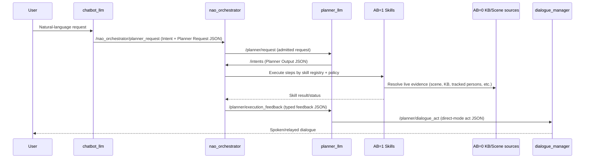

# Supervisor Walkthrough: End-to-End User -> Planner Dialogue Flow

Date: 2026-06-01  
Audience: Supervisor review + live demo preparation  
Scope: Full conceptual and contract-level flow from user utterance to planner execution and dialogue emission.

---

## 1) Walkthrough Objective

Provide one coherent, inspectable narrative of the runtime flow with:

- clear node ownership boundaries,
- explicit JSON seams,
- field-level variable definitions,
- and implementation guardrails already applied in this branch.

This document is presentation-oriented and pairs with:

- `docs/contracts.md` (canonical contract reference),
- `docs/plans/planner_grounding_moe_contract_2026-06-01.md`,
- `docs/plans/planner_replan_lineage_adr.md`.

---

## 2) E2E Conceptual Flow



Key ownership rule:
- Planner context is T0 planning evidence.
- Live world-state ownership remains with execution-time skills.

---

## 3) Contract A: `chatbot_llm` JSON Output

Owner: `chatbot_llm`  
Primary role: route + intent declaration (not executable step authoring)

```json
{
  "verbal_ack": "Okay, I will do that.",
  "route": "execution",
  "confidence": 0.82,
  "user_intent": {
    "type": "look_at",
    "goal": "look at the person",
    "goal_text": "look at the person",
    "scene_targets": ["person"],
    "request_kind": "new_goal",
    "interaction_mode": "speech"
  }
}
```

Variables:
- `verbal_ack`: optional immediate user-facing acknowledgement text.
- `route`: one of `dialogue | knowledge_query | execution`.
- `confidence`: chatbot confidence for route/intent.
- `user_intent.type`: normalized intent class.
- `user_intent.goal` / `goal_text`: concise planner-facing objective text.
- `user_intent.scene_targets`: compact target list.
- `user_intent.request_kind`: transition type (`new_goal`, `goal_update`, etc.).
- `user_intent.interaction_mode`: currently speech-first interaction mode.

---

## 4) Contract B: Planner Request (`/planner/request`, `Intent.data`)

Owners:
- authoring: `chatbot_llm`
- admission and forwarding: `nao_orchestrator`
- consumption: `planner_llm`

```json
{
  "request_id": "turn_123",
  "goal_id": "goal_turn_123",
  "parent_goal_id": "",
  "supersedes_goal_id": "",
  "request_kind": "new_goal",
  "goal_text": "look at the person and report completion",
  "normalized_intents": ["look_at"],
  "scene_targets": ["person"],
  "dialogue_context": [],
  "requested_plan": [],
  "grounded_context": {
    "knowledge_snapshot": {
      "schema_version": "knowledge_snapshot_v2",
      "captured_at_sec": 1777040000.0,
      "references": [{"normalized_name": "person", "id": "person_1", "type": "Person"}],
      "counts": {"entities": 1, "people": 1, "objects": 0}
    },
    "scene_summary": {
      "schema_version": "scene_summary_v2",
      "observer": "myself",
      "backend": "emorobcare_cv",
      "captured_at_sec": 1777040000.0,
      "objects": [],
      "people": [{"entity_id": "person_1", "label": "person", "kb_class": "Person"}]
    },
    "state_t0": {
      "schema_version": "state_t0_v2",
      "observer": "myself",
      "backend": "emorobcare_cv",
      "captured_at_sec": 1777040000.0,
      "entity_counts": {"entities": 1, "people": 1, "objects": 0},
      "entities": [
        {
          "normalized_name": "person",
          "id": "person_1",
          "type": "Person",
          "kind": "person",
          "source": "emorobcare_cv",
          "last_seen_sec": 1777040000.0
        }
      ]
    }
  },
  "planner_mode": "default",
  "interaction_mode": "speech",
  "dialogue_turn_id": "role:turn"
}
```

Root variables:
- `request_id`: idempotent per-turn request identifier.
- `goal_id`: stable goal continuity id.
- `parent_goal_id`: optional lineage to a parent goal.
- `supersedes_goal_id`: explicit supersede target for replacement requests.
- `request_kind`: transition kind (`new_goal`, `goal_update`, `clarification_answer`, `cancel_request`).
- `goal_text`: planner objective text.
- `normalized_intents`: strict intent labels.
- `scene_targets`: compact entity/object/person targets.
- `dialogue_context`: optional turn context list.
- `requested_plan`: optional plan hint list.
- `grounded_context`: Hybrid Minimal T0 planner context.
- `planner_mode`: planner policy profile selector.
- `interaction_mode`: interaction channel metadata.
- `dialogue_turn_id`: conversation turn correlation id.

`grounded_context.knowledge_snapshot` variables:
- `schema_version`: payload schema gate.
- `captured_at_sec`: observation/query timestamp.
- `references[]`: compact KB references with:
  - `normalized_name`
  - `id`
  - `type`
- `counts`: aggregate counts (`entities`, `people`, `objects`).

`grounded_context.scene_summary` variables:
- `schema_version`, `observer`, `backend`, `captured_at_sec`.
- `objects[]`: current object detections.
- `people[]`: current people detections.

`grounded_context.state_t0` variables:
- `schema_version`, `observer`, `backend`, `captured_at_sec`.
- `entity_counts`: deterministic counts for planning checks.
- `entities[]`: canonical T0 entity set with:
  - `normalized_name`, `id`, `type`, `kind`, `source`, `last_seen_sec`.

Semantics guardrail:
- People and objects are represented in separate arrays where relevant.
- In `state_t0.entities`, `kind` disambiguates `person` vs `object`.

Removed from this contract:
- `goal_token`
- `world_model_snapshot`
- `world_model_text`

---

## 5) Contract C: Planner Output (`/intents`, `Intent.data`)

Owner: `planner_llm`  
Consumer: `nao_orchestrator`

```json
{
  "grounded_context": {
    "knowledge_snapshot": {},
    "scene_summary": {},
    "state_t0": {}
  },
  "plan": {
    "goal_id": "goal_turn_123",
    "plan_id": "plan_123",
    "plan_version": 2,
    "status": "planning",
    "validation_status": "draft",
    "failure_reason": "",
    "user_facing_reason": "",
    "replan_hint": "",
    "retry_budget": 1,
    "scene_targets": ["person"],
    "communication_policy": {
      "emit_acknowledge": false,
      "emit_progress": false,
      "emit_completion": true,
      "emit_failure": true
    },
    "steps": [
      {
        "id": "step_1",
        "type": "look_at",
        "name": "look_at",
        "args": {"target_frame": "person_1"},
        "requires": [],
        "on_failure": "replan",
        "retry_budget": 0
      }
    ]
  }
}
```

`plan` variables:
- `goal_id`: continuity across replans.
- `plan_id`: logical plan identity.
- `plan_version`: strictly increasing revision for same goal.
- `status`: planning/execution lifecycle state.
- `validation_status`: plan-validation result state.
- `failure_reason`: planner/system failure reason.
- `user_facing_reason`: optional reason for relay.
- `replan_hint`: next-pass planner hint.
- `retry_budget`: plan-level retry budget.
- `scene_targets`: planner target echo for traceability.
- `communication_policy`: relay toggles.
- `steps[]`: executable sequence.

`steps[]` variables:
- `id`: stable step identifier (required for mid-join).
- `type`: one of `noop|say|skill|look_at`.
- `name`: concrete skill/action name.
- `args`: typed action arguments.
- `requires`: dependency list.
- `on_failure`: failure policy (`fail|continue|replan|clarify|ask_user|ignore`).
- `retry_budget`: step-local retry budget.

Removed from planner output:
- planner-level `ack_mode`
- planner-level raw `ack_text`
- duplicated top-level plan metadata fields

---

## 6) Contract D: Execution Feedback (`/planner/execution_feedback`)

Owner: `nao_orchestrator`  
Consumer: `planner_llm`

```json
{
  "goal_id": "goal_turn_123",
  "plan_id": "plan_123",
  "plan_version": 2,
  "event_type": "step_succeeded",
  "status": "executing",
  "reason": "",
  "retry_budget": 1,
  "blocking": false,
  "needs_user_input": false,
  "scene_targets": ["person"],
  "timestamp_sec": 1777040000.0,
  "result_summary": "Look-at completed for person_1",
  "result_payload": {
    "skill": "look_at",
    "target": "person_1",
    "target_kind": "people",
    "target_found": true
  },
  "step": {
    "id": "step_1",
    "type": "look_at",
    "name": "look_at",
    "retry_budget": 0,
    "on_failure": "replan",
    "requires": []
  }
}
```

Variables:
- lineage: `goal_id`, `plan_id`, `plan_version`.
- event/state: `event_type`, `status`, `reason`.
- replan control: `retry_budget`, `blocking`, `needs_user_input`.
- traceability: `scene_targets`, `timestamp_sec`.
- outputs: `result_summary`, `result_payload`.
- step trace: `step` object with executed step metadata.

---

## 7) Contract E: Planner Dialogue Act (`/planner/dialogue_act`)

Owner: `planner_llm`  
Consumer: `dialogue_manager`

```json
{
  "goal_id": "goal_turn_123",
  "plan_id": "plan_123",
  "plan_version": 2,
  "act": "ask_clarification",
  "priority": "normal",
  "await_user_response": true,
  "reason": "missing target object",
  "text_hint": "Which person should I look at?",
  "slots_needed": ["target"],
  "context": {
    "scene_targets": ["person"],
    "status": "waiting_user"
  }
}
```

Variables:
- lineage: `goal_id`, `plan_id`, `plan_version`.
- dialogue semantics: `act`, `priority`, `await_user_response`.
- rationale: `reason`, `text_hint`, `slots_needed[]`.
- compact context: `context.scene_targets`, `context.status`.

Dialogue guardrail:
- direct planner dialogue-act mode only.
- no legacy fallback dialogue mode branches.

---

## 8) Replanning + Join Policy (Implementation Facet)

Current accepted behavior:

1. Single active goal queue model.
2. Goal continuity by `goal_id`.
3. Plan lineage by (`plan_id`, `plan_version`).
4. Replan join strategy:
   - mid-join if active `step_id` maps in the newer plan,
   - otherwise front-join from first pending step.
5. Duplicate suppression checks exact active tuple:
   - `goal_id`, `plan_id`, `plan_version`.

---

## 9) Why This Architecture Is Deliberate

- Keeps planner payload concise (removes duplicate/dead fields).
- Preserves deterministic T0 context for planning quality.
- Avoids node ownership mismatch by keeping live world-state in skill execution seams.
- Supports future MoE-by-AB specialization without redesigning the planner interface.

---

## 10) Live Demo Script (Supervisor Session)

1. Show user utterance -> `chatbot_llm` route decision (`execution`).
2. Show emitted planner request JSON (highlight Hybrid Minimal T0).
3. Show planner output plan (highlight `goal_id`, `plan_id`, `plan_version`, `steps[*].id`).
4. Trigger one successful step and one forced replan/failure case.
5. Show execution feedback JSON used for replanning.
6. Show planner dialogue act and final completion relay.
7. Close with ownership map:
   - planner plans,
   - orchestrator dispatches,
   - skills resolve live world state.

---

## 11) Related References

- `docs/contracts.md`
- `docs/current_workflow.md`
- `docs/architecture/demo_stack_seam_contract_2026-05-26.md`
- `docs/plans/planner_grounding_moe_contract_2026-06-01.md`
- `docs/plans/planner_replan_lineage_adr.md`
