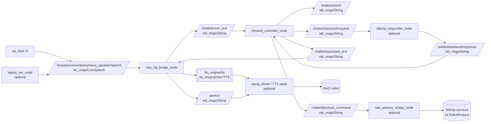

# NAO Chatbot Stack Architecture

This diagram reflects `src/nao_chatbot/launch/nao_chatbot_stack.launch.py` and current node wiring.

## Notes

- `rules` mode: `mission_controller_node` publishes `/chatbot/assistant_text` directly.
- `backend` mode: `mission_controller_node` uses `/chatbot/backend/request` and `/chatbot/backend/response` through `ollama_responder_node`.
- Posture commands (`stand`, `sit`, `kneel`) are published on `/chatbot/posture_command` and executed by `nao_posture_bridge_node` through NAOqi services.
- `rqt_chat` and `naoqi_driver` are launch-time optional components; `laptop_asr_node` is optional and can share the same `LiveSpeech` topic with UI input.
