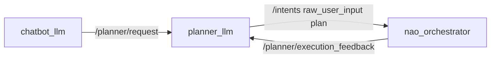
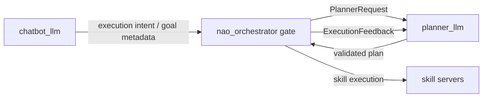

# `nao_orchestrator` Planner-Gate Handoff

## Current status

Implemented on 2026-05-05 as an orchestrator-owned admission gate over the
existing `hri_actions_msgs/Intent` + `PlannerRequest` contract. No new ROS
interfaces were added.

Demo/sim/robot profiles now send chatbot-originated planner requests to
`/nao_orchestrator/planner_request` when the planner gate is enabled. The
orchestrator accepts, rejects, cancels, or supersedes requests and republishes
accepted requests to `/planner/request` for `planner_llm`.

## Original reason for the pass

The current demo path is intentionally direct:

That was acceptable for the demo cleanup because it preserved the narrow chatbot
contract and kept planning in `planner_llm`. The current pass moves admission
closer to `nao_orchestrator` so execution goal ownership and cancellation are
centralized in the deterministic executor.

## Target shape

## Ownership rules

- `chatbot_llm` keeps producing only `verbal_ack`, route metadata, and goal
  text. It does not synthesize plans.
- `nao_orchestrator` becomes the active-goal gate: reject, cancel, supersede, or
  submit planner requests using deterministic state.
- `planner_llm` remains the only component that chooses abstract steps.
- `dialogue_manager` remains the speaking owner for chatbot responses and
  planner dialogue acts.
- No new `.msg`, `.srv`, or `.action` files should be added unless the existing
  intent/topic contracts cannot express the gate cleanly.

## Implemented behavior

- First `new_goal` is accepted and becomes the active planner goal.
- Duplicate active goals are rejected.
- A second new goal must explicitly supersede the active goal.
- Matching `goal_update`, `clarification_answer`, and `cancel_request` are
  accepted.
- Completion, cancellation, invalid, or failed execution feedback clears the
  active gate goal.
- Rejections are logged by `nao_orchestrator`; the gate does not speak and does
  not call the LLM.

## Non-goals

- Do not put LLM calls inside `nao_orchestrator`.
- Do not make the orchestrator speak directly.
- Do not hardcode demo interactions in the gate.
- Do not replace `planner_common` contracts with package-local copies.

## Remaining follow-up

- Run a live end-to-end launch where chatbot publishes to the gate and confirm
  `/planner/request` only receives accepted requests.
- Consider publishing a non-speaking planner/dialogue diagnostic for rejected
  gate requests if operator visibility is not enough through logs.
