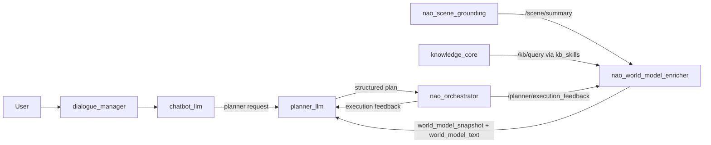

# Planner Phase D Handoff

Last updated: 2026-04-12

This document captures the remaining implementation for Phase D of the planner
architecture. It is intentionally a handoff only: do not implement the world
model enricher (`WME`) from this document until the Phase A-C supervisor stack
has been validated on the live system.

The baseline for this handoff is:

- `planner_common` already exposes supervisor-ready contracts
- `planner_llm` already owns goal supervision, replanning policy, and planner
  dialogue acts
- `nao_orchestrator` already owns deterministic validation, execution, and
  lifecycle feedback publication
- `chatbot_llm` already publishes planner ingress in the richer supervisor shape
- WME is currently out of scope for the live branch and should stay that way
  until the planner-only path is stable

## 1. Phase D Objective

Add a planner-facing world model layer that enriches grounded context without
stealing ownership from the existing ROS4HRI stack.

The WME must improve planning by making recent world state, execution impact,
and task-relevant salience easier to consume, while preserving the following
boundaries:

- `nao_scene_grounding` remains the owner of detector-to-KB grounding
- `kb_skills` remains the only local KnowledgeCore transport boundary
- `planner_llm` remains the goal supervisor and planner
- `nao_orchestrator` remains the deterministic executor and execution monitor
- `dialogue_manager` and `chatbot_llm` remain the user-facing interaction layer

## 2. Non-Goals For Phase D

Phase D should not:

- replace `nao_scene_grounding`
- bypass `kb_skills`
- execute robot skills directly
- own replanning policy that belongs to `planner_llm`
- own final dialogue realization
- introduce autonomous long-term memory writes by default
- introduce a second person-identity system in parallel with ROS4HRI person
  management

## 3. Target Runtime Shape



The important architectural rule is that WME enriches planner context; it does
not become another planner or another executor.

## 4. Inputs And Outputs

### WME inputs

WME should start with only these inputs:

- `/scene/summary`
- `/planner/execution_feedback`
- KB reads performed through `kb_skills`

Optional later inputs, but not in the first WME pass:

- ROS4HRI person-manager topics
- VLM-derived structured observations
- touch or proprioceptive signals if they support task-state enrichment

### WME outputs

Phase D should standardize two outputs:

- `/world_model/enriched_snapshot`
  - machine-facing JSON snapshot
- `/world_model/enriched_text`
  - bounded planner-facing text summary

Those outputs must map directly into the existing `grounded_context` envelope:

```json
{
  "grounded_context": {
    "knowledge_snapshot": {},
    "scene_summary": {},
    "world_model_snapshot": {},
    "world_model_text": ""
  }
}
```

That same envelope should remain the canonical representation for all LLMs in
this repo so `chatbot_llm`, `planner_llm`, and future VLM bridges can consume
compatible context.

## 5. Recommended Internal WME State

The initial WME should stay deliberately small and inspectable.

Track only:

- current visible entities
- recently seen entities
- stale entities
- likely persistent or occluded entities when recent evidence supports it
- current plan and step context derived from execution feedback
- task-relevant scene targets
- bounded KB evidence relevant to the active task

Do not add speculative world simulation or persistent autonomous belief updates
in the first pass.

## 6. Recommended Phase D Sequence

### D0. Contract lock

Before adding runtime code:

- keep `grounded_context.world_model_snapshot` and
  `grounded_context.world_model_text` as the only new planner-facing contract
  fields
- keep transport lightweight using existing JSON-over-ROS messages
- keep planner dialogue and execution contracts unchanged

### D1. Thin WME node

Create `nao_world_model_enricher` as its own node.

It should:

- subscribe to `/scene/summary`
- subscribe to `/planner/execution_feedback`
- perform KB reads through `kb_skills`
- maintain local short-horizon state
- publish `/world_model/enriched_snapshot`
- publish `/world_model/enriched_text`

It should not write to KB by default.

### D2. Planner ingestion

Update `planner_llm` only enough to:

- subscribe to the two WME topics
- inject them into the existing grounded context envelope
- use WME context as additional planning evidence, not as a hard dependency

The planner must still function when WME is absent.

### D3. Local replay and validation

Test Phase D with replayable fixtures before any live robot evaluation.

Suggested replay cases:

- target visible and still present
- target recently seen then lost
- stale target remains in KB but no longer visible
- execution failure changes target relevance
- planner receives a clarification-worthy world-state mismatch

### D4. Optional write-back experiments

Only after D1-D3 are stable:

- consider transient KB mirroring through `kb_skills`
- keep it feature-flagged
- never treat WME local state and KB as co-equal authorities without an explicit
  conflict policy

## 7. Acceptance Criteria

Phase D should be considered complete when:

- `planner_llm` can consume WME outputs without breaking when WME is absent
- WME improves planner context without duplicating detector grounding logic
- WME stays read-mostly by default
- WME does not take ownership of execution or dialogue
- the same grounded-context contract is usable by both `chatbot_llm` and
  `planner_llm`
- local replay tests cover the main world-state transitions before live robot
  validation

## 8. Testing Plan

### Unit tests

- WME state transitions for visible, recent, stale, and occluded entities
- JSON snapshot normalization and bounded text formatting
- planner fallback behavior when WME topics are missing

### Integration tests

- `/scene/summary` -> WME outputs
- `/planner/execution_feedback` -> WME task-context updates
- WME outputs -> `planner_llm` grounded-context ingestion

### Live checks

- echo `/world_model/enriched_snapshot`
- echo `/world_model/enriched_text`
- confirm planner output changes only when WME contributes meaningful context
- confirm `nao_orchestrator` behavior is unchanged except for improved planner
  decisions upstream

## 9. Architectural Risks To Watch

- WME becoming a second planner through hidden retry or failure policy
- WME duplicating KB transport instead of using `kb_skills`
- WME becoming mandatory for planner operation too early
- overfitting WME to NAO-specific topics instead of staying ROS4HRI-compatible
- adding uncontrolled persistent memory before short-horizon enrichment is
  proven useful

## 10. Cursor / Codex Prompt Seed

Use something close to this when resuming Phase D:

```text
Phase A-C of the planner supervisor are already implemented. Do not change the
ownership boundaries: chatbot_llm and dialogue_manager stay user-facing,
planner_llm stays the goal supervisor, nao_orchestrator stays the deterministic
executor, kb_skills stays the KnowledgeCore boundary, and nao_scene_grounding
stays the detector-to-KB grounding bridge. Implement Phase D by adding a thin,
read-mostly world model enricher that consumes /scene/summary,
/planner/execution_feedback, and KB reads through kb_skills, then publishes
world_model_snapshot and world_model_text into the standardized grounded_context
envelope for planner_llm.
```

## 11. Read These First

Before implementing Phase D, reread:

- `docs/planner_supervisor_phase_c_handoff.md`
- `docs/wme_planner_alignment.md`
- `docs/demo_status_and_contracts.md`
- `docs/thesis_planning_handoff.md`
