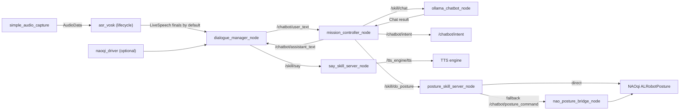
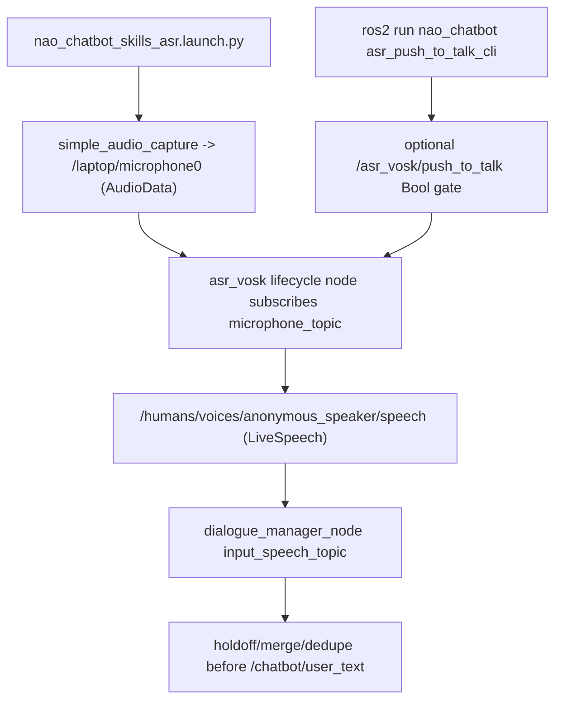

# Current Workflow

Last updated: 2026-03-06

This is the live architecture reference for this repository.
It mirrors the launch behavior in:

- `src/nao_chatbot/launch/nao_chatbot_stack.launch.py`
- `src/nao_chatbot/launch/nao_chatbot_skills.launch.py`
- `src/nao_chatbot/launch/nao_chatbot_skills_asr.launch.py`
- `src/nao_chatbot/launch/nao_chatbot_asr_only.launch.py`

## Profiles at a Glance

| Launch profile | Purpose | ASR mode | Notes |
|---|---|---|---|
| `nao_chatbot_stack.launch.py` | Full configurable stack | Disabled by default | Base launch used by all profiles |
| `nao_chatbot_skills.launch.py` | Skills-first runtime | Disabled | Backend mode defaults, no local ASR |
| `nao_chatbot_skills_asr.launch.py` | Skills + local ASR | Topic-fed lifecycle ASR | Launches `simple_audio_capture` + `asr_vosk` |
| `nao_chatbot_asr_only.launch.py` | ASR-only isolation/debug profile | Topic-fed lifecycle ASR | Launches only `simple_audio_capture` + `asr_vosk` |

## End-to-End Runtime Flow

```text
LiveSpeech source (/humans/voices/anonymous_speaker/speech)
    -> dialogue_manager_node
        final-only extraction by default
        short holdoff + merge of consecutive ASR finals
        busy-guard against overlapping user turns
        -> /chatbot/user_text (JSON payload with turn_id)
        -> /speech (assistant speech mirror / ASR guard path)
    -> mission_controller_node
        rules mode:
            -> /chatbot/assistant_text
            -> /chatbot/intent
        backend mode:
            -> /skill/chat (communication_skills/action/Chat)
            -> ollama_chatbot_node (two-stage: response + intent)
            -> /chatbot/assistant_text
            -> /chatbot/intent
        posture route:
            -> /skill/do_posture (nao_skills/action/DoPosture)
            -> posture_skill_server_node
            -> fallback /chatbot/posture_command -> nao_posture_bridge_node
    -> dialogue_manager_node
        -> /skill/say (communication_skills/action/Say)
        -> say_skill_server_node
        -> /tts_engine/tts
```

## Mermaid: Active Nodes



## Mermaid: ASR Variants



## Runtime Toggles That Change Topology

- `asr_vosk_enabled`: enables/disables `asr_vosk` lifecycle node.
- `asr_audio_capture_enabled`: enables/disables `simple_audio_capture` node.
- `asr_microphone_topic`: topic used between capture and ASR.
- `asr_speech_locale`: locale published in `LiveSpeech`.
- `asr_publish_partials`: publish incremental hypotheses or final-only output.
- `asr_push_to_talk_enabled`: enables explicit operator-gated listening.
- `asr_push_to_talk_topic`: Bool topic used by the operator CLI or manual publishers.
- `dialogue_user_turn_holdoff_sec`: buffers/merges consecutive ASR finals into one turn.
- `dialogue_ignore_user_speech_while_busy`: blocks overlapping user turns while a reply is pending.
- `mission_mode`: selects `rules` vs `backend` behavior in `mission_controller_node`.
- `start_naoqi_driver`: includes/excludes `naoqi_driver`.
- `start_rqt_chat`: includes/excludes `rqt_chat`.

## Source of Truth Rule

If this file and launch code ever diverge, launch code is authoritative.
Update this file whenever launch defaults or node wiring changes.
