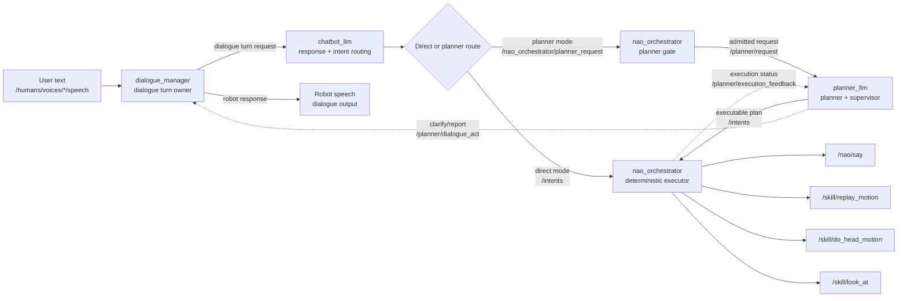
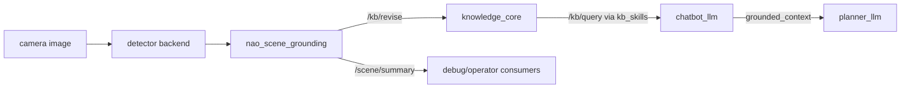
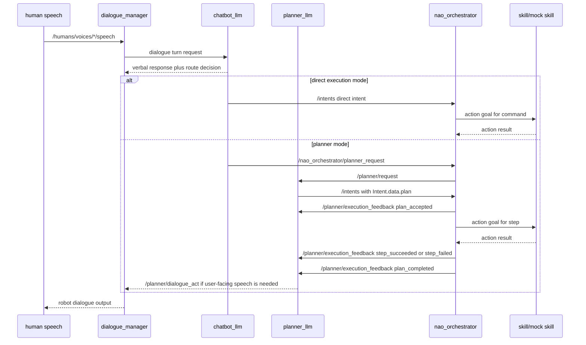

# Current Workflow

Last updated: 2026-06-30

This is the canonical workflow map for the active NAO ROS4HRI bridge. Historical
handoffs and old integration notes live in `docs/artifacts/`.

## Ownership

| Layer | Owner | Responsibility |
| --- | --- | --- |
| Dialogue | `dialogue_manager` | Dialogue lifecycle and speaking ownership |
| LLM dialogue | `chatbot_llm` | Response generation, intent declaration, planner routing, KB snapshot formatting |
| Planning | `planner_llm` | Goal supervision, plan generation, replanning, planner dialogue acts |
| Contracts | `planner_common` | JSON contract normalization and helpers |
| Execution | `nao_orchestrator` | Deterministic intent validation, ordered skill execution, execution feedback |
| Knowledge | `kb_skills` | KnowledgeCore query/revise boundary |
| Object grounding | `nao_scene_grounding` | Detector-to-KB object facts and `/scene/summary` |
| Launch | `nao_chatbot` | Demo and robot launch profiles |

## Main Runtime Graph


```mermaid
flowchart LR
    user["User text<br/>/humans/voices/*/speech"] --> dm["dialogue_manager<br/>dialogue turn owner"]
    dm -->|dialogue turn request| chatbot["chatbot_llm<br/>response + intent routing"]
    chatbot --> route{"Direct or planner route"}

    route -->|direct mode<br/>/intents| orch["nao_orchestrator<br/>deterministic executor"]
    route -->|planner mode<br/>/nao_orchestrator/planner_request| gate["nao_orchestrator<br/>planner gate"]
    gate -->|admitted request<br/>/planner/request| planner["planner_llm<br/>planner + supervisor"]

    planner -->|executable plan<br/>/intents| orch
    orch -.->|execution status<br/>/planner/execution_feedback| planner
    planner -.->|clarify/report<br/>/planner/dialogue_act| dm

    dm -->|robot response| speech_out["Robot speech<br/>dialogue output"]
    orch --> say["/nao/say"]
    orch --> replay["/skill/replay_motion"]
    orch --> head["/skill/do_head_motion"]
    orch --> look["/skill/look_at"]
```

The interaction starts with user text on `/humans/voices/*/speech`.
`dialogue_manager` owns the dialogue turn and calls `chatbot_llm`.
`chatbot_llm` then chooses either direct execution through `/intents` or planner
execution through orchestrator planner-gate ingress
(`/nao_orchestrator/planner_request`), then `nao_orchestrator` forwards admitted
requests to `/planner/request`. The planner never speaks directly; it publishes
`/planner/dialogue_act` back to `dialogue_manager`.
In planner mode, visibility-only scene questions stay on `knowledge_query`
unless the user explicitly asks for a fresh scan/action.

## Grounded Scene Flow


```mermaid
flowchart LR
    cam["camera image"] --> detector["detector backend"]
    detector --> grounding["nao_scene_grounding"]
    grounding -->|/kb/revise| kb["knowledge_core"]
    grounding -->|/scene/summary| summary["debug/operator consumers"]
    kb -->|/kb/query via kb_skills| chatbot["chatbot_llm"]
    chatbot -->|grounded_context| planner["planner_llm"]
```

`nao_scene_grounding` does not directly control planning. It turns detector
observations into transient symbolic state and a compact summary. `chatbot_llm`
projects KnowledgeCore and scene data into the compact `grounded_context_v3`
contract described in `docs/contracts.md`.

The compact contract keeps roles separate:

- `entities` is the bounded subject inventory.
- `locations` is a derived grouping view for support/place relations.
- Rooms, places, and containers use `kind: "location"`; physical supports such
  as tables and benches use `kind: "object"` and may also form derived
  `support_group` records. Spatial materialization types do not promote domain
  objects into locations, and a support anchor is not repeated as its own group
  member.
- people remain recipients or human targets, not locations.
- rooms, ontology/meta classes, and people are filtered out of deliverable
  object lists. Physical supports remain objects in the entity inventory, but
  grouped expansion treats them as anchors unless the user asks for the support
  object itself.

## Planner Loop


```mermaid
sequenceDiagram
    participant H as human speech
    participant D as dialogue_manager
    participant C as chatbot_llm
    participant P as planner_llm
    participant O as nao_orchestrator
    participant S as skill/mock skill

    H->>D: /humans/voices/*/speech
    D->>C: dialogue turn request
    C-->>D: verbal response plus route decision
    alt direct execution mode
        C->>O: /intents direct intent
        O->>S: action goal for command
        S-->>O: action result
    else planner mode
        C->>O: /nao_orchestrator/planner_request
        O->>P: /planner/request
        P->>O: /intents with Intent.data.plan
        O->>P: /planner/execution_feedback plan_accepted
        O->>S: action goal for step
        S-->>O: action result
        O->>P: /planner/execution_feedback step_succeeded or step_failed
        O->>P: /planner/execution_feedback plan_completed
        P-->>D: /planner/dialogue_act if user-facing speech is needed
    end
    D-->>H: robot dialogue output
```

The Monday diagnostic should prove this loop with the smallest safe skill target
before adding richer demo behavior.

## Contract Currency

The important runtime currencies are:

- `/nao_orchestrator/planner_request`: planner-ingress request from `chatbot_llm`.
- `/planner/request`: admitted planner requests forwarded by `nao_orchestrator` gate.
- `/intents`: executable downstream intent/plan from `planner_llm` or direct mode.
- `/planner/execution_feedback`: executor status back to the planner.
- `/planner/dialogue_act`: planner communication request without direct execution.
- `grounded_context`: compact symbolic context with `entities`, `locations`,
  role-separated people, and filtered user-facing object groups.
- `knowledge_snapshot`: chatbot prompt context from KnowledgeCore.
- `plan_outcome_summary`: structured executor evidence inside execution
  feedback for completed, failed, and pending targets.
- `/scene/summary`: detector-grounded object summary for operators/future consumers.

The full shapes are in `docs/contracts.md`.

## Minimal Verification

```bash
ros2 topic info /planner/request
ros2 topic info /intents
ros2 topic info /planner/execution_feedback
ros2 topic info /planner/dialogue_act
ros2 action list -t
ros2 service list -t
```

Focused source-level tests:

```bash
PYTHONPATH=src/planner_common:src/planner_llm:src/nao_orchestrator:src/kb_skills \
python3 -m pytest -q \
  src/planner_common/test/test_contracts.py \
  src/planner_llm/test/test_planner_engine.py \
  src/planner_llm/test/test_supervisor.py \
  src/nao_orchestrator/test/test_nao_orchestrator_intent_rules.py
```
