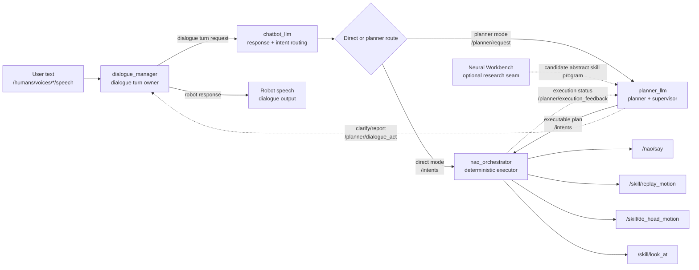
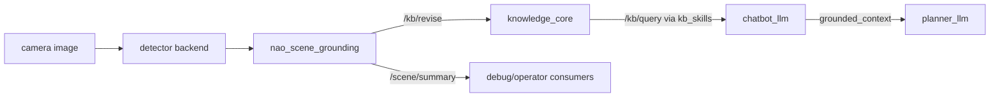
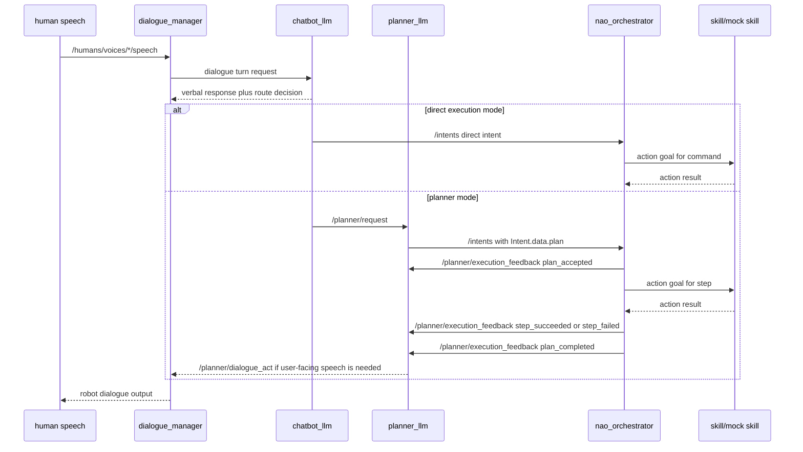

# Current Workflow

Last updated: 2026-04-27

This is the canonical workflow map for the active NAO ROS4HRI bridge. Historical
handoffs and old integration notes live in `docs/artifacts/`.

## Ownership

| Layer | Owner | Responsibility |
| --- | --- | --- |
| Dialogue | `dialogue_manager` | Dialogue lifecycle and speaking ownership |
| LLM dialogue | `chatbot_llm` | Response generation, intent declaration, planner routing, KB snapshot formatting |
| Planning | `planner_llm` | Goal supervision, plan generation, replanning, planner dialogue acts |
| Research planner seam | Neural Workbench | Optional candidate abstract skill program proposal before provider LLM planning |
| Contracts | `planner_common` | JSON contract normalization and helpers |
| AB registry | `skill_common` / Neural Workbench | Optional canonical AB object registry and exported planner skill view |
| Execution | `nao_orchestrator` | Deterministic intent validation, ordered skill execution, execution feedback |
| Knowledge | `kb_skills` | KnowledgeCore query/revise boundary |
| Object grounding | `nao_scene_grounding` | Detector-to-KB object facts and `/scene/summary` |
| Launch | `nao_chatbot` | Demo and robot launch profiles |

## Main Runtime Graph


```mermaid
flowchart LR
    user["User text<br/>/humans/voices/*/speech"] --> dm["dialogue_manager<br/>dialogue turn owner"]
    dm -->|dialogue turn request| chatbot["chatbot_llm<br/>response + intent routing"]
    chatbot --> route{"Direct or planner route"}

    route -->|direct mode<br/>/intents| orch["nao_orchestrator<br/>deterministic executor"]
    route -->|planner mode<br/>/planner/request| planner["planner_llm<br/>planner + supervisor"]

    workbench["Neural Workbench<br/>optional research seam"] -.->|candidate abstract skill program| planner
    planner -->|executable plan<br/>/intents| orch
    orch -.->|execution status<br/>/planner/execution_feedback| planner
    planner -.->|clarify/report<br/>/planner/dialogue_act| dm

    dm -->|robot response| speech_out["Robot speech<br/>dialogue output"]
    orch --> say["/nao/say"]
    orch --> replay["/skill/replay_motion"]
    orch --> head["/skill/do_head_motion"]
    orch --> look["/skill/look_at"]
```

The interaction starts with user text on `/humans/voices/*/speech`.
`dialogue_manager` owns the dialogue turn and calls `chatbot_llm`.
`chatbot_llm` then chooses either direct execution through `/intents` or planner
execution through `/planner/request`. The planner never speaks directly; it
publishes `/planner/dialogue_act` back to `dialogue_manager`.

The Neural Workbench seam is optional and planner-owned. When enabled,
`planner_llm` asks the external Workbench package for a candidate abstract skill
program before calling the configured LLM provider. The candidate is still
validated by the local `planner_llm` skill registry, and execution still flows
through `/intents` into `nao_orchestrator`.

## Grounded Scene Flow


```mermaid
flowchart LR
    cam["camera image"] --> detector["detector backend"]
    detector --> grounding["nao_scene_grounding"]
    grounding -->|/kb/revise| kb["knowledge_core"]
    grounding -->|/scene/summary| summary["debug/operator consumers"]
    kb -->|/kb/query via kb_skills| chatbot["chatbot_llm"]
    chatbot -->|grounded_context| planner["planner_llm"]
```

`nao_scene_grounding` does not directly control planning. It turns detector
observations into transient symbolic state and a compact summary. `chatbot_llm`
and future world-model enrichment consume that state through explicit contracts.

## Planner Loop


```mermaid
sequenceDiagram
    participant H as human speech
    participant D as dialogue_manager
    participant C as chatbot_llm
    participant P as planner_llm
    participant O as nao_orchestrator
    participant S as skill/mock skill

    H->>D: /humans/voices/*/speech
    D->>C: dialogue turn request
    C-->>D: verbal response plus route decision
    alt direct execution mode
        C->>O: /intents direct intent
        O->>S: action goal for command
        S-->>O: action result
    else planner mode
        C->>P: /planner/request
        P->>O: /intents with Intent.data.plan
        O->>P: /planner/execution_feedback plan_accepted
        O->>S: action goal for step
        S-->>O: action result
        O->>P: /planner/execution_feedback step_succeeded or step_failed
        O->>P: /planner/execution_feedback plan_completed
        P-->>D: /planner/dialogue_act if user-facing speech is needed
    end
    D-->>H: robot dialogue output
```

The Monday diagnostic should prove this loop with the smallest safe skill target
before adding richer demo behavior.

## Contract Currency

The important runtime currencies are:

- `/planner/request`: task ingress from `chatbot_llm` to `planner_llm`.
- `/intents`: executable downstream intent/plan from `planner_llm` or direct mode.
- `/planner/execution_feedback`: executor status back to the planner.
- `/planner/dialogue_act`: planner communication request without direct execution.
- `knowledge_snapshot`: chatbot prompt context from KnowledgeCore.
- `/scene/summary`: detector-grounded object summary for operators/future consumers.

The full shapes are in `docs/contracts.md`.

## AB Registry Seam

`planner_llm` can consume either the legacy planner registry JSON with top-level
`skills` or the canonical Neural Workbench AB registry JSON with top-level
`objects`.

When an AB registry is provided through `planner_skill_registry_path`,
`planner_llm` extracts planner-safe AB=1 `kind=skill` objects into its normal
`SkillRegistry`. AB=0 ROS surfaces such as `/planner/execution_feedback`,
`/scene/summary`, and KB query primitives remain part of the shared Workbench
and dashboard vocabulary, but they are not exposed as executable planner skills.

Example local source-level check:

```bash
PYTHONPATH=src/planner_common:src/planner_llm \
python3 - <<'PY'
from planner_llm.skill_registry import SkillRegistry

registry = SkillRegistry.load(
    "/Users/juanbendek/repos/Neural-Wokbench/src/skill_common/skill_common/defaults/ab_registry.json"
)
print(registry.allowed_skill_names)
print(registry.resolve_skill_name("look_around"))
PY
```

This is the first bridge-side step toward one shared capability vocabulary for
`planner_llm`, `chatbot_llm`, Neural Workbench, stack observation, and executor
mapping views.

## Stack Observer

The Neural Workbench `stack_observer` is not based on `rqt` yet. It is a small
ROS lifecycle observer plus import-light text/JSONL renderer. The current
implementation subscribes to planner/executor/scene topics and can replay a
JSONL trace into a text dashboard. This gives us a portable research view before
deciding whether the richer UI should become an `rqt` plugin, web dashboard, or
terminal dashboard.

No-ROS local smoke check:

```bash
PYTHONPATH=/Users/juanbendek/repos/Neural-Wokbench/src/skill_common:/Users/juanbendek/repos/Neural-Wokbench/src/neural_workbench:/Users/juanbendek/repos/Neural-Wokbench/src/stack_observer \
python3 - <<'PY'
from stack_observer import StackEvent, StackGraph, render_text_dashboard

graph = StackGraph()
graph.add(StackEvent.from_json_text("/planner/request", '{"goal_id":"goal_scan"}'))
graph.add(StackEvent.from_json_text("/planner/execution_feedback", '{"goal_id":"goal_scan","plan_id":"plan_scan"}'))
print(render_text_dashboard(graph))
PY
```

## Minimal Verification

```bash
ros2 topic info /planner/request
ros2 topic info /intents
ros2 topic info /planner/execution_feedback
ros2 topic info /planner/dialogue_act
ros2 action list -t
ros2 service list -t
```

Focused source-level tests:

```bash
PYTHONPATH=src/planner_common:src/planner_llm:src/nao_orchestrator:src/kb_skills \
python3 -m pytest -q \
  src/planner_common/test/test_contracts.py \
  src/planner_llm/test/test_planner_engine.py \
  src/planner_llm/test/test_skill_registry.py \
  src/planner_llm/test/test_supervisor.py \
  src/nao_orchestrator/test/test_nao_orchestrator_intent_rules.py
```
