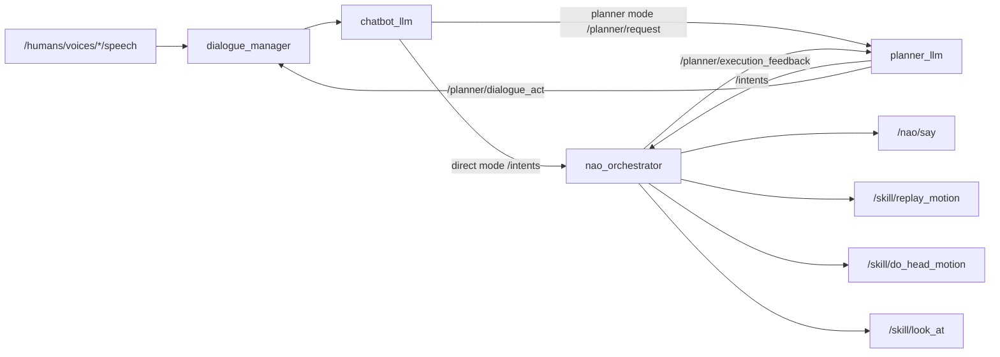
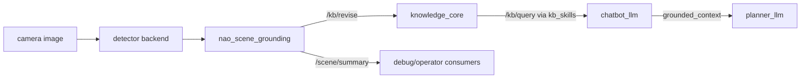
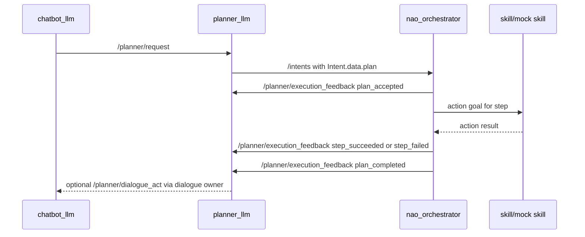

# Current Workflow

Last updated: 2026-04-24

This is the canonical workflow map for the active NAO ROS4HRI bridge. Historical
handoffs and old integration notes live in `docs/artifacts/`.

## Ownership

| Layer | Owner | Responsibility |
| --- | --- | --- |
| Dialogue | `dialogue_manager` | Dialogue lifecycle and speaking ownership |
| LLM dialogue | `chatbot_llm` | Response generation, intent declaration, planner routing, KB snapshot formatting |
| Planning | `planner_llm` | Goal supervision, plan generation, replanning, planner dialogue acts |
| Contracts | `planner_common` | JSON contract normalization and helpers |
| Execution | `nao_orchestrator` | Deterministic intent validation, ordered skill execution, execution feedback |
| Knowledge | `kb_skills` | KnowledgeCore query/revise boundary |
| Object grounding | `nao_scene_grounding` | Detector-to-KB object facts and `/scene/summary` |
| Launch | `nao_chatbot` | Demo and robot launch profiles |

## Main Runtime Graph


```mermaid
flowchart LR
    speech["/humans/voices/*/speech"] --> dm["dialogue_manager"]
    dm --> chatbot["chatbot_llm"]
    chatbot -->|direct mode /intents| orch["nao_orchestrator"]
    chatbot -->|planner mode /planner/request| planner["planner_llm"]
    planner -->|/intents| orch
    orch -->|/planner/execution_feedback| planner
    planner -->|/planner/dialogue_act| dm
    orch --> say["/nao/say"]
    orch --> replay["/skill/replay_motion"]
    orch --> head["/skill/do_head_motion"]
    orch --> look["/skill/look_at"]
```

## Grounded Scene Flow


```mermaid
flowchart LR
    cam["camera image"] --> detector["detector backend"]
    detector --> grounding["nao_scene_grounding"]
    grounding -->|/kb/revise| kb["knowledge_core"]
    grounding -->|/scene/summary| summary["debug/operator consumers"]
    kb -->|/kb/query via kb_skills| chatbot["chatbot_llm"]
    chatbot -->|grounded_context| planner["planner_llm"]
```

`nao_scene_grounding` does not directly control planning. It turns detector
observations into transient symbolic state and a compact summary. `chatbot_llm`
and future world-model enrichment consume that state through explicit contracts.

## Planner Loop


```mermaid
sequenceDiagram
    participant C as chatbot_llm
    participant P as planner_llm
    participant O as nao_orchestrator
    participant S as skill/mock skill

    C->>P: /planner/request
    P->>O: /intents with Intent.data.plan
    O->>P: /planner/execution_feedback plan_accepted
    O->>S: action goal for step
    S-->>O: action result
    O->>P: /planner/execution_feedback step_succeeded or step_failed
    O->>P: /planner/execution_feedback plan_completed
    P-->>C: optional /planner/dialogue_act via dialogue owner
```

The Monday diagnostic should prove this loop with the smallest safe skill target
before adding richer demo behavior.

## Contract Currency

The important runtime currencies are:

- `/planner/request`: task ingress from `chatbot_llm` to `planner_llm`.
- `/intents`: executable downstream intent/plan from `planner_llm` or direct mode.
- `/planner/execution_feedback`: executor status back to the planner.
- `/planner/dialogue_act`: planner communication request without direct execution.
- `knowledge_snapshot`: chatbot prompt context from KnowledgeCore.
- `/scene/summary`: detector-grounded object summary for operators/future consumers.

The full shapes are in `docs/contracts.md`.

## Minimal Verification

```bash
ros2 topic info /planner/request
ros2 topic info /intents
ros2 topic info /planner/execution_feedback
ros2 topic info /planner/dialogue_act
ros2 action list -t
ros2 service list -t
```

Focused source-level tests:

```bash
PYTHONPATH=src/planner_common:src/planner_llm:src/nao_orchestrator:src/kb_skills \
python3 -m pytest -q \
  src/planner_common/test/test_contracts.py \
  src/planner_llm/test/test_planner_engine.py \
  src/planner_llm/test/test_supervisor.py \
  src/nao_orchestrator/test/test_nao_orchestrator_intent_rules.py
```
