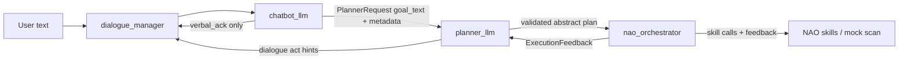

# Demo-Ready Handoff - 2026-05-05

## Current runtime target

Tomorrow's demo path is:



The important contract is still narrow: `chatbot_llm` speaks only the safe
acknowledgement text and hands execution goals to `planner_llm`; `planner_llm`
owns planning; `nao_orchestrator` owns deterministic execution.

## What changed since the previous clean commit

- Tightened the chatbot execution contract so JSON planner metadata is never
  spoken as TTS and deprecated `plan` hints are stripped from chatbot handoff.
- Removed the old `user_text` planner-consumption path in favor of `goal_text`.
- Moved demo multi-step parsing toward YAML/prompt-pack heuristics and planner
  ownership instead of local chatbot plan guesses.
- Introduced `IntentLabels` and shared planner contract helpers in
  `planner_common` so intent compatibility does not live in a one-off module.
- Formalized `scan` as a NAO skill contract in package metadata and the planner
  skill registry, with demo/mock execution behind `nao_orchestrator`.
- Renamed look-around demo behavior to the `scan` skill and kept the mock
  backend deterministic for no-robot validation.
- Cleaned the orchestrator execution path: less dead wrapper code, clearer
  result summaries, `on_failure=continue` support, and feedback status alignment.
- Preserved head-motion open-loop options for no-TF/no-robot debugging while
  keeping real robot launch profiles explicit.
- Reworked `nao_chatbot` launch sequencing so `dialogue_manager` waits for
  `chatbot_llm` lifecycle activation instead of racing the backend service.
- Added LLM preflight/warmup parameters for chatbot and planner models. Demo
  profiles now require preflight before the stack is considered ready.
- Changed demo/profile defaults to use `gemma4:31b-cloud` for both chatbot and
  planner after current Ollama cloud testing showed `qwen3.5:cloud` is gated and
  `qwen3-coder:480b-cloud` was timing out.
- Added visible startup markers: `[STACK]`, `[LLM PREFLIGHT]`, and
  `[STACK READY]` so rqt logs show selected models, enabled subsystems,
  lifecycle sequencing, and readiness.

## Supervisor feedback covered

- The stack now has a clearer separation between dialogue, planning, execution,
  and perception grounding.
- Demo paths no longer depend on hardcoded interaction scripts in the chatbot.
  Rule/mock behavior is limited to skill execution and provider fallback seams.
- Skill contracts are declared in the YAML/package registry path first, rather
  than only added directly to planner code.
- Runtime logs now make model readiness and lifecycle order visible enough for
  operator debugging.

## Current model policy

Primary model for tomorrow: `gemma4:31b-cloud` for both `chatbot_llm` and
`planner_llm`.

Known model results:

- `qwen3.5:cloud`: rejected by Ollama cloud subscription gating.
- `qwen3-coder:480b-cloud`: capable when it answers, but timed out in current
  live-stack tests.
- `gpt-oss:120b` / `gpt-oss:20b-cloud`: previously observed as weaker for this
  contract.
- Local `llama.cpp` endpoint remains the next fallback if cloud reliability
  drops again.

## Demo launch commands

Simulator/no-robot daily path:

```bash
source /opt/ros/jazzy/setup.bash
source /home/ubuntu/ws/install/setup.bash
ros2 launch nao_chatbot nao_chatbot_sim.launch.py \
  start_naoqi_driver:=true \
  start_object_detection:=true \
  start_scene_grounding:=true \
  object_detection_backend:=emorobcare_cv \
  nao_ip:=172.26.112.25 \
  network_interface:=wlp1s0 \
  ollama_model:=gemma4:31b-cloud \
  planner_llm_model:=gemma4:31b-cloud \
  start_planner_llm:=true \
  chatbot_planner_mode_enabled:=true
```

Robot/tools path:

```bash
source /opt/ros/jazzy/setup.bash
source /home/ubuntu/ws/install/setup.bash
ros2 launch nao_chatbot nao_chatbot_robot.launch.py \
  start_object_detection:=true \
  start_scene_grounding:=true \
  object_detection_backend:=emorobcare_cv \
  start_interaction_sim:=true \
  start_interaction_sim_perception:=false \
  start_interaction_sim_tools:=true \
  nao_ip:=172.26.112.25 \
  ollama_model:=gemma4:31b-cloud \
  planner_llm_model:=gemma4:31b-cloud \
  start_planner_llm:=true \
  chatbot_planner_mode_enabled:=true
```

## What to watch in rqt logs

- `[STACK] nao_chatbot launch` confirms selected chatbot/planner models.
- `[LLM PREFLIGHT] chatbot model ready` confirms chatbot response/intent model
  warmup.
- `[LLM PREFLIGHT] planner model ready` confirms planner provider warmup.
- `[STACK READY] chatbot_llm configured`, `[STACK READY] planner_llm ready`, and
  `[STACK READY] dialogue path active` mark the usable path.
- Planner backend failures should now emit `explain_failure`, not
  `ask_clarification`.

## Remaining gaps

- Real robot skill execution still needs hardware validation.
- The mock `scan` path proves planner/orchestrator routing, but the eventual
  production scan skill should revise KnowledgeCore through the scene-grounding
  contract once perception is stable.
- The planner-gate migration in `nao_orchestrator` is still a follow-up pass:
  today the chatbot publishes planner requests directly for the demo path.

## Suggested commit slices

1. `chatbot_llm: keep execution handoff speech-safe`
   Tighten response parsing, strip deprecated plan hints, route execution-shaped
   LLM failures to the planner with safe acknowledgement text, and cover JSON/TTS
   regressions.

2. `chatbot_llm: add planner handoff payload contract`
   Keep planner requests centered on `goal_text`, normalized intents, grounded
   context, dialogue context, and empty `requested_plan` for chatbot-originated
   execution turns.

3. `planner_common: consolidate intent labels and plan contracts`
   Move compatibility labels into shared contracts and remove one-off intent
   compatibility code.

4. `planner_llm: formalize skill registry and scan planning`
   Register `scan`, keep plans over abstract skills, and expand planner tests for
   motion and scene-inspection demo goals.

5. `nao_orchestrator: execute planner plans with clearer feedback`
   Clean dead wrappers, support continuation/failure policy, and publish more
   useful execution result summaries.

6. `nao_replay_motion: harden head-motion no-TF demos`
   Preserve open-loop/convergence timeout options for simulator and no-robot
   debugging while keeping robot-facing motion seams intact.

7. `nao_chatbot: repair lifecycle launch sequencing`
   Use lifecycle events so `dialogue_manager` starts after `chatbot_llm` is
   active across sim, robot, and ASR launch profiles.

8. `runtime: add LLM preflight and visible stack readiness`
   Warm chatbot/planner models before first user turn, require preflight in demo
   profiles, standardize on `gemma4:31b-cloud`, and add `[STACK]` log markers.

9. `docs: consolidate planner architecture and demo status`
   Replace scattered runtime notes with the current architecture/status docs and
   meeting-ready handoff.

10. `guardrails: update ROS4HRI LLM readiness checks`
    Teach the repo guardrail skill about model preflight, backend-failure
    classification, and preserving dialogue/planner/executor ownership.
