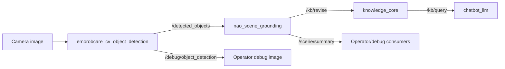
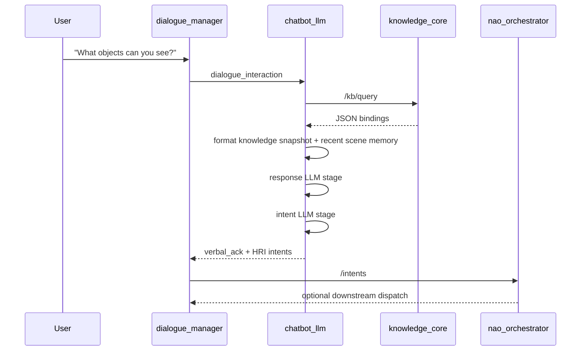

# Demo Status And Runtime Contracts

Last updated: 2026-03-25

This note is the high-level demo brief for the current migration checkpoint.
It focuses on what is live today, how the grounded scene reaches the LLM, and
the exact runtime contracts that matter during a walkthrough or review.

For the concise thesis-facing architecture summary and next-stage planning
direction, see [thesis_planning_handoff.md](./thesis_planning_handoff.md).
For launch commands and profile toggles, see
[launch_profiles.md](./launch_profiles.md).

## Executive Summary

The stack now demonstrates four major capabilities working together:

1. `knowledge_core` is part of the live dialogue and planner path through a
   dedicated `kb_skills` boundary for query and revise operations.
2. object detection is live through the emorobcare backend and is grounded into
   transient KB facts by `nao_scene_grounding`.
3. `chatbot_llm` injects a bounded symbolic scene snapshot into both the
   response and intent LLM stages.
4. `nao_orchestrator` consumes richer `Intent.data` payloads, including
   `ack_text`, `ack_mode`, `scene_targets`, and optional structured `plan`
   steps.

The main architectural point for the demo is this:

- raw perception does not go directly into `chatbot_llm`
- `nao_scene_grounding` turns raw detections into symbolic scene facts
- `chatbot_llm` reads those facts through `/kb/query`
- the LLM therefore reasons over a bounded, symbolic, grounded scene view

## What Is Implemented

| Area | Current status | Why it matters in the demo |
| --- | --- | --- |
| KB-aware chatbot turns | live | the robot can answer perception questions from grounded state instead of guessing |
| Shared KB client boundary | live in `kb_skills` | keeps KnowledgeCore transport out of LLM prompt code and future planner logic |
| Object detection backend | live through `emorobcare_cv` | lets us show live object grounding on the laptop camera |
| Detector-to-KB bridge | live in `nao_scene_grounding` | detector output becomes symbolic scene facts |
| Scene summary output | live contract in `/scene/summary` | gives operators and future consumers a compact world-state feed |
| Cross-turn scene memory | live in `chatbot_llm` | lets the robot talk about what changed across recent turns |
| Structured downstream intent metadata | live | supports acknowledgements and future plan-driven execution |
| `look_at` downstream seam | live at orchestrator/skill level | ready for follow-up target-frame grounding work |

## End-To-End Picture

### 1. Dialogue And Grounded Reasoning

```mermaid
flowchart LR
    U[User speech/text] --> DM[dialogue_manager]
    DM --> CLLM[chatbot_llm]
    KC[knowledge_core] -->|/kb/query| CLLM
    CLLM -->|spoken reply + intents| DM
    DM -->|/intents| ORCH[nao_orchestrator]
    ORCH --> SAY[/nao/say]
    ORCH --> RM[/skill/replay_motion]
    ORCH --> HM[/skill/do_head_motion]
    ORCH --> LA[/skill/look_at]
```

### 2. Object Detection To LLM Grounding



### 3. One Turn With Grounding



## Package Responsibility Split

| Package | Responsibility |
| --- | --- |
| `emorobcare_cv_object_detection` | raw detector inference and debug image publishing |
| `nao_scene_grounding` | detector normalization, identity stabilization, transient KB writes, `/scene/summary` |
| `knowledge_core` | symbolic world-state store |
| `kb_skills` | reusable KB query/mutation boundary and KB intent labels |
| `chatbot_llm` | prompt building, knowledge snapshot injection, recent scene memory, response + intent generation |
| `dialogue_manager` | dialogue lifecycle and speaking ownership |
| `nao_orchestrator` | downstream intent normalization and NAO skill dispatch |

## Runtime Contracts

## Raw Detector Contract

Current demo backend:

- topic: `/detected_objects`
- type: `emorobcare_cv_msgs/msg/ObjectDetections`

`ObjectDetections`:

```text
std_msgs/Header header
ObjectDetection[] detections
```

`ObjectDetection`:

```text
string label
float32 x1
float32 y1
float32 x2
float32 y2
float32 confidence
```

Important current detector note:

- the model is biased toward `blueberry`, `corn`, `pear`, `tomato`, and
  `zucchini`
- non-matching props or body regions can still get misclassified
- the detector is still useful for the demo because grounding happens after
  detection and the debug image makes the failure mode visible

## Internal Grounding Contract

`nao_scene_grounding` converts raw detections into the shared internal
`ObjectObservation` model:

```python
ObjectObservation(
    entity_id: str,
    label: str,
    kb_class: str,
    score: float,
    tracker_id: str,
    source: str,
    center_x: float,
    center_y: float,
)
```

Interpretation:

- `label`: normalized detector label such as `pear`
- `kb_class`: KnowledgeCore-friendly class such as `Pear`
- `entity_id`: stable symbolic id such as `detected_pear_320_240`
- `source`: current backend, for example `emorobcare_cv`
- `center_x`, `center_y`: 2D image-space center used for fallback identity

For emorobcare specifically:

- there is no tracker id in the raw message
- fallback entity ids start from bounding-box centers
- local temporal matching in `nao_scene_grounding` stabilizes those ids across
  nearby frames

## KnowledgeCore Write Contract

`nao_scene_grounding` writes transient facts through
`kb_skills.KnowledgeCoreMutationClient`, which forwards to `/kb/revise`.

Service contract:

```text
Request:
  string method
  string[] statements
  string[] models
  builtin_interfaces/Duration lifespan

Response:
  bool success
  string error_msg
```

Current write behavior per tracked object:

```text
method = "update"
statements = [
  "myself sees detected_pear_320_240",
  "detected_pear_320_240 rdf:type Pear"
]
models = []
lifespan = 4.0s by default
```

This is deliberately transient:

- `nao_scene_grounding` refreshes the facts while the object remains visible
- stale objects fall out of the local tracker and the KB facts expire naturally

## KnowledgeCore Read Contract

`chatbot_llm` reads grounded scene state through `/kb/query` using
`kb_skills.KnowledgeCoreQueryClient`.

Service contract:

```text
Request:
  string[] patterns
  string[] vars
  string[] models

Response:
  bool success
  string json
  string error_msg
```

Default query used by `chatbot_llm`:

```text
patterns:
  - myself sees ?entity
  - ?entity rdf:type ?type

vars:
  - ?entity
  - ?type

query group:
  - myself sees ?entity && ?entity rdf:type ?type
```

Default live parameters from `chatbot_llm/config/00-defaults.yml`:

| Parameter | Default |
| --- | --- |
| `knowledge_enabled` | `true` |
| `knowledge_query_service_name` | `/kb/query` |
| `knowledge_query_timeout_sec` | `0.5` |
| `knowledge_default_query_groups` | `myself sees ?entity && ?entity rdf:type ?type` |
| `knowledge_default_vars` | `?entity, ?type` |
| `knowledge_max_results` | `40` |
| `knowledge_max_chars` | `3000` |
| `scene_memory_turns` | `4` |

## Dialogue Role Override Contract

Each dialogue role may override the default KB snapshot policy through
`role.configuration` JSON:

```json
{
  "knowledge_snapshot": {
    "enabled": true,
    "query_groups": [
      "myself sees ?entity && ?entity rdf:type ?type"
    ],
    "patterns": [
      "myself sees ?entity",
      "?entity rdf:type ?type"
    ],
    "vars": ["?entity", "?type"],
    "models": [],
    "max_results": 40,
    "max_chars": 3000
  }
}
```

This matters because:

- the grounding seam is configurable without rewriting `chatbot_llm`
- different dialogue roles can later query different symbolic subsets

## Formatted Knowledge Snapshot Contract

The `/kb/query` JSON rows are not injected raw into the prompt. They are turned
into a bounded text block by `knowledge_snapshot.py`.

Example formatted snapshot:

```text
Entities currently seen by the robot: detected pear 320 240 (Pear), anonymous person dhgef (Human, Person)
Scene facts:
- detected pear 320 240 is currently classified as Pear
- anonymous person dhgef is currently classified as Human, Person
```

That snapshot is then wrapped into the final scene-context block used by both
LLM stages:

```text
Current grounded scene:
Entities currently seen by the robot: detected pear 320 240 (Pear), anonymous person dhgef (Human, Person)
Scene facts:
- detected pear 320 240 is currently classified as Pear
- anonymous person dhgef is currently classified as Human, Person

Recent scene memory from previous turns:
- Entities currently seen by the robot: book bkjwb (Book)
```

Key design point:

- the LLM sees both current grounded state and a short bounded recent-memory
  trail
- the prompt explicitly tells it to distinguish what is visible now from what
  was only seen earlier

## Exact LLM Injection Point

`chatbot_llm` injects the scene context into both prompt stages:

1. response generation
2. intent extraction

The prompt builder labels the block as:

```text
Live symbolic scene state from KnowledgeCore for this turn:
...
Knowledge snapshot:
<formatted scene context>
```

So the LLM is never told "here are raw detections". It is told "here is the
robot's best grounded symbolic view of the scene for this turn".

## `/scene/summary` Contract

`nao_scene_grounding` also publishes a compact operator-facing summary on:

- topic: `/scene/summary`
- type: `std_msgs/msg/String`
- payload: JSON string

Schema:

```json
{
  "backend": "emorobcare_cv",
  "objects": [
    {
      "center_x": 320.0,
      "center_y": 240.0,
      "entity_id": "detected_pear_320_240",
      "kb_class": "Pear",
      "label": "pear",
      "last_seen_sec": 1774380000.125,
      "score": 0.881,
      "source": "emorobcare_cv",
      "tracker_id": ""
    }
  ],
  "observer": "myself"
}
```

Important clarification:

- `/scene/summary` is for operators, debugging, and future consumers
- `chatbot_llm` does not currently subscribe to `/scene/summary`
- `chatbot_llm` still uses `/kb/query` as its single read-side seam

## Intent Contract After The LLM

Downstream intent messages are standard `hri_actions_msgs/msg/Intent`.

Important fields:

```text
string intent
string data
string source
string modality
uint8 priority
float32 confidence
```

The important local extension is inside `Intent.data`, which stays JSON.

Current useful keys:

- `object`
- `recipient`
- `goal`
- `input`
- `suggested_response`
- `ack_text`
- `ack_mode`
- `scene_targets`
- `plan_id`
- `validation_status`
- `failure_reason`
- `replan_hint`
- `retry_budget`
- `plan`

Example KB-query intent payload:

```json
{
  "goal": "visible_people",
  "suggested_response": "I can currently see one person.",
  "ack_text": "I can currently see one person.",
  "ack_mode": "say"
}
```

Example motion payload:

```json
{
  "object": "stand",
  "ack_text": "Sure.",
  "ack_mode": "say",
  "plan": [
    {
      "type": "skill",
      "name": "perform_motion",
      "args": {
        "object": "stand"
      }
    }
  ]
}
```

Example object-aware action payload:

```json
{
  "object": "cup",
  "ack_text": "I will bring the cup.",
  "ack_mode": "say",
  "scene_targets": ["cup"],
  "plan": [
    {
      "type": "skill",
      "name": "bring_object",
      "args": {
        "object": "cup"
      }
    }
  ]
}
```

## Plan Contract

Current supported planned step types in `nao_orchestrator`:

- `say`
- `skill`
- `look_at`
- `noop`

Current downstream behavior:

- `skill/perform_motion` is routed to replay motion or head motion
- `look_at` supports reset or target-frame dispatch
- `ack_text` is used as a spoken acknowledgement when speech dispatch is enabled
- `ack_mode` is currently informational, with `say` as the active convention
- planner-facing metadata can now carry validation and retry hints without
  changing the ROS message type
- `nao_orchestrator` publishes structured execution feedback on
  `/planner/execution_feedback` for future planner or world-model consumers

## Grounding Defaults In `nao_scene_grounding`

Useful current defaults:

| Parameter | Default |
| --- | --- |
| `detector_backend` | `emorobcare_cv` |
| `detector_topic` | `/detected_objects` |
| `summary_topic` | `~/summary` |
| `min_detection_score` | `0.35` |
| `allowed_labels` | `bottle,cup,book,cell phone,backpack,remote,laptop,keyboard,mouse,chair,blueberry,corn,pear,tomato,zucchini` |
| `entity_prefix` | `detected` |
| `observer_name` | `myself` |
| `knowledge_revise_service_name` | `/kb/revise` |
| `knowledge_lifespan_sec` | `4.0` |
| `knowledge_refresh_interval_sec` | `1.0` |
| `local_stale_after_sec` | `4.5` |

## What To Emphasize In The Demo

Good talking points:

1. The LLM is grounded through a symbolic read path, not through direct raw CV.
2. `nao_scene_grounding` is the continuous semantic filter between raw
   detections and the rest of the stack.
3. The same KB seam now serves both person/face awareness and object awareness.
4. The intent output is richer than before, but still stays within the standard
   ROS4HRI `Intent` message.
5. We have separated responsibilities cleanly:
   detector inference, scene grounding, LLM reasoning, and robot dispatch are
   no longer collapsed into one place.

## Suggested Demo Story

A short story that matches the current stack well:

1. show the simulator stack with the debug-ready `rqt` layout
2. show the HRI overlay and object detector debug image side by side
3. ask who is visible now
4. ask what objects are visible now
5. keep the conversation going for a few turns and show that the robot still
   distinguishes current grounded scene from recent memory
6. ask for a simple action such as waving to show that the intent path still
   reaches `nao_orchestrator`

## Known Caveats

- the emorobcare model is currently trained on a limited object set, so demo
  props should stay close to `blueberry`, `corn`, `pear`, `tomato`, and
  `zucchini`
- body regions can still be misclassified as one of those labels
- `ack_mode` is present in the contract, but only `say` is currently meaningful
- `/scene/summary` is published as JSON in a `std_msgs/String`, not a custom
  typed scene message yet
- planner-facing KB mutation support now lives in `kb_skills`, while
  `nao_scene_grounding` still owns the semantics of detector-derived writes

## Quick Validation Commands

```bash
ros2 topic list | egrep '/detected_objects|/debug/object_detection|/scene/summary|/intents'
ros2 topic echo /detected_objects --once
ros2 topic echo /scene/summary --once
ros2 service type /kb/query
ros2 service type /kb/revise
ros2 node list | egrep 'chatbot_llm|nao_scene_grounding|object_detector_node|nao_orchestrator'
```

## One-Line Summary

The current stack takes raw perception, grounds it into transient symbolic
scene facts, injects that grounded state into the LLM at turn time, and routes
the resulting enriched intents through a downstream orchestrator without
collapsing perception, reasoning, and execution into the same node.
