# Build & Deployment

# Build & Deployment

This module provides the infrastructure for building, testing, and deploying the NAO robot software stack. It implements a layered Docker image strategy, development tooling, and CI/CD hooks.

## Overview

The build system supports two Docker image profiles:

| Profile | Base Image | Purpose |
|---------|------------|---------|
| `overlay` | `iiia:nao` | Incremental builds on a validated runtime image |
| `full` | `ros:jazzy-ros-base` | Complete rebuild from upstream ROS base |

The overlay profile is optimized for development velocity—reusing a pre-validated NAOqi runtime stack and only rebuilding repository-owned packages. The full profile is used for creating new base images or when the overlay strategy isn't applicable.

## Docker Build Strategy

```mermaid
flowchart TD
    subgraph Overlay["Overlay Build (Development)"]
        A[Base Image<br/>iiia:nao] --> B[Remove stale src/]
        B --> C[Copy new src/]
        C --> D[Install missing deps]
        D --> E[Rebuild local packages]
        E --> F[Overlay Image<br/>iiia:nao-overlay]
    end

    subgraph Full["Full Build (Release)"]
        G[ros:jazzy-ros-base] --> H[Add SocialMinds repo]
        H --> I[Install all deps]
        I --> J[Copy src/]
        J --> K[Build all packages]
        K --> L[Full Image]
    end
```



### Image Layers

Both Dockerfiles follow the same conceptual layers:

1. **Runtime dependencies** — GStreamer, Python packages, ROS packages
2. **SocialMinds packages** — HRI, knowledge, UI packages from apt repository
3. **Local workspace** — Repository packages built via `colcon build`
4. **Entrypoint** — Sources ROS and workspace, optionally builds detector packages

### Package Rebuild Strategy

The overlay Dockerfile rebuilds specific packages to ensure changes are reflected:

```bash
rebuild_packages=(
  kb_skills
  dialogue_manager
  asr_vosk
  chatbot_llm
  planner_common
  planner_llm
  nao_say_skill
  nao_replay_motion
  nao_look_at
  nao_orchestrator
  nao_scene_grounding
  nao_chatbot
  simple_audio_capture
)
```

Optional packages (`emorobcare_cv_msgs`, `emorobcare_cv_object_detection`, `my_game_interface`) are conditionally included when their source directories exist.

## Key Components

### Dockerfiles

#### `docker/Dockerfile` (Overlay)

Builds incrementally on `iiia:nao`:

- Removes stale source tree to prevent deleted files from persisting
- Copies `src/` into the workspace
- Installs only missing dependencies (checks with `dpkg -s`)
- Rebuilds local packages with `colcon build --symlink-install --packages-up-to`

#### `docker/Dockerfile.full` (Full)

Builds from upstream `ros:jazzy-ros-base`:

- Adds SocialMinds apt repository for ROS4HRI packages
- Installs all required system and ROS packages
- Installs Python packages: vosk, PyTorch (CPU), ultralytics
- Builds all workspace packages

#### `docker/ros_entrypoint.sh`

Runtime entrypoint that:

1. Sources `/opt/ros/jazzy/setup.bash`
2. Sources `/home/ubuntu/ws/install/setup.bash` if available
3. Optionally builds detector packages when sources exist but aren't installed
4. Lists available NAO-related packages for verification

The `AUTO_BUILD_OPTIONAL_WS_PACKAGES` environment variable controls optional package building (default: `1`).

### Build Scripts

#### `scripts/build_docker.sh`

Builds Docker images with profile selection:

```bash
# Overlay build (default)
./scripts/build_docker.sh overlay iiia:nao-overlay

# Full build
./scripts/build_docker.sh full iiia:nao-full

# Custom base image for overlay
BASE_IMAGE=iiia:nao-working-legacy ./scripts/build_docker.sh overlay iiia:nao
```

**Safety check**: Refuses to build overlay when `TAG` equals `BASE_IMAGE` to prevent recursive layering.

Uses BuildKit (`docker buildx`) when available for better output; falls back to legacy builder otherwise.

#### `scripts/export_docker_image.sh` / `scripts/import_docker_image.sh`

Image transfer utilities for air-gapped deployment:

```bash
# Export
./scripts/export_docker_image.sh iiia:nao docker/iiia_nao_image.tar.gz

# Import
./scripts/import_docker_image.sh docker/iiia_nao_image.tar.gz
```

### Bootstrap Script

#### `scripts/bootstrap_socialminds_sources.sh`

Clones reference and workspace packages:

**Reference sources** (outside active workspace, for documentation/testing):
- `kb_msgs`, `knowledge_core`, `interaction_sim`, `oro`

**Workspace sources** (under `src/` for graph coverage):
- `interaction_skills`, `std_skills`, `motions_skills`

**Optional sources** (via environment variables):
- `EMOROBCARE_CV_MSGS_REPO`
- `EMOROBCARE_CV_OBJECT_DETECTION_REPO`
- `MY_GAME_INTERFACE_REPO`

### Development Scripts

#### `scripts/setup_dev_tools.sh`

Creates Python virtual environment and installs development dependencies:

```bash
./scripts/setup_dev_tools.sh
source .venv/bin/activate
```

Installs from `requirements-dev.txt`:
- `pre-commit>=3.5.0`
- `pytest>=7.0.0`
- `ruff>=0.9.0`

#### `scripts/run_tests.sh`

Comprehensive test runner executing 10 phases:

| Phase | Description | Dependencies |
|-------|-------------|--------------|
| 1 | Python syntax checks | None |
| 2 | `nao_chatbot` unit tests | None |
| 3 | `kb_skills` unit tests | None |
| 4 | `planner_common`/`planner_llm` unit tests | None |
| 5 | `chatbot_llm` unit tests | `hri_actions_msgs`, `chatbot_msgs` |
| 6 | `dialogue_manager` unit tests | `numpy` |
| 7 | `asr_vosk` unit tests | None |
| 8 | `simple_audio_capture` unit tests | None |
| 9 | Migration package unit tests | `numpy` (partial fallback) |
| 10 | Launch file smoke tests | Built workspace |

The script sources ROS and workspace setups when available, enabling ROS message imports for tests that require them.

### Pre-commit Hooks

#### `scripts/run_precommit.sh`

Wrapper that activates the virtual environment and runs `pre-commit run --all-files`.

#### Python Hook Scripts

| Script | Purpose |
|--------|---------|
| `precommit_check_merge_conflict.py` | Detects `<<<<<<<`, `=======`, `>>>>>>>`, `|||||||` markers |
| `precommit_check_yaml.py` | Validates YAML syntax using `yaml.safe_load_all` |
| `precommit_fix_eof.py` | Ensures files end with a single newline, preserving CRLF/LF convention |
| `precommit_trim_trailing_whitespace.py` | Removes trailing spaces/tabs, preserves Markdown double-space line breaks |

All scripts return `1` if changes were made (for pre-commit autofix behavior) or if errors found.

## Usage

### Development Workflow

```bash
# 1. Set up development environment
./scripts/setup_dev_tools.sh
source .venv/bin/activate

# 2. Bootstrap external sources (optional)
./scripts/bootstrap_socialminds_sources.sh

# 3. Run pre-commit checks
./scripts/run_precommit.sh

# 4. Run tests
./scripts/run_tests.sh
```

### Docker Build Workflow

```bash
# Development: overlay build on existing base
./scripts/build_docker.sh overlay iiia:nao-dev

# Release: full build from scratch
./scripts/build_docker.sh full iiia:nao-$(date +%Y%m%d)

# Export for deployment
./scripts/export_docker_image.sh iiia:nao-$(date +%Y%m%d) release.tar.gz
```

### Running Containers

```bash
# Interactive session
docker run -it --rm --net=host iiia:nao-overlay

# With optional detector build disabled
docker run -it --rm --net=host -e AUTO_BUILD_OPTIONAL_WS_PACKAGES=0 iiia:nao-overlay
```

## Dependencies

### System Packages (Docker)

- **GStreamer**: Audio/video capture and streaming
- **Python**: `python3-colcon-common-extensions`, `python3-opencv`, `python3-matplotlib`, etc.
- **ROS Jazzy**: `cv-bridge`, `gscam`, `image-transport-plugins`, `rosbridge-server`, `rqt-*`

### SocialMinds Packages

Runtime dependencies from the SocialMinds apt repository:

- HRI stack: `hri-msgs`, `hri-emotion-*`, `hri-person-manager`, `hri-visualization`
- Knowledge: `kb-msgs`, `knowledge-core`, `oro`
- UI: `ui-msgs`, `ui-server`, `rqt-chat`, `rqt-human-radar`
- NAO: `naoqi-driver`, `naoqi-bridge-msgs`

### Python Packages (pip)

- **Speech**: `vosk`, `pyasyncore`, `pyasynchat`
- **ML**: `torch`, `torchvision` (CPU), `ultralytics`
