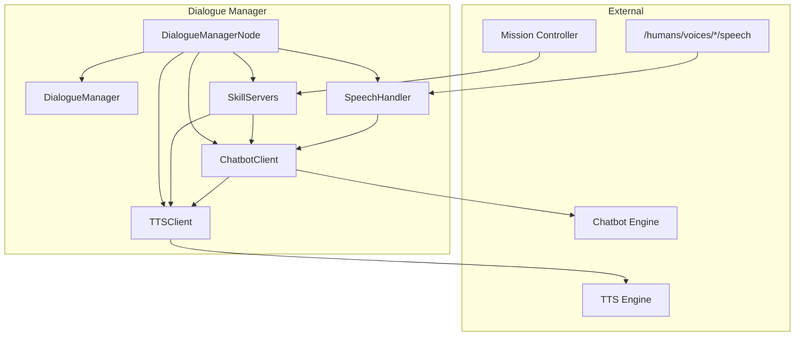

# Dialogue Management

# Dialogue Manager

A ROS2 lifecycle package for dialogue tracking and communication skills (`chat`, `ask`, `say`). The Dialogue Manager orchestrates speech input, chatbot interactions, and text-to-speech output for human-robot dialogue.

## Overview

The Dialogue Manager provides:

- **Dialogue tracking** — Manages multiple concurrent dialogue sessions with priority-based arbitration
- **Speech routing** — Routes user speech to active dialogues or publishes as raw intents
- **Communication skills** — Implements `chat`, `ask`, and `say` actions for mission controllers
- **Multi-modal output** — Synchronized speech and expression capabilities



## Core Components

### DialogueManagerNode

The main lifecycle node (`manager_node.py`) orchestrates all components:

- **on_configure** — Creates publishers, clients, and handlers
- **on_activate** — Subscribes to voice topics, optionally starts default chat
- **on_deactivate** — Unsubscribes, disables servers, clears dialogues
- **on_shutdown** — Destroys all handlers

### DialogueManager

Tracks active dialogues and manages priority arbitration:

```python
from dialogue_manager.dialogue import Dialogue, DialogueManager, DialogueState

manager = DialogueManager()

# Add a dialogue
dialogue = Dialogue(role=role, person_id='person_123', priority=150)
manager.add_dialogue(dialogue)

# Check if a new goal can be accepted
if manager.can_accept_priority(200):
    # Higher priority - can proceed
    pass

# Find dialogue for a person
dialogue = manager.get_dialogue_for_person('person_123')
```

**Dialogue States:**

| State | Description |
|-------|-------------|
| `PENDING` | Created but not yet started with chatbot |
| `ACTIVE` | Processing normally |
| `WAITING_RESPONSE` | Awaiting chatbot response |
| `COMPLETED` | Dialogue finished |

### ChatbotClient

Manages dialogue sessions with the chatbot backend:

- Creates action client for `<chatbot>/start_dialogue`
- Creates service client for `<chatbot>/dialogue_interaction`
- Publishes intents to `/intents` when detected
- Publishes waiting state to `~/currently_waiting_for_chatbot_response`

### TTSClient

Handles text-to-speech interactions:

- Creates action client for `tts_engine/tts`
- Publishes closed captions for robot speech
- Forwards word-by-word feedback to `~/robot_speech`
- Manages expression priority during speech

### SpeechHandler

Manages dynamic subscriptions to voice topics:

- Subscribes to `/humans/voices/tracked` for voice discovery
- Creates per-voice subscriptions to `/humans/voices/<id>/speech`
- Routes speech to active dialogues or publishes `RAW_USER_INPUT` intent

### SkillServers

Implements three action servers:

| Action | Purpose |
|--------|---------|
| `/skill/chat` | Open-ended dialogue with defined role |
| `/skill/ask` | Ask question, get structured answer |
| `/skill/say` | Speak multi-modal expression |

## ROS API

### Parameters

| Parameter | Type | Default | Description |
|-----------|------|---------|-------------|
| `chatbot` | string | `"chatbot"` | Chatbot node FQN prefix. Empty = disabled |
| `enable_default_chat` | bool | `false` | Enable default chat while active |
| `default_chat_role` | string | `"__default__"` | Role for default chat |
| `default_chat_configuration` | string | `""` | Configuration for default chat |
| `chatbot_startup_timeout` | float | `30.0` | Max wait for chatbot startup (s) |
| `chatbot_response_timeout` | float | `5.0` | Max wait for chatbot response (s) |
| `multi_modal_expression_timeout` | float | `60.0` | Max expression duration (s) |
| `markup_action_timeout` | float | `10.0` | Default markup action timeout (s) |
| `markup_libraries` | string[] | `["config/00-default_markup_libraries.json"]` | Markup definition files |
| `disabled_markup_actions` | string[] | `["motion"]` | Markup actions to skip |

### Topics

#### Subscribed

| Topic | Type | Description |
|-------|------|-------------|
| `/humans/voices/tracked` | `hri_msgs/IdsList` | Tracked voice IDs |
| `/humans/voices/<id>/speech` | `hri_msgs/LiveSpeech` | User speech input |

#### Published

| Topic | Type | Description |
|-------|------|-------------|
| `~/closed_captions` | `hri_actions_msgs/ClosedCaption` | Captions for all speech |
| `~/robot_speech` | `std_msgs/String` | Current word being spoken |
| `~/currently_waiting_for_chatbot_response` | `std_msgs/Bool` | True while awaiting chatbot |
| `/intents` | `hri_actions_msgs/Intent` | Detected intents |
| `/diagnostics` | `diagnostic_msgs/DiagnosticArray` | Node diagnostics |

### Action Servers

| Action | Interface | Description |
|--------|-----------|-------------|
| `/skill/chat` | `communication_skills/Chat` | Start dialogue with defined role |
| `/skill/ask` | `communication_skills/Ask` | Ask question, get structured answer |
| `/skill/say` | `communication_skills/Say` | Speak multi-modal expression |

**Priority handling:** Goals are rejected if `meta.priority` ≤ any ongoing dialogue or expression priority.

### Action Clients

| Action | Interface | Description |
|--------|-----------|-------------|
| `<chatbot>/start_dialogue` | `chatbot_msgs/Dialogue` | Open dialogue channel |
| `tts_engine/tts` | `tts_msgs/TTS` | Text-to-speech |

### Service Clients

| Service | Interface | Description |
|---------|-----------|-------------|
| `<chatbot>/dialogue_interaction` | `chatbot_msgs/DialogueInteraction` | Send input, get response |

## Lifecycle States

Topics and services are only available in the `active` state. Action servers exist in both `configured` and `active` states but reject goals in `configured`.

```
[Unconfigured] --configure--> [Inactive] --activate--> [Active]
      ^                          |                          |
      |                          |                          |
      +-------shutdown-----------+        deactivate--------+
```

## Usage

### Launch

```bash
ros2 launch dialogue_manager dialogue_manager.launch.py
```

Or with the migration stack:

```bash
ros2 launch nao_chatbot nao_chatbot_ros4hri_migration.launch.py
```

### Programmatic Usage

```python
from dialogue_manager.dialogue import Dialogue, DialogueManager, DialogueState
from chatbot_msgs.msg import DialogueRole

# Create a dialogue
role = DialogueRole()
role.name = 'assistant'
role.configuration = '{"style": "friendly"}'

dialogue = Dialogue(
    role=role,
    person_id='person_123',
    priority=150,
    state=DialogueState.PENDING
)

# Track it
manager = DialogueManager()
manager.add_dialogue(dialogue)

# Check priority
print(f"Current max priority: {manager.current_max_priority}")
print(f"Can accept priority 200: {manager.can_accept_priority(200)}")
```

### Chat Action Example

```python
from communication_skills.action import Chat
from rclpy.action import ActionClient

# Create client
client = ActionClient(node, Chat, '/skill/chat')

# Send goal
goal = Chat.Goal()
goal.role.name = 'assistant'
goal.person_id = 'person_123'
goal.meta.priority = 150
goal.initiate = True

future = client.send_goal_async(goal)
```

### Say Action Example

```python
from communication_skills.action import Say

goal = Say.Goal()
goal.input = "Hello, I'm ready to help."
goal.meta.priority = 200

future = client.send_goal_async(goal)
```

## Speech Flow

1. **Voice Discovery** — `SpeechHandler` subscribes to `/humans/voices/tracked`
2. **Dynamic Subscription** — For each tracked voice, subscribes to `/humans/voices/<id>/speech`
3. **Speech Processing** — On final speech:
   - If chatbot waiting: ignore (busy)
   - If chatbot disabled: publish `RAW_USER_INPUT` intent
   - If dialogue exists for person: route to chatbot
   - If default dialogue exists: route to default
   - Otherwise: publish `RAW_USER_INPUT` intent
4. **Response** — Chatbot response spoken via TTS, intents published

## Priority System

Dialogues and expressions use priority values (0-255):

- **Higher priority wins** — Goals with priority ≤ current max are rejected
- **Default chat uses priority 0** — Lowest priority, always preemptable
- **Expressions block lower-priority actions** — TTS speech sets expression priority

```python
# Expression priority management
manager.set_expression_priority(200)  # During speech
# ... speech completes ...
manager.clear_expression_priority()    # Clear after
```

## Configuration

Default configuration in `config/00-defaults.yml`:

```yaml
/dialogue_manager:
  ros__parameters:
    chatbot: "chatbot"
    enable_default_chat: false
    default_chat_role: "__default__"
    chatbot_startup_timeout: 30.0
    chatbot_response_timeout: 5.0
    multi_modal_expression_timeout: 60.0
    markup_action_timeout: 10.0
    markup_libraries:
      - "config/00-default_markup_libraries.json"
    disabled_markup_actions:
      - "motion"
```

## Migration Notes

- The `chatbot` parameter should point to `chatbot_llm` in the current migration
- A temporary executable alias `dialogue_manager_node` exists for backward compatibility
- The old local bridge implementation is archived under `.migration_backups/`
- NAO-specific dialogue behavior should stay outside this package unless upstreamable
