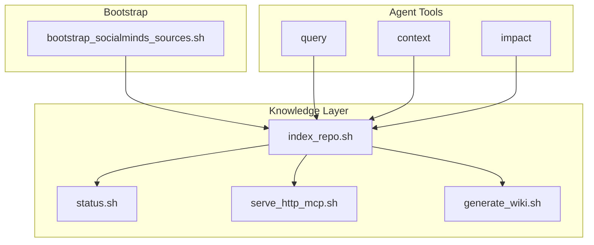

# Documentation — AGENTS.md

# AGENTS.md — Agent Guidance Module

## Overview

`AGENTS.md` serves as the entry point for AI agents working in this repository. It documents the GitNexus knowledge layer integration and establishes preferred workflows for code exploration, debugging, and refactoring tasks.

## Purpose

This module provides:

1. **Tool Discovery** — Points agents to the GitNexus MCP tools available under `tools/knowledge/`
2. **Usage Guidance** — Establishes when to use knowledge layer tools vs. direct source access
3. **Workflow Patterns** — Defines recommended sequences for common development tasks
4. **Maintenance Procedures** — Documents how to keep the knowledge index synchronized with code changes

## Knowledge Layer Architecture

The repository integrates GitNexus, a code analysis backend that maintains a graph-based index of symbols, calls, and relationships. This knowledge layer lives under `tools/knowledge/`.



## Tool Reference

### Status and Health

| Script | Purpose |
|--------|---------|
| `tools/knowledge/status.sh` | Confirms whether the index is fresh before architecture-sensitive work |
| `tools/knowledge/index_repo.sh` | Refreshes the local index after major code changes or when GitNexus reports staleness |

### Bootstrap and Setup

| Script | Purpose |
|--------|---------|
| `scripts/bootstrap_socialminds_sources.sh` | Must run before the first serious graph pass — exposes ignored ROS4HRI source packages and reference KB stack to GitNexus |

### Wiki and Documentation

| Script | Purpose |
|--------|---------|
| `tools/knowledge/generate_wiki.sh` | Manual, LLM-backed wiki synchronization |

### MCP Serving

| Script | Purpose |
|--------|---------|
| `tools/knowledge/serve_http_mcp.sh` | Optional remote MCP serving |
| `tools/knowledge/codex_with_gitnexus.sh` | Use with `GITNEXUS_USE_HTTP=1` when HTTP backend is running |

## Workflows

### Exploration Workflow

```
query → context → source reads
```

1. Start with `query` to find relevant symbols
2. Use `context` to understand relationships
3. Read source files directly to confirm details

### Debugging Workflow

```
query (symptom) → context (suspect) → source confirmation
```

1. `query` the symptom or error pattern
2. `context` the suspected symbol
3. Confirm findings in source code

### Refactoring Workflow

```
context + impact → edits → refresh graph
```

1. Run `context` and `impact` before making edits
2. Perform the refactoring
3. Refresh the graph with `tools/knowledge/index_repo.sh`

### Live UI Sessions

When the GitNexus HTTP backend is already running:

1. Set `GITNEXUS_USE_HTTP=1`
2. Run `tools/knowledge/codex_with_gitnexus.sh`
3. Verify with `codex mcp list` — the shared backend appears as `gitnexus_http`
4. Avoid direct local CLI graph calls against the same running repo database

## Trust Hierarchy

When GitNexus and source code disagree:

1. **Trust the code** — Source files are the source of truth
2. **Call out mismatches** — Report discrepancies for investigation
3. **Use grep and file reads as fallback** — Direct access remains the verification path

## Related Documentation

- `docs/knowledge/WORKFLOWS.md` — Extended workflow documentation
