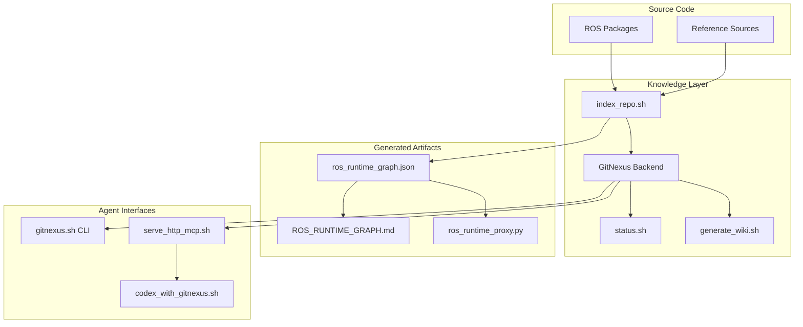

# Documentation — knowledge

# Knowledge Layer Documentation

## Overview

The `docs/knowledge/` module provides a tracked documentation surface for code intelligence in the nao-ros4hri-bridge repository. It uses GitNexus as a local backend to build and query a semantic graph of the codebase, making ROS runtime relationships, package dependencies, and cross-module flows discoverable for both human developers and AI agents.

This layer serves three purposes:

1. **Index Management** — Scripts to build, refresh, and query a local GitNexus graph database
2. **ROS Runtime Documentation** — Auto-generated artifacts that make ROS topics, services, and actions explicit
3. **Agent Integration** — Configuration and workflows for AI coding assistants to leverage the knowledge graph

## Architecture



## Key Components

### Documentation Files

| File | Purpose |
|------|---------|
| `README.md` | Entry point and primary reference |
| `QUICKSTART.md` | Fastest path to a working setup |
| `WORKFLOWS.md` | Graph-guided agent playbooks |
| `DECISIONS.md` | Architectural decisions about the knowledge layer |
| `EVAL.md` | Evaluation criteria for GitNexus effectiveness |
| `INDEX_STATUS.md` | Current index metadata (commit, timestamp, node counts) |

### Generated Artifacts

**`ros_runtime_graph.json`** — Machine-readable ROS endpoint registry containing:
- All packages with their publishers, subscribers, service clients/servers, and action clients/servers
- Endpoint-to-package mappings with contract annotations
- Cross-package flow relationships

**`ROS_RUNTIME_GRAPH.md`** — Human-readable tables showing:
- Package-level endpoint summaries
- Shared runtime endpoints with publisher/subscriber lists
- Contract definitions for skill interfaces

**`ros_runtime_proxy.py`** — Python module that makes ROS seams explicit for GitNexus indexing. Each function returns a ROS endpoint string, and flow functions trace publisher→topic→subscriber chains.

### Tools (`tools/knowledge/`)

| Script | Function |
|--------|----------|
| `setup_gitnexus.sh` | Install GitNexus backend (first-time setup) |
| `index_repo.sh` | Build or refresh the knowledge graph |
| `status.sh` | Display index metadata |
| `generate_wiki.sh` | Sync GitNexus wiki to `docs/knowledge/wiki/` |
| `serve_http_mcp.sh` | Start HTTP MCP backend for shared agent access |
| `codex_with_gitnexus.sh` | Launch Codex with GitNexus MCP integration |
| `gitnexus.sh` | Direct CLI wrapper for GitNexus commands |
| `post_commit_refresh.sh` | Refresh index after commits |
| `pre_commit_advisory.sh` | Advisory check (does not refresh) |
| `generate_ros_graph_proxy.py` | Regenerate ROS runtime artifacts |
| `ros_graph_overrides.json` | Manual overrides for launch-specific endpoint rewrites |

## ROS Runtime Graph

The knowledge layer generates explicit documentation of ROS runtime seams that static analysis alone cannot infer. This captures:

### Endpoint Types

- **Topics**: `/audio`, `/intents`, `/diagnostics`, `/speech`
- **Services**: `/kb/query`, `/chatbot_llm/dialogue_interaction`
- **Actions**: `/nao/say`, `/skill/look_at`, `/chatbot_llm/start_dialogue`

### Key Runtime Flows

The `ros_runtime_proxy.py` file defines flow functions that trace message paths:

```python
def ros_flow_topic_intents():
    """Publisher/subscriber flow for /intents."""
    ros_node_dialogue_manager()      # Publisher
    ros_topic_intents()              # Topic
    ros_node_nao_orchestrator()      # Subscriber
```

### Contract Packages

Some packages define interface contracts without implementation:

| Package | Contracts |
|---------|-----------|
| `communication_skills` | `/skill/ask`, `/skill/chat`, `/skill/say` |
| `interaction_skills` | `/skill/look_at`, `/skill/do_led_effect`, `/skill/set_expression` |
| `nao_skills` | `/skill/do_head_motion`, `/skill/do_posture`, `/skill/replay_motion` |
| `kb_skills` | `/kb/query`, `/kb/revise` |

## GitNexus Integration

### Index Configuration

The repository uses `.gitnexusignore` (not `.gitignore`) to include graph-relevant packages that are otherwise excluded from version control:

```
src/chatbot_llm/
src/dialogue_manager/
ref_src/knowledge_sources/
```

Run `scripts/bootstrap_socialminds_sources.sh` before indexing to clone upstream packages.

### Index Status

Current index metadata (from `INDEX_STATUS.md`):

```
Backend: GitNexus 1.5.3
Files: 426
Nodes: 3463
Edges: 9503
Communities: 175
Processes: 276
```

### Refresh Workflow

```bash
# After code changes
tools/knowledge/post_commit_refresh.sh

# Or force full reindex
tools/knowledge/index_repo.sh --force
```

**Important**: If the HTTP backend is running, avoid direct CLI graph calls against the same database to prevent file locks. Use `GITNEXUS_USE_HTTP=1` to share the running backend.

## Agent Integration

### Codex Integration

```bash
# Start with local GitNexus
tools/knowledge/codex_with_gitnexus.sh

# Or share HTTP backend
GITNEXUS_USE_HTTP=1 tools/knowledge/codex_with_gitnexus.sh
```

In HTTP mode, `codex mcp list` shows `gitnexus_http` as the shared backend.

### Cursor Integration

The `.cursor/mcp.json` configuration enables GitNexus queries from Cursor IDE.

### Claude Skills

Located in `.claude/skills/gitnexus/`:
- `gitnexus-cli` — Direct command-line queries
- `gitnexus-debugging` — Debug workflows using graph context
- `gitnexus-exploring` — Code exploration patterns
- `gitnexus-impact-analysis` — Change impact assessment
- `gitnexus-refactoring` — Safe refactoring workflows

## Workflows

### Exploration Pattern

```bash
# 1. Query for symbol
./tools/knowledge/gitnexus.sh query <symbol>

# 2. Get context
./tools/knowledge/gitnexus.sh context <symbol>

# 3. Confirm in source
```

### Refactoring Pattern

```bash
# 1. Get context + impact before edits
./tools/knowledge/gitnexus.sh context <symbol>
./tools/knowledge/gitnexus.sh impact <symbol>

# 2. Make changes

# 3. Refresh graph
tools/knowledge/post_commit_refresh.sh
```

### ROS Endpoint Investigation

Use `docs/knowledge/ROS_RUNTIME_GRAPH.md` to trace:
1. Which packages publish/subscribe to a topic
2. Which packages implement vs. consume a service
3. Action server/client relationships

For programmatic access, query `ros_runtime_graph.json` or import `ros_runtime_proxy.py`.

## Source Coverage

The knowledge layer intentionally includes packages ignored by git:

| Path | Source | Included Via |
|------|--------|--------------|
| `src/chatbot_llm/` | Bootstrapped | `.gitnexusignore` |
| `src/dialogue_manager/` | Bootstrapped | `.gitnexusignore` |
| `ref_src/knowledge_sources/` | Cloned upstream | `.gitnexusignore` + bootstrap script |

Run `scripts/bootstrap_socialminds_sources.sh` before the first serious graph pass to populate these directories.

## ROS Graph Overrides

Static analysis cannot reliably infer all runtime endpoints. The `ros_graph_overrides.json` file provides manual hints:

```json
{
  "endpoint_rewrites": {
    "/namespace/service": "/actual/runtime/service"
  }
}
```

This is useful for:
- Namespaced services that differ from source
- Cross-package endpoint rewrites at launch time
- Remapped topics in specific launch configurations