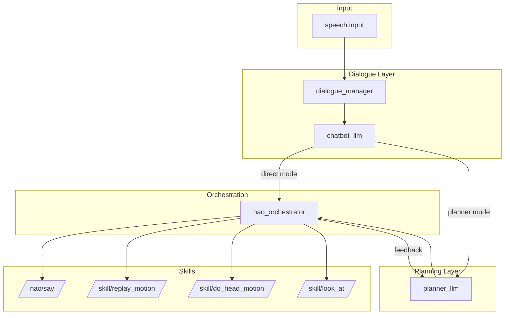
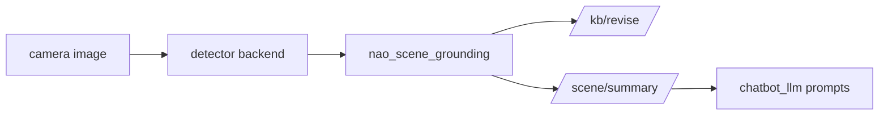

# Documentation — README.md

# NAO ROS4HRI Bridge

ROS 2 Jazzy workspace providing the runtime stack for NAO robot human-robot interaction. The workspace integrates dialogue management, intent orchestration, skill execution, and optional knowledge grounding through a modular package architecture.

## Architecture Overview

The workspace separates concerns across four package categories:

| Category | Purpose | Packages |
|----------|---------|----------|
| Robot-side runtime | NAO-specific execution and orchestration | `nao_chatbot`, `nao_orchestrator`, `nao_say_skill`, `nao_replay_motion`, `nao_look_at`, `nao_scene_grounding` |
| Fork-tracked upstream | Dialogue and LLM interaction | `dialogue_manager`, `chatbot_llm` |
| Interface definitions | Message/service contracts | `communication_skills`, `nao_skills`, `motions_skills`, `std_skills` |
| Optional external | Knowledge base and simulator | `knowledge_core`, `kb_msgs`, `interaction_sim`, `oro` |

## Execution Flow

Two primary execution paths exist: direct-execution mode and planner-enabled mode.



### Direct-Execution Mode

Default path where `chatbot_llm` outputs intents directly to `nao_orchestrator`:

```
speech input -> dialogue_manager -> chatbot_llm
    -> /intents -> nao_orchestrator
    -> skill execution
```

### Planner-Enabled Mode

Extended path with plan generation and execution feedback:

```
speech input -> dialogue_manager -> chatbot_llm
    -> /planner/request -> planner_llm
    -> /intents -> nao_orchestrator
    -> /planner/execution_feedback -> planner_llm
    -> skill execution
```

**Required launch flags:**
- `start_planner_llm:=true`
- `chatbot_planner_mode_enabled:=true`

## Package Responsibilities

### Core Runtime Packages

**`nao_chatbot`** — Launch surfaces and operator utilities. Contains all primary launch files for simulator and robot configurations.

**`nao_orchestrator`** — Downstream `/intents` consumer. Dispatches intents to NAO skills without owning prompt logic. Stays downstream-only.

**`planner_llm`** — Interprets `/planner/request` messages, generates executable plans, and makes replan decisions based on execution feedback.

**`chatbot_llm`** — Owns model interaction, grounded dialogue turns, and planner-mode routing. Uses `kb_skills` for knowledge queries.

### Skill Execution Packages

**`nao_say_skill`** — NAO-specific `/nao/say` execution bridge.

**`nao_replay_motion`** — Replay-motion, posture compatibility, and head motion execution.

**`nao_look_at`** — NAO implementation of `interaction_skills/look_at` contract.

**`kb_skills`** — Dedicated ROS-facing client boundary for KnowledgeCore interactions. Exposes `/kb/query` through `kb_msgs/srv/Query`.

### Perception Packages

**`nao_scene_grounding`** — Normalizes detector outputs, refreshes transient KB facts, and publishes JSON scene summaries. Backend-agnostic grounding seam.

**`asr_vosk`** — Local lifecycle ASR node.

**`simple_audio_capture`** — Local microphone source for the ASR path.

### Upstream Fork-Track Packages

**`dialogue_manager`** — Canonical owner of `/skill/chat`, `/skill/ask`, and `/skill/say`. Owns dialogue state.

**`chatbot_llm`** — Backend dialogue contract using local Ollama-based response pipeline.

## Knowledge Grounding

Knowledge grounding is local to `chatbot_llm`, not `knowledge_core`:

1. `knowledge_core` exposes `/kb/query` through `kb_msgs/srv/Query`
2. `kb_skills` provides the ROS-facing client boundary
3. `chatbot_llm` calls `/kb/query` once per response turn
4. Returned JSON bindings are formatted into bounded text snapshots
5. Snapshots appended to response and intent prompts as grounded context

**Default visibility query:**
```
myself sees ?entity && ?entity rdf:type ?type
```

Role-level `knowledge_snapshot` JSON blocks merge with node defaults for patterns, variables, models, and output limits.

## Object Detection and Scene Memory

Detector-first grounding path for object awareness:



### Supported Detector Backends

| Backend | Topics | Notes |
|---------|--------|-------|
| `emorobcare_cv` | `/detected_objects`, `/debug/object_detection` | Default backend |
| `yolo_ros` | `/yolo/tracking`, `/yolo/debug_image` | Fallback path |

### emorobcare Configuration Requirements

- Keep `use_knowledge_base: false` — `nao_scene_grounding` owns KB fact writing
- Keep `use_human_radar: false` unless explicitly needed
- Set `draw_image: true` for debug visualization
- Use `cpu` runtime for laptop deployments
- Default model biased toward: blueberry, corn, pear, tomato, zucchini

## Launch Profiles

Primary launch files in `src/nao_chatbot/launch/`:

| Launch File | Purpose |
|-------------|---------|
| `nao_chatbot_sim.launch.py` | Simulator stack with `interaction_sim` |
| `nao_chatbot_sim_asr.launch.py` | Simulator + local ASR |
| `nao_chatbot_robot.launch.py` | Real robot + RViz + HRI overlays |
| `nao_chatbot_robot_asr.launch.py` | Real robot + ASR |
| `nao_chatbot_planner_local.launch.py` | Planner-only local harness |
| `nao_chatbot_asr_only.launch.py` | Isolated ASR pipeline |

### Key Launch Arguments

| Argument | Purpose |
|----------|---------|
| `nao_ip` | Robot IP — forwarded to `naoqi_driver` and motion bridges |
| `start_planner_llm` | Enable planner node |
| `chatbot_planner_mode_enabled` | Route dialogue through planner |
| `start_object_detection` | Enable detector backend |
| `start_scene_grounding` | Enable grounding node |
| `object_detection_backend` | Choose `emorobcare_cv` or `yolo_ros` |

### Common Launch Patterns

**Simulator with object detection:**
```bash
ros2 launch nao_chatbot nao_chatbot_sim.launch.py \
  start_object_detection:=true \
  start_scene_grounding:=true \
  object_detection_backend:=emorobcare_cv
```

**Real robot with full stack:**
```bash
ros2 launch nao_chatbot nao_chatbot_robot.launch.py \
  nao_ip:=<robot_ip> \
  start_object_detection:=true \
  start_scene_grounding:=true
```

## Build and Test

```bash
source /opt/ros/jazzy/setup.bash
colcon build --symlink-install --packages-select \
  std_skills communication_skills motions_skills kb_skills nao_skills \
  planner_common planner_llm chatbot_llm dialogue_manager nao_orchestrator nao_say_skill \
  nao_replay_motion nao_look_at nao_scene_grounding nao_chatbot \
  asr_vosk simple_audio_capture
```

**Validation:**
```bash
./scripts/run_tests.sh
./.venv/bin/pre-commit run --all-files
```

## Docker Deployment

**Preferred demo image:**
```bash
docker build -f docker/Dockerfile \
  --build-arg BASE_IMAGE=iiia:nao \
  -t nao-ros4hri-bridge:demo .
```

**Laptop camera smoke test:**
```bash
docker run --rm -it \
  --network host \
  --ipc host \
  --device /dev/video0 \
  -e DISPLAY \
  -v /tmp/.X11-unix:/tmp/.X11-unix \
  nao-ros4hri-bridge:demo
```

## Topic Reference

| Topic | Purpose |
|-------|---------|
| `/camera/front/image_raw` | Raw robot camera |
| `/image/hri_overlay` | HRI overlay (compressed transport) |
| `/debug/object_detection` | emorobcare debug visualization |
| `/intents` | Intent stream to orchestrator |
| `/planner/request` | Planner request channel |
| `/planner/execution_feedback` | Execution feedback to planner |
| `/kb/query` | KnowledgeCore query service |
| `/kb/revise` | KB fact revision |
| `/scene/summary` | JSON scene summary |

## Related Documentation

| Document | Content |
|----------|---------|
| `docs/demo_status_and_contracts.md` | Demo readiness and API contracts |
| `docs/launch_profiles.md` | Detailed launch configuration |
| `docs/current_workflow.md` | Development workflow |
| `docs/node_interactions_map.md` | Node interaction diagrams |
| `docs/ollama_chatbot_architecture.md` | LLM integration details |
| `docs/knowledge_core_integration_scope.md` | KB integration boundaries |
| `docs/asr_vosk_setup.md` | ASR configuration |
| `docs/nao_camera_vlm_research.md` | Vision-language research notes |

## Important Notes

- `src/dialogue_manager/` and `src/chatbot_llm/` are nested git repos — PR in their own histories
- `knowledge_core` does not inject prompt text — the KB-to-prompt seam lives in `chatbot_llm`
- `naoqi_driver` exposes camera topics and joint interfaces — build on these ROS interfaces
- `emorobcare_cv_object_detection` and `emorobcare_cv_msgs` are workspace packages but ignored by monorepo history
- `interaction_skills` contracts should be implemented, not redefined