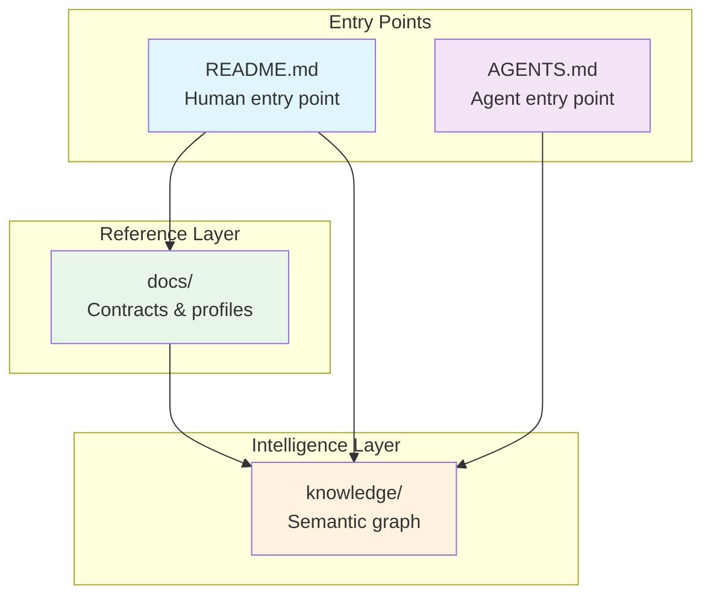

# Documentation

# Documentation Module

Reference documentation and agent guidance for the NAO ROS4HRI Bridge project. This module provides multiple documentation surfaces optimized for different audiences—human developers, AI coding assistants, and automated tooling.

## Module Structure

| Sub-module | Audience | Purpose |
|------------|----------|---------|
| [README](readme.md) | Human developers | Project entry point, architecture overview, package taxonomy |
| [AGENTS.md](agents.md) | AI coding assistants | Tool discovery, workflow patterns, knowledge layer integration |
| [docs](docs.md) | Developers | Reference documentation for runtime contracts, launch profiles, thesis direction |
| [knowledge](knowledge.md) | Agents & tooling | Semantic code graph, ROS runtime relationships, index management |

## How the Sub-modules Relate

The documentation is organized in three layers:

1. **Entry Points** — `README.md` and `AGENTS.md` serve as the primary entry points for humans and AI agents respectively. Both reference the deeper documentation layers.

2. **Reference Layer** — The `docs/` sub-module contains detailed reference material: runtime contracts, message schemas, launch profile configurations, and planning documentation for thesis work.

3. **Intelligence Layer** — The `knowledge/` sub-module provides a semantic graph of the codebase through GitNexus integration. It makes ROS runtime relationships explicit and queryable, supporting both agent workflows and developer exploration.

## Key Cross-cutting Workflows

**Onboarding Flow**: New developers start with the README architecture overview, then drill into `docs/demo_status_and_contracts.md` for current runtime behavior, and use `docs/launch_profiles.md` to run the stack.

**Agent Workflow**: AI agents entering via `AGENTS.md` discover the knowledge layer tools, then query the semantic graph in `knowledge/` to understand ROS node relationships before making code changes.

**Runtime Investigation**: When debugging ROS communication issues, the `knowledge/ros_runtime_proxy.py` artifacts provide explicit topic/service/action relationships that complement the contract documentation in `docs/`.