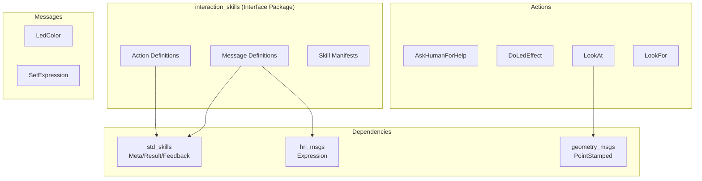

# Interaction Skills

# Interaction Skills

ROS 2 interface package defining skill manifests and message/action definitions for human-robot interaction. This package provides the **interface layer** for interaction skills — implementations are provided by separate skill provider nodes.

## Skills Overview

| Skill | Interface | Purpose |
|-------|-----------|---------|
| `ask_human_for_help` | Action | Request assistance from nearby humans |
| `do_led_effect` | Action | Control robot LED visual effects |
| `look_for_human` | Action | Search and localize specific humans |
| `look_for_object` | Action | Search and localize specific objects |
| `set_expression` | Topic | Set robot facial expression |
| `look_at` | Action | Control robot gaze direction |

## Architecture



## Action Definitions

### AskHumanForHelp

Request help from humans in the robot's vicinity.

**Action File:** `action/AskHumanForHelp.action`

```
# Goal
std_skills/Meta meta
string[] person_ids          # Preferred person IDs to ask (optional)
string question_to_human     # The question to ask

---
# Result
std_skills/Result result
string value                 # Response from human

---
# Feedback
std_skills/Feedback feedback
```

**Skill Parameters:**
- `question_to_human` (string, required): The question to ask the human
- `person_ids` (string array, optional): Preferred persons to ask; if empty, all tracked humans are considered

**Functional Domains:** `interaction`, `communication`

---

### DoLedEffect

Execute visual effects on the robot's LED arrays.

**Action File:** `action/DoLedEffect.action`

```
# Goal
std_skills/Meta meta
string[] groups              # LED groups to use (empty = all groups)
string effect                # Effect type (solid_color, rainbow, fade, blink, flow)
float32 duration             # Total duration (≤0 = indefinite)
interaction_skills/LedColor color
interaction_skills/LedColor secondary_color
float32 cycle                # Duration of one effect cycle
float32 partition            # Proportion for two-phase effects [0.0, 1.0]

---
# Result
std_skills/Result result

---
# Feedback
std_skills/Feedback feedback
```

**Effect Types:**

| Effect | Description | Color Usage |
|--------|-------------|-------------|
| `solid_color` | Static color(s) on LED groups | Primary + secondary (partitioned) |
| `rainbow` | Moving rainbow effect | Ignored |
| `fade` | Fade between two colors | Primary ↔ secondary |
| `blink` | Alternate between two colors | Primary ↔ secondary |
| `flow` | Loading-style animation | Primary moving, secondary background |

**Skill Parameters:**
- `groups` (string array, default: `[]`): LED group names (e.g., `["ear_leds", "back_leds"]`)
- `effect` (string, default: `"solid_color"`): Effect type
- `duration` (float, default: `0.0`): Total duration; ≤0 runs indefinitely
- `color` (LedColor): Primary color
- `secondary_color` (LedColor): Secondary color for two-color effects
- `cycle` (float, default: `1.0`): Cycle duration in seconds
- `partition` (float, default: `1.0`): First phase proportion [0.0, 1.0]

---

### LookAt

Control the robot's gaze direction.

**Action File:** `action/LookAt.action`

```
# Goal
std_skills/Meta meta
string policy                # Gaze policy (random, social, glance, auto, reset)
geometry_msgs/PointStamped target  # Target point to track

---
# Result
std_skills/Result result

---
# Feedback
std_skills/Feedback feedback
```

**Gaze Policies:**

| Policy | Behavior |
|--------|----------|
| `random` | Random looking with short fixations |
| `social` | Look around for faces, fixate on detected faces |
| `glance` | Briefly look at target, then return to previous policy |
| `auto` | Implementation-dependent (typically `social`) |
| `reset` | Reset gaze to looking straight ahead |
| *(empty)* | Track the `target` point continuously |

**Skill Parameters:**
- `policy` (string): One of the policies above, or empty to track `target`
- `target` (geometry_msgs/PointStamped): TF frame to track when policy is empty

---

### LookFor

Search for and localize entities matching RDF patterns.

**Action File:** `action/LookFor.action`

```
# Goal
std_skills/Meta meta
string[] patterns            # RDF patterns identifying entities

---
# Result
std_skills/Result result
string[] found_entities      # IDs of found entities

---
# Feedback
std_skills/Feedback feedback
```

This action is used by both `look_for_human` and `look_for_object` skills.

**Skill Parameters:**
- `patterns` (string array, default: `[]`): RDF patterns with exactly one variable; empty returns all visible entities of the default type

---

## Message Definitions

### LedColor

Extended color specification supporting both RGB and HTML color formats.

**Message File:** `msg/LedColor.msg`

```
string name                  # HTML color name or hex code (e.g., "Green", "#008000")
float32 alpha                # Brightness/opacity [0.0, 1.0]
std_msgs/ColorRGBA rgba      # Standard RGBA encoding
```

**Color Specification:**
- If `name` is non-empty: use HTML color name or hex triplet (`#RRGGBB`)
- If `name` is empty: use `rgba` field for RGB values

The `alpha` field controls LED brightness when using named colors.

---

### SetExpression

Set the robot's facial expression.

**Message File:** `msg/SetExpression.msg`

```
std_skills/Meta meta
hri_msgs/Expression expression
```

**Skill Parameters:**
- `expression.expression` (string): Named expression (neutral, happy, sad, angry, surprised, etc.)
- `expression.valence` (float): Emotional valence [-1.0, 1.0]
- `expression.arousal` (float): Emotional arousal [-1.0, 1.0]

**Available Expressions:**
`neutral`, `angry`, `sad`, `happy`, `surprised`, `disgusted`, `scared`, `pleading`, `vulnerable`, `despaired`, `guilty`, `disappointed`, `embarrassed`, `horrified`, `skeptical`, `annoyed`, `furious`, `suspicious`, `rejected`, `bored`, `tired`, `asleep`, `confused`, `amazed`, `excited`

---

## Dependencies

| Package | Usage |
|---------|-------|
| `std_skills` | Meta, Result, Feedback message types |
| `hri_msgs` | Expression message type |
| `geometry_msgs` | PointStamped for gaze targets |
| `builtin_interfaces` | Standard ROS types |
| `std_msgs` | ColorRGBA type |

## Skill Manifests

Skill manifests are embedded in `package.xml` under `<export>` tags. Each manifest defines:

- **id**: Unique skill identifier
- **interface**: `action`, `topic`, or `service`
- **default_interface_path**: Default ROS namespace
- **datatype**: Full message/action type
- **parameters**: Input/output parameter specifications
- **functional_domains**: Skill categorization

## Usage Example

```python
# Python client for look_at skill
from interaction_skills.action import LookAt
from geometry_msgs.msg import PointStamped

goal = LookAt.Goal()
goal.policy = "glance"
goal.target = PointStamped()
goal.target.header.frame_id = "map"
goal.target.point.x = 1.0
goal.target.point.y = 0.0
goal.target.point.z = 1.5

# Send goal via action client...
```
