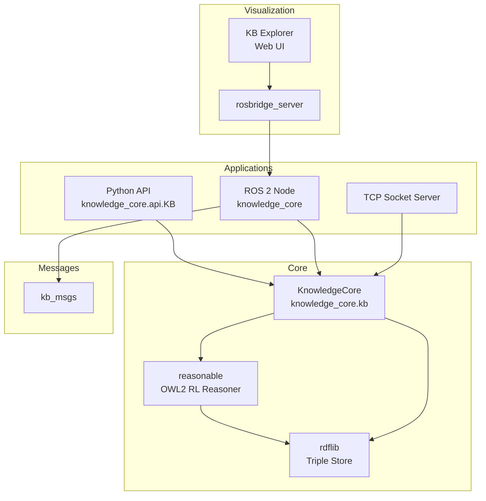
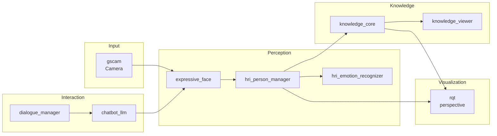

# Knowledge Base — knowledge_sources

# Knowledge Sources Module

This module provides the knowledge representation infrastructure for the ROS4HRI neuro-symbolic interaction system. It consists of three packages:

- **kb_msgs**: ROS 2 message and service definitions for knowledge operations
- **knowledge_core**: The RDFlib-backed knowledge base with OWL2 RL reasoning
- **interaction_sim**: Bring-up package for the social interaction simulator

---

## Architecture Overview



---

## kb_msgs — Message Definitions

The `kb_msgs` package defines the ROS 2 interface for knowledge operations.

### Services

| Service | Purpose |
|---------|---------|
| `Manage.srv` | Clear, load, save, status operations |
| `Revise.srv` | Add, update, retract statements |
| `Query.srv` | Pattern-based queries with variables |
| `About.srv` | All triples involving a term |
| `Lookup.srv` | Full-text search by name or label |
| `Sparql.srv` | Raw SPARQL queries |
| `Event.srv` | Subscribe to knowledge events |

### Messages

| Message | Purpose |
|---------|---------|
| `ActiveConcepts.msg` | List of currently active concepts |

### Service Details

#### Revise.srv

Used for adding, updating, and retracting statements:

```
string UPDATE=update
string RETRACT=retract
string method
string[] statements
string[] models
builtin_interfaces/Duration lifespan  # for UPDATE only
---
bool success
string error_msg
```

#### Query.srv

Pattern-based queries with variable binding:

```
string[] patterns      # e.g., ["?x rdf:type Robot", "?x isIn ?place"]
string[] vars          # variables to return (empty = all)
string[] models
---
bool success
string json            # JSON-encoded list of dictionaries
string error_msg
```

#### Event.srv

Subscribe to knowledge change notifications:

```
string[] patterns      # patterns to monitor
bool one_shot          # auto-remove after first trigger
string[] models
---
string id              # event identifier
string topic           # subscribe to /kb/events/<id>
```

---

## knowledge_core — Knowledge Base

### Core Concepts

#### Statements

Knowledge is stored as RDF triples using infix notation:

```
subject predicate object
```

Example: `ari rdf:type Robot`

Objects can be literals (quoted strings with optional language tags or datatype annotations):

```
ari hasName "ARI"
temperature hasValue "25"^^xsd:integer
```

#### Namespace Prefixes

Predefined prefixes eliminate the need for full URIs:

| Prefix | Namespace |
|--------|-----------|
| `oro` | `http://kb.openrobots.org#` (default) |
| `rdf` | `http://www.w3.org/1999/02/22-rdf-syntax-ns#` |
| `rdfs` | `http://www.w3.org/2000/01/rdf-schema#` |
| `owl` | `http://www.w3.org/2002/07/owl#` |
| `xsd` | `http://www.w3.org/2001/XMLSchema#` |
| `foaf` | `http://xmlns.com/foaf/0.1/` |
| `prov` | `http://www.w3.org/ns/prov#` |
| `dbp` | `http://dbpedia.org/property/` |

#### Variables and Wildcards

Variables (prefixed with `?`) enable pattern matching:

```python
kb.find(["?robot rdf:type Robot", "?robot isIn ?place"])
# Returns: [{'robot': 'ari', 'place': 'kitchen'}]
```

The `*` wildcard is an unnamed variable, returned as `var1`, `var2`, etc.:

```python
kb["* rdf:type Robot"]  # Returns: [{'var1': 'ari'}]
```

#### Models

Models are independent knowledge contexts for multi-agent scenarios:

```python
kb.update(["task1 status running"], models=["agent_a"])
kb.update(["task1 status paused"], models=["agent_b"])
# Each agent sees different knowledge
```

### Python API

#### Direct Usage (Embedded Mode)

```python
from knowledge_core.kb import KnowledgeCore

kb = KnowledgeCore()  # with reasoner (if available)
kb = KnowledgeCore(enable_reasoner=False)  # without reasoner

# Add statements
kb += ["ari rdf:type Robot", "ari isIn kitchen"]

# Query
results = kb["?x rdf:type Robot"]  # [{'var1': 'ari'}]
results = kb.find(["?x isIn ?place"], variables=["?place"])

# Check existence
if "ari rdf:type Robot" in kb:
    print("ARI is a robot")

# Remove
kb -= ["ari isIn kitchen"]
```

#### Operators

| Operator | Example | Description |
|----------|---------|-------------|
| `+=` | `kb += ["s p o"]` | Add/update statements |
| `-=` | `kb -= ["s p o"]` | Remove statements |
| `[]` | `kb["?x rdf:type Robot"]` | Query (returns list of dicts) |
| `in` | `"s p o" in kb` | Check existence (returns bool) |

#### Key Methods

**Knowledge Management:**

```python
kb.update(stmts, models=None, lifespan=0)  # Add with optional expiration
kb.remove(stmts, models=None)              # Retract statements
kb.clear(keep_defaults=False)             # Reset knowledge base
kb.load(filename, models=None)            # Load OWL/RDF ontology
kb.save(path, basename='kb', models=None) # Save to RDF/XML
```

**Querying:**

```python
kb.find(patterns, variables=None, models=None)  # Pattern query
kb.exist(stmts, models=None)                     # Existence check
kb.about(term, models=None)                       # All triples for term
kb.lookup(term, models=None)                      # Search by name/label
kb.label(term, models=None)                       # Get labels
kb.details(term, model=None)                      # Rich term info
kb.sparql(query, model=None)                      # Raw SPARQL
kb.classesof(term, direct=False, models=None)    # Get classes
```

**Events:**

```python
def on_robot(evt):
    print(f"New robot: {evt}")

event_id = kb.subscribe(["?x rdf:type Robot"], on_robot, one_shot=False)
```

### ROS 2 API

#### Starting the Node

```bash
ros2 launch knowledge_core knowledge_core.launch.py
```

Configuration file (`config/00-defaults.yaml`):

```yaml
/kb/knowledge_core:
  ros__parameters:
    default_kb: "ontology://oro/oro.owl"
```

#### Pythonic ROS Wrapper

```python
from knowledge_core.api import KB

kb = KB()  # Creates its own node and executor
# or:
kb = KB(my_ros_node)  # Reuse existing node (requires MultiThreadedExecutor)

kb += ["ari rdf:type Robot"]
print(kb["* rdf:type Robot"])

def on_event(evt):
    print("Event:", evt)

kb.subscribe(["?robot rdf:type Robot"], on_event)
```

#### Topics

| Topic | Type | Description |
|-------|------|-------------|
| `/kb/add_fact` | `std_msgs/String` | Add a single triple |
| `/kb/remove_fact` | `std_msgs/String` | Remove a single triple |
| `/kb/active_concepts` | `kb_msgs/ActiveConcepts` | Currently active concepts |
| `/kb/events/<id>` | `std_msgs/String` | Event notifications |

#### Services

| Service | Type | Description |
|---------|------|-------------|
| `/kb/manage` | `kb_msgs/Manage` | Clear, load, save, status |
| `/kb/revise` | `kb_msgs/Revise` | Add/remove/update statements |
| `/kb/query` | `kb_msgs/Query` | Pattern-based queries |
| `/kb/about` | `kb_msgs/About` | All triples for a term |
| `/kb/label` | `kb_msgs/About` | Label of a term |
| `/kb/details` | `kb_msgs/About` | Detailed term info |
| `/kb/lookup` | `kb_msgs/Lookup` | Full-text search |
| `/kb/sparql` | `kb_msgs/Sparql` | Raw SPARQL queries |
| `/kb/events` | `kb_msgs/KbEvent` | Subscribe to events |

### Socket API

Start the server:

```bash
knowledge_core                    # default port 6969
knowledge_core --port 7000        # custom port
knowledge_core --no-ros           # without ROS
knowledge_core --no-reasoner      # without reasoner
knowledge_core --debug            # verbose logging
knowledge_core ontology.owl       # pre-load ontology
```

Protocol format (messages terminated by `#end#`):

```
method_name
arg1_as_json
arg2_as_json
#end#
```

Response:

```
ok
result_as_json
#end#
```

Error:

```
error
kberror
error message
#end#
```

### Active Concepts

Concepts marked with `rdf:type ActiveConcept` are tracked as "currently important":

```python
kb += ["ari rdf:type ActiveConcept"]
# After 5 seconds, automatically retracted
```

Active concepts are published on `/kb/active_concepts` and displayed in the KB Explorer.

### Reasoning

KnowledgeCore integrates with [reasonable](https://github.com/gtfierro/reasonable) for OWL2 RL reasoning:

- Automatic materialization of inferred facts
- Support for `rdfs:subClassOf`, `owl:equivalentClass`, etc.
- Lazy materialization (only when queries are made)

### Performance Optimizations

The knowledge base includes several optimizations:

1. **Lazy materialization**: Reasoning only triggered when models are dirty
2. **Batch context manager**: Defer materialization for bulk updates

```python
with kb.batch():
    for stmt in large_list:
        kb += [stmt]
# Materialization happens once at exit
```

3. **LRU memoization**: Cached N3 parsing for repeated patterns

---

## interaction_sim — Social Interaction Simulator

A bring-up package that launches the complete ROS4HRI neuro-symbolic interaction simulator.

### Launch File

```python
ros2 launch interaction_sim simulator.launch.py ui:=True
```

### Launch Arguments

| Argument | Default | Description |
|----------|---------|-------------|
| `ui` | `False` | Start the UI server |

### Components Launched

The simulator launches the following components:



### Topic Remappings

The launch file applies these remappings:

| Source | Destination |
|--------|-------------|
| `image` | `/camera/image_raw` |
| `camera_info` | `/camera/camera_info` |
| `/expressive_face/look_at` | `/look_at` |
| `/expressive_face/tts` | `/dialogue_manager/robot_speech` |
| `/dialogue_manager/closed_captions` | `/closed_captions` |

### Camera Configuration

Default camera calibration (`config/camera_info.yaml`):

```yaml
image_width: 640
image_height: 480
camera_name: camera
distortion_model: plumb_bob
```

### RQT Perspective

The package includes a pre-configured RQT perspective (`config/simulator.perspective`) with:

- Image View (expressive face output)
- Image View (camera with HRI overlay)
- Human Radar
- Chat widget
- Parameter reconfigure
- Robot Monitor

---

## Testing

### Unit Tests

```bash
# Core knowledge base tests (no ROS)
python -m pytest tests/test_base.py

# ROS 2 interface tests
colcon test --packages-select knowledge_core
```

### Benchmarks

Performance benchmarks are available in `tests/benchmarks/`:

- `test_bench_pipeline.py`: Full pipeline benchmarks
- `test_bench_materialise.py`: Reasoning materialization
- `test_bench_events.py`: Event system performance
- `test_bench_parsing.py`: N3 parsing performance

---

## KB Explorer

Web-based visualization tool for the knowledge base.

### Starting

```bash
# Start rosbridge server
ros2 run rosbridge_server rosbridge_websocket

# Start knowledge viewer
ros2 run knowledge_core knowledge_viewer

# Open browser
# http://localhost:8010
```

### Features

- Interactive graph visualization
- Real-time updates via `/kb/active_concepts`
- Class/instance differentiation
- Relationship exploration

---

## Dependencies

### knowledge_core

| Package | Purpose |
|---------|---------|
| `rdflib >= 6.0.0` | RDF triple store |
| `reasonable` | OWL2 RL reasoner (optional) |
| `kb_msgs` | ROS message definitions |
| `diagnostic_aggregator` | Diagnostics |

### interaction_sim

| Package | Purpose |
|---------|---------|
| `expressive_face` | Robot face animation |
| `dialogue_manager` | Conversation management |
| `chatbot_llm` | LLM-based chatbot |
| `hri_person_manager` | Person tracking |
| `hri_face_detect_yunet` | Face detection |
| `hri_emotion_recognizer` | Emotion recognition |
| `hri_visualization` | HRI visualization |
| `knowledge_core` | Knowledge base |
| `rosbridge_server` | WebSocket bridge |
| `gscam` | Camera input |
