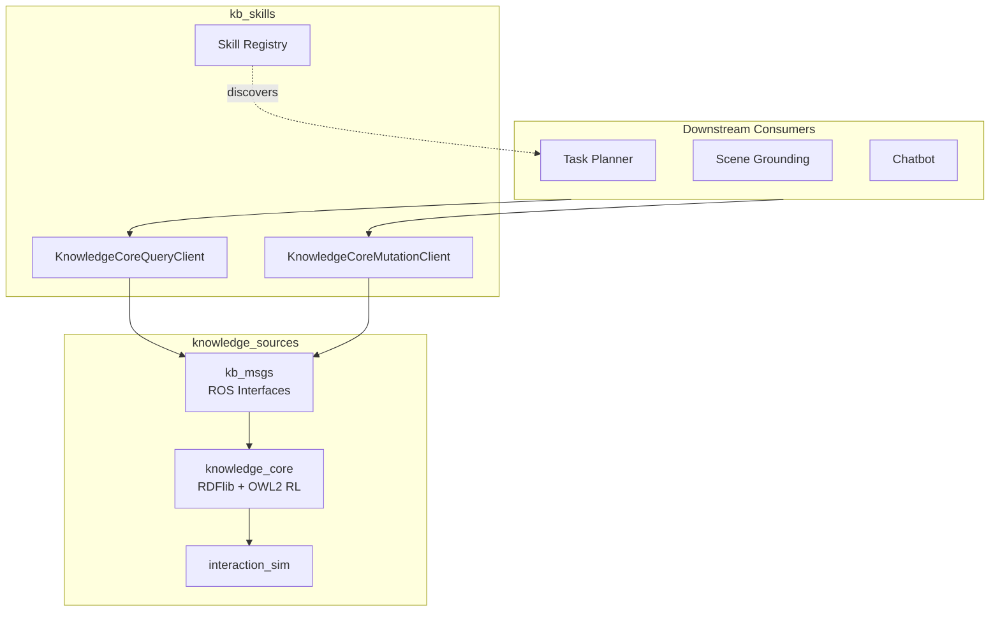

# Knowledge Base

# Knowledge Base Module

The Knowledge Base module provides a complete neuro-symbolic knowledge representation system for the ROS4HRI framework. It combines RDF-based storage with OWL2 RL reasoning and exposes all functionality through ROS 2 interfaces.

## Sub-modules

| Module | Role |
|--------|------|
| [knowledge_sources](knowledge_sources.md) | Core infrastructure: message definitions, KB implementation, and reasoning engine |
| [kb_skills](kb_skills.md) | Client library and skill registry for ROS 2 service interaction |

## Architecture

## Key Workflows

**Query Path**: Downstream modules use `KnowledgeCoreQueryClient` to query the KB. The client handles service discovery, timeout management, and response parsing, keeping consumers decoupled from ROS service details.

**Mutation Path**: State changes flow through `KnowledgeCoreMutationClient` which provides `add`, `remove`, and `revise` operations. The client coerces statements from strings or lists and reports service failures.

**Reasoning Pipeline**: When statements are added via mutation, `knowledge_core` applies OWL2 RL reasoning through the `reasonable` reasoner, automatically inferring new facts.

**Event Subscription**: The `knowledge_core.api.KB` class exposes an event system for reactive programming. Clients subscribe to KB changes, enabling downstream modules to react to knowledge updates without polling.

## Integration Points

- **kb_msgs** defines the ROS service contracts (`Query`, `Revise`, `Manage`, `Events`) that both sub-modules depend on
- **kb_skills** clients are tested against `knowledge_core` nodes (see `test_ros.py`, `test_ros_events.py`)
- The skill registry in `kb_skills` declares `kb_query`, `kb_revise`, `kb_add`, and `kb_remove` for planner discovery