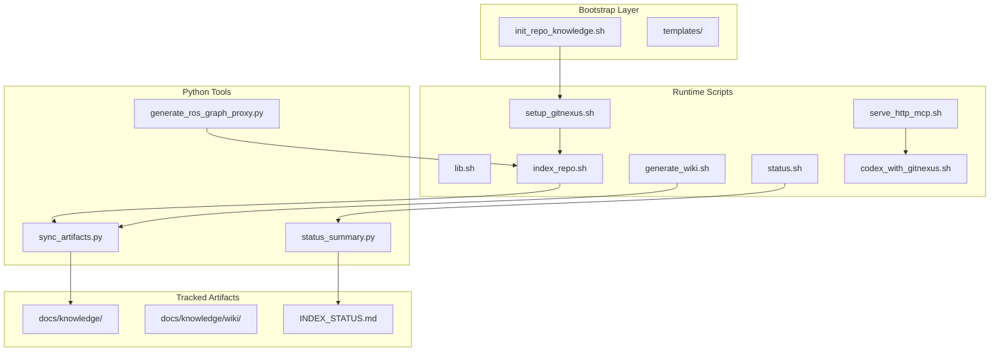

# Knowledge Tools

# Knowledge Tools

A GitNexus-based code intelligence layer that provides semantic indexing, wiki generation, and MCP (Model Context Protocol) endpoints for AI-assisted development workflows.

## Purpose

The Knowledge Tools module enables repositories to:

- **Index code semantically** — Build a graph of symbols, dependencies, and relationships
- **Generate documentation** — Create wiki pages from code structure
- **Expose MCP endpoints** — Allow AI assistants (Codex, Cursor) to query code intelligence
- **Track artifacts** — Sync generated docs into version-controlled `docs/knowledge/`

The design is intentionally **advisory**: it augments development workflows without forcing LLM-backed operations into normal commit paths.

## Architecture



## Quick Start

```bash
# Bootstrap a new repo (one-time)
tools/knowledge/bootstrap/init_repo_knowledge.sh /path/to/target-repo

# Setup and index
tools/knowledge/setup_gitnexus.sh
tools/knowledge/index_repo.sh

# Check status
tools/knowledge/status.sh

# Generate wiki (requires LLM config)
tools/knowledge/generate_wiki.sh
```

## Core Components

### Bootstrap Layer

**`bootstrap/init_repo_knowledge.sh`**

Seeds a target repository with the knowledge runtime. Copies scripts, creates directory structure, and writes template files (skipping any that already exist).

```bash
tools/knowledge/bootstrap/init_repo_knowledge.sh ~/projects/my-repo
```

Creates:
- `tools/knowledge/` — Runtime scripts
- `docs/knowledge/` — Tracked documentation skeleton
- `.codex/config.toml` — Codex MCP configuration
- `.cursor/mcp.json` — Cursor MCP configuration
- `AGENTS.md` — Agent guidance file

### Shared Library

**`lib.sh`**

Provides common functions used by all runtime scripts:

| Function | Purpose |
|-----------|---------|
| `ensure_gitnexus_installed` | Installs GitNexus npm package if missing |
| `run_gitnexus` | Executes GitNexus binary with arguments |
| `sync_knowledge_artifacts` | Calls `sync_artifacts.py` to update tracked docs |
| `has_wiki_llm_config` | Checks for LLM API key configuration |
| `repo_name` | Returns repository basename |

Environment variables:
- `GITNEXUS_VERSION` — Version to install (default: `1.5.3`)
- `GITNEXUS_INSTALL_ROOT` — Installation directory (default: `~/.gitnexus-tooling/gitnexus-{version}`)
- `GITNEXUS_CONFIG_FILE` — Config file path (default: `~/.gitnexus/config.json`)

### Indexing

**`index_repo.sh`**

Analyzes repository code and builds the GitNexus graph. Runs before any query operations.

```bash
tools/knowledge/index_repo.sh
```

Process:
1. Generates ROS graph proxy (if `generate_ros_graph_proxy.py` exists)
2. Runs `gitnexus analyze` with `--skip-agents-md`
3. Syncs artifacts to `docs/knowledge/`

If `.gitnexusignore` exists, sets `GITNEXUS_NO_GITIGNORE=1` to respect ignore rules.

**`generate_ros_graph_proxy.py`**

ROS-specific analyzer that extracts runtime relationships from Python source and launch files. Generates:

- `docs/knowledge/ROS_RUNTIME_GRAPH.md` — Human-readable endpoint summary
- `docs/knowledge/ros_runtime_graph.json` — Machine-readable graph data
- `docs/knowledge/ros_runtime_proxy.py` — Proxy functions for GitNexus indexing

Extracts:
- Topic publishers/subscribers
- Service clients/servers
- Action clients/servers
- Interface contracts from `package.xml`

### Status and Monitoring

**`status.sh`**

Reports index freshness and artifact sync state.

```bash
tools/knowledge/status.sh
```

With `--advisory` flag, exits successfully even if index is missing (used by `pre_commit_advisory.sh`).

**`status_summary.py`**

Prints a concise summary of:
- Index timestamp and commit
- File/node/edge/process counts
- Wiki page count
- `module_tree.json` presence

### Wiki Generation

**`generate_wiki.sh`**

Generates wiki documentation from the indexed code graph. Requires LLM configuration (OpenAI API key or saved GitNexus config).

```bash
tools/knowledge/generate_wiki.sh
```

### MCP Serving

**`serve_http_mcp.sh`**

Starts an HTTP server exposing GitNexus via MCP protocol.

```bash
tools/knowledge/serve_http_mcp.sh
```

Environment:
- `GITNEXUS_HTTP_HOST` — Bind host (default: `0.0.0.0`)
- `GITNEXUS_HTTP_PORT` — Port (default: `4747`)

MCP endpoint: `http://{host}:{port}/api/mcp`

**`codex_with_gitnexus.sh`**

Launches Codex with GitNexus MCP integration. Supports two modes:

1. **Process MCP** (default): Spawns GitNexus as subprocess
2. **HTTP MCP**: Connects to running HTTP server

```bash
# Process mode
tools/knowledge/codex_with_gitnexus.sh

# HTTP mode (connect to running server)
GITNEXUS_USE_HTTP=1 tools/knowledge/codex_with_gitnexus.sh

# Custom HTTP URL
GITNEXUS_MCP_URL=http://host:port/api/mcp tools/knowledge/codex_with_gitnexus.sh
```

### Artifact Synchronization

**`sync_artifacts.py`**

Copies GitNexus outputs to tracked documentation:

| Source | Destination |
|--------|-------------|
| `.gitnexus/meta.json` stats | `docs/knowledge/INDEX_STATUS.md` |
| `.gitnexus/wiki/*.md` | `docs/knowledge/wiki/` |
| `.gitnexus/wiki/module_tree.json` | `docs/knowledge/module_tree.json` |

Also builds `module_tree.json` from `git ls-files` if GitNexus hasn't generated one.

### Git Hooks

**`pre_commit_advisory.sh`**

Runs `status.sh --advisory` to check index freshness before commits. Non-blocking.

**`post_commit_refresh.sh`**

Refreshes GitNexus index after commits. Runs the same analysis as `index_repo.sh`.

## ROS Graph Analysis

For ROS (Robot Operating System) projects, `generate_ros_graph_proxy.py` extracts runtime seams that static analysis cannot see:

### What It Extracts

| Category | Sources |
|----------|---------|
| Topics | `create_publisher()`, `create_subscription()` |
| Services | `create_client()`, `create_service()` |
| Actions | `ActionClient`, `ActionServer` |
| Node names | `super().__init__()` calls, launch files |
| Contracts | `package.xml` interface declarations |

### Override Configuration

**`ros_graph_overrides.json`**

Manual corrections for endpoints that cannot be inferred statically:

```json
{
  "packages": {
    "dialogue_manager": {
      "endpoint_rewrites": {
        "/*/dialogue_interaction": "/chatbot_llm/dialogue_interaction"
      }
    },
    "knowledge_core": {
      "namespace": "kb"
    }
  }
}
```

### Output Files

**`ros_runtime_proxy.py`**

Generated proxy functions that make ROS relationships visible to GitNexus:

```python
def ros_topic__cmd_vel():
    """ROS topic endpoint /cmd_vel."""
    return "/cmd_vel"

def ros_node_my_package():
    """Runtime ROS proxy for package/node my_package."""
    ros_topic__cmd_vel()
    ros_service__get_state()
```

## Tracked Artifacts

All generated documentation lives under `docs/knowledge/`:

```
docs/knowledge/
├── README.md           # Overview and commands
├── QUICKSTART.md       # Fastest path to productivity
├── WORKFLOWS.md        # Graph-guided agent playbooks
├── DECISIONS.md        # Architecture decisions
├── EVAL.md             # GitNexus evaluation template
├── INDEX_STATUS.md     # Current index state
├── module_tree.json     # File tree structure
├── ROS_RUNTIME_GRAPH.md # ROS endpoints (if applicable)
└── wiki/               # Generated wiki pages
```

## MCP Integration

GitNexus exposes these MCP tools for AI assistants:

| Tool | Purpose |
|------|---------|
| `query` | Search symbols by name or pattern |
| `context` | Get surrounding context for a symbol |
| `impact` | Analyze blast radius of changes |
| `flow` | Trace execution paths |

### Workflow Patterns

**Exploration**: `query` → `context` → source read
**Debugging**: `query` symptom → `context` suspect → source confirm
**Refactoring**: `context` + `impact` before edits → refresh after

## Configuration Files

### `.codex/config.toml`

```toml
[mcp_servers.gitnexus]
command = "./tools/knowledge/gitnexus.sh"
args = ["mcp"]
```

### `.cursor/mcp.json`

```json
{
  "mcpServers": {
    "gitnexus": {
      "command": "./tools/knowledge/gitnexus.sh",
      "args": ["mcp"]
    }
  }
}
```

## Environment Variables

| Variable | Default | Purpose |
|----------|---------|---------|
| `GITNEXUS_VERSION` | `1.5.3` | GitNexus version to install |
| `GITNEXUS_INSTALL_ROOT` | `~/.gitnexus-tooling/gitnexus-{version}` | Installation directory |
| `GITNEXUS_CONFIG_FILE` | `~/.gitnexus/config.json` | GitNexus config path |
| `GITNEXUS_HTTP_HOST` | `0.0.0.0` | HTTP server bind host |
| `GITNEXUS_HTTP_PORT` | `4747` | HTTP server port |
| `GITNEXUS_USE_HTTP` | `0` | Use HTTP MCP in codex wrapper |
| `GITNEXUS_MCP_URL` | — | Custom MCP URL (overrides USE_HTTP) |
| `GITNEXUS_NO_GITIGNORE` | — | Skip .gitignore processing |
| `OPENAI_API_KEY` | — | LLM API key for wiki generation |
| `GITNEXUS_API_KEY` | — | Alternative LLM API key |
| `AZURE_OPENAI_API_KEY` | — | Azure OpenAI API key |
