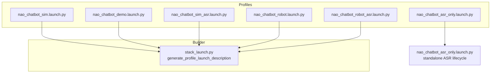
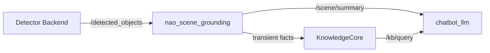

# Launch Profiles

# Launch Profiles Module

## Overview

`nao_chatbot` is the launch surface and operator-utility package for the NAO ROS4HRI stack. It composes the migrated HRI components into ready-to-run profiles for simulator testing, real-robot validation, and demo workflows.

The package does **not** implement chatbot or mission control logic. Those responsibilities live in:
- `chatbot_llm` — chatbot backend contract
- `dialogue_manager` — canonical `/skill/chat`, `/skill/ask`, `/skill/say`
- `nao_orchestrator` — downstream intent dispatch
- `knowledge_core` — symbolic fact storage

## Launch Profiles

All profiles share a common builder (`stack_launch.py`) and differ only in their default argument values.



### Simulator Profile

```bash
ros2 launch nao_chatbot nao_chatbot_sim.launch.py
```

Default configuration:
- `start_interaction_sim:=true`
- `start_interaction_sim_perception:=true`
- `start_interaction_sim_tools:=true`
- `start_interaction_sim_expressive_face:=false`
- `start_rqt_console:=true`

With object detection and scene grounding:

```bash
ros2 launch nao_chatbot nao_chatbot_sim.launch.py \
  start_object_detection:=true \
  start_scene_grounding:=true \
  object_detection_backend:=emorobcare_cv
```

Planner is on by default in sim/robot/demo. To disable planner handoff:

```bash
ros2 launch nao_chatbot nao_chatbot_sim.launch.py \
  start_planner_llm:=false \
  chatbot_planner_mode_enabled:=false
```

### Real-Robot Profile

```bash
ros2 launch nao_chatbot nao_chatbot_robot.launch.py \
  nao_ip:=<robot_ip>
```

Default configuration:
- `start_nao_robot:=true`
- `start_nao_robot_hri_visualization:=true`
- `start_rviz:=true`
- `start_interaction_sim:=false`
- `start_interaction_sim_tools:=true`
- `object_detection_input_image_topic:=/camera/front/image_raw`

With object detection:

```bash
ros2 launch nao_chatbot nao_chatbot_robot.launch.py \
  nao_ip:=<robot_ip> \
  start_object_detection:=true \
  start_scene_grounding:=true \
  object_detection_backend:=emorobcare_cv
```

YOLO fallback:

```bash
ros2 launch nao_chatbot nao_chatbot_robot.launch.py \
  nao_ip:=<robot_ip> \
  start_object_detection:=true \
  start_scene_grounding:=true \
  object_detection_backend:=yolo_ros \
  object_detection_model:=yolov8n.pt \
  object_detection_device:=cpu
```

### ASR Profiles

Simulator with ASR:

```bash
ros2 launch nao_chatbot nao_chatbot_sim_asr.launch.py \
  asr_vosk_model_path:=/models/vosk-model-small-en-us-0.15
```

Real robot with ASR:

```bash
ros2 launch nao_chatbot nao_chatbot_robot_asr.launch.py \
  nao_ip:=<robot_ip>
```

ASR-only utility (no robot or simulator):

```bash
ros2 launch nao_chatbot nao_chatbot_asr_only.launch.py
```

### Minimal planner harness (optional)

The former `nao_chatbot_planner_local.launch.py` entry point was removed. Use the sim profile and disable components you do not need, for example:

```bash
ros2 launch nao_chatbot nao_chatbot_sim.launch.py \
  start_chatbot_llm:=false \
  start_dialogue_manager:=false \
  start_knowledge_core:=false \
  start_interaction_sim:=false \
  start_interaction_sim_perception:=false \
  start_interaction_sim_tools:=false \
  start_object_detection:=false \
  start_scene_grounding:=false \
  start_rqt_console:=false \
  start_robot_speech_debug:=false
```

## Architecture

### Shared Launch Builder

`stack_launch.py` provides `generate_profile_launch_description()`, which:

1. Declares all shared launch arguments with profile-specific defaults
2. Creates lifecycle node bundles with automatic bootstrap scripts
3. Includes optional external integrations based on argument flags
4. Emits summary logs for operator awareness

```python
def generate_profile_launch_description(
    *,
    profile_defaults: dict | None = None,
    include_asr: bool = False,
):
    ...
```

Each profile wrapper defines a `_PROFILE_DEFAULTS` dict:

```python
_SIM_PROFILE_DEFAULTS = {
    "start_interaction_sim": "true",
    "start_interaction_sim_perception": "true",
    "start_interaction_sim_tools": "true",
    "start_rqt_console": "true",
    ...
}

def generate_launch_description():
    return generate_profile_launch_description(
        profile_defaults=_SIM_PROFILE_DEFAULTS,
        include_asr=False,
    )
```

### Lifecycle Node Bootstrap

Lifecycle nodes require explicit configure → activate transitions. The builder generates shell scripts that poll node state and drive transitions:

```python
def _lifecycle_bootstrap_script(node_name: str, timeout_sec: int = 30) -> str:
    return f"""
while true; do
  state="$(ros2 lifecycle get "/{node_name}" 2>/dev/null | awk '{{print $1}}')"
  case "$state" in
    active) exit 0 ;;
    inactive) ros2 lifecycle set "/{node_name}" activate ;;
    unconfigured) ros2 lifecycle set "/{node_name}" configure ;;
    ...
  esac
done
"""
```

### Interaction Simulator Support

`interaction_sim_support.py` provides `build_interaction_sim_actions()`, which:

1. Checks for required packages (`diagnostic_aggregator`, `interaction_sim`, `gscam`, HRI nodes)
2. Conditionally launches perception and/or tools layers
3. Remaps topics for the nao_chatbot stack
4. Emits summary logs

```python
def build_interaction_sim_actions(context):
    if not _as_bool(context, "start_interaction_sim"):
        return []

    start_perception = _as_bool(context, "start_interaction_sim_perception")
    start_tools = _as_bool(context, "start_interaction_sim_tools")
    ...
```

## Key Launch Arguments

### Core Stack

| Argument | Default | Description |
|----------|---------|-------------|
| `start_chatbot_llm` | `true` | Launch chatbot_llm backend |
| `start_dialogue_manager` | `true` | Launch dialogue_manager lifecycle node |
| `start_knowledge_core` | `true` | Launch KnowledgeCore when installed |
| `start_nao_orchestrator` | `true` | Launch NAO orchestrator scaffold |
| `start_nao_say_skill` | `true` | Launch NAO say skill |
| `start_nao_replay_motion` | `true` | Launch replay_motion and head-motion servers |
| `start_nao_look_at` | `true` | Launch NAO look_at skill |

### Robot Connection

| Argument | Default | Description |
|----------|---------|-------------|
| `nao_ip` | profile-specific | NAO robot IP |
| `nao_port` | `9559` | NAOqi port |
| `start_nao_robot` | profile-specific | Launch packaged nao_robot bring-up |
| `start_naoqi_driver` | `false` | Launch standalone naoqi_driver |

### Object Detection

| Argument | Default | Description |
|----------|---------|-------------|
| `start_object_detection` | `false` | Launch detector backend |
| `object_detection_backend` | `emorobcare_cv` | Backend: `emorobcare_cv` or `yolo_ros` |
| `object_detection_model` | `yolov8n.pt` | Model for yolo_ros |
| `object_detection_device` | `cpu` | Device: `cpu` or `cuda:0` |
| `object_detection_threshold` | `0.35` | Detection confidence threshold |
| `object_detection_input_image_topic` | profile-specific | Input image topic |
| `object_detection_log_level` | `warn` | Detector log level |

### Scene Grounding

| Argument | Default | Description |
|----------|---------|-------------|
| `start_scene_grounding` | `false` | Launch nao_scene_grounding node |
| `scene_grounding_detector_topic` | `/detected_objects` | Detection input topic |
| `scene_grounding_allowed_labels` | `bottle,cup,book,...` | Labels to ground |
| `scene_grounding_knowledge_lifespan_sec` | `4.0` | Transient fact lifespan |

### Planner

| Argument | Default | Description |
|----------|---------|-------------|
| `start_planner_llm` | `false` | Launch planner_llm node |
| `chatbot_planner_mode_enabled` | `false` | Enable planner handoff in chatbot_llm |
| `planner_llm_provider` | `ollama` | Backend provider |
| `planner_llm_model` | `gpt-oss:120b-cloud` | Model name |
| `planner_llm_base_url` | `http://127.0.0.1:11434` | Backend URL |

### Interaction Simulator

| Argument | Default | Description |
|----------|---------|-------------|
| `start_interaction_sim` | profile-specific | Enable simulator support |
| `start_interaction_sim_perception` | `true` | Launch webcam/HRI perception |
| `start_interaction_sim_tools` | `true` | Launch rosbridge, ui_server |
| `start_interaction_sim_expressive_face` | `false` | Launch simulator expressive_face |
| `interaction_sim_hri_log_profile` | `quiet` | Log verbosity: `quiet` or `debug` |

## Operator Utilities

### ASR Push-to-Talk CLI

Toggle the ASR gate from the terminal:

```bash
ros2 run nao_chatbot asr_push_to_talk_cli
```

Interactive controls:
- `space` or `t` — toggle listening
- `o` — open gate (start listening)
- `c` — close gate (stop listening)
- `?` — show help
- `q` — quit

One-shot modes:

```bash
# Open and exit
ros2 run nao_chatbot asr_push_to_talk_cli --open

# Close and exit
ros2 run nao_chatbot asr_push_to_talk_cli --close

# Pulse: open, wait 2 seconds, close
ros2 run nao_chatbot asr_push_to_talk_cli --pulse 2.0
```

### Robot Speech Debug

Mirror speech events into ROS logs for operator consoles:

```bash
ros2 run nao_chatbot robot_speech_debug
```

Subscribes to:
- `/debug/nao_say/speech` — robot speech
- `/dialogue_manager/closed_captions` — system/user captions

Outputs labeled log messages:
- `[ROBOT OUTPUT]` — robot utterances
- `[USER INPUT]` — user transcriptions

## Perception Integration

### Object Detection Backends

The stack supports two detector backends:

**emorobcare_cv** (default):
- Package: `emorobcare_cv_object_detection`
- Publishes to: `/detected_objects`
- Best for: tomato, pear, zucchini, corn, blueberry

**yolo_ros** (fallback):
- Package: `yolo_bringup`, `yolo_ros`
- Publishes to: `/yolo/tracking`
- Configure via `object_detection_model` and `object_detection_device`

### Scene Grounding Flow



Configuration recommendations:
- Set `use_knowledge_base: false` in detector config
- Let `nao_scene_grounding` be the single KB writer
- `chatbot_llm` consumes grounded facts via `knowledge_snapshot`

## Docker Workflow

Build the overlay image:

```bash
docker build -f docker/Dockerfile \
  --build-arg BASE_IMAGE=iiia:nao \
  -t nao-ros4hri-bridge:demo .
```

Run with laptop camera:

```bash
docker run --rm -it \
  --network host \
  --ipc host \
  --device /dev/video0 \
  -e DISPLAY \
  -v /tmp/.X11-unix:/tmp/.X11-unix \
  nao-ros4hri-bridge:demo
```

Inside container, test simulator path:

```bash
ros2 launch nao_chatbot nao_chatbot_sim.launch.py \
  start_object_detection:=true \
  start_scene_grounding:=true \
  object_detection_backend:=emorobcare_cv
```

Then robot path:

```bash
ros2 launch nao_chatbot nao_chatbot_robot.launch.py \
  nao_ip:=<robot_ip> \
  start_object_detection:=true \
  start_scene_grounding:=true \
  object_detection_backend:=emorobcare_cv
```

## Configuration Files

### RQt Perspective

`config/interaction_sim_debug.perspective` — debug-ready layout with:
- `rqt_console` — filtered for turn tracing
- `rqt_chat` — chat interface
- `rqt_human_radar` — HRI radar
- `rqt_image_view` — `/debug/object_detection` and HRI overlay

Console highlight filter matches:
```
TURN_START|TURN_DONE|LLM_REQUEST|KB_SNAPSHOT|CHATBOT RESPONSE|CHATBOT REQUEST|SPEECH INPUT|USER INPUT|ROBOT OUTPUT|INTENT_|SAY_START|TTS_ACCEPTED
```

### RViz Config

`config/nao_robot_safe.rviz` — robot validation view with:
- RobotModel — NAO URDF
- TF — coordinate frames
- Image — `/camera/front/image_raw`
- HRI Overlay — `/image/hri_overlay`
- Object Detection Debug — `/debug/object_detection`
- YOLO Debug — `/yolo/debug_image`

## Module Entry Point

`module/nao_chatbot_module.yaml` defines the default entry:

```yaml
nao_chatbot:
  launch: "nao_chatbot nao_chatbot_sim.launch.py"
```
