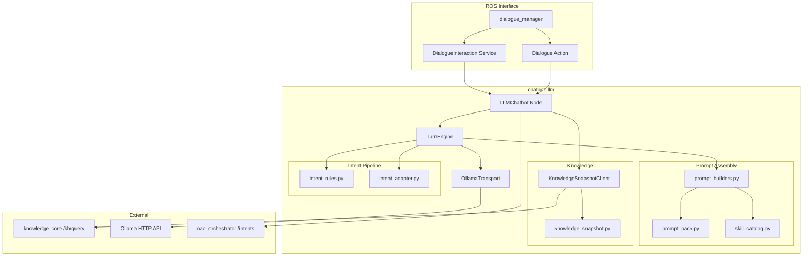

# LLM Chatbot

# chatbot_llm

The `chatbot_llm` package provides the upstream-aligned LLM chatbot backend for the NAO ROS4HRI stack. It exposes a ROS lifecycle node that handles dialogue sessions through a two-stage turn pipeline: response generation followed by structured intent extraction.

## Architecture Overview



## ROS API

### Actions

| Action | Type | Description |
|--------|------|-------------|
| `~/start_dialogue` | `chatbot_msgs/action/Dialogue` | Long-lived dialogue session. One active dialogue at a time. |

### Services

| Service | Type | Description |
|---------|------|-------------|
| `~/dialogue_interaction` | `chatbot_msgs/srv/DialogueInteraction` | Per-turn interaction within an active dialogue. |
| `~/get_supported_locales` | `i18n_msgs/srv/GetLocales` | Returns supported locales (optional, when `i18n_msgs` available). |

### Actions (Optional)

| Action | Type | Description |
|--------|------|-------------|
| `~/set_default_locale` | `i18n_msgs/action/SetLocale` | Sets default locale for dialogue sessions. |

### Published Topics

| Topic | Type | Description |
|-------|------|-------------|
| `/diagnostics` | `diagnostic_msgs/msg/DiagnosticArray` | Runtime status (active dialogue, model, request count). |
| `<planner_request_topic>` | `hri_actions_msgs/msg/Intent` | Planner request when `planner_mode_enabled` is true. |

## Turn Pipeline

Each dialogue interaction follows this sequence:

1. **Input Reception**: `dialogue_manager` forwards user text through `dialogue_interaction` service.
2. **Knowledge Grounding**: If enabled, `KnowledgeSnapshotClient` queries `/kb/query` and formats results into a prompt block.
3. **History Assembly**: Bounded conversation history is loaded and trimmed to `max_history_messages`.
4. **Response Stage**: The response model generates `verbal_ack` (spoken reply).
5. **Intent Stage**: The intent model (or rule fallback) produces structured intent data.
6. **Intent Translation**: `intent_adapter.py` converts to `hri_actions_msgs/Intent` messages.
7. **Response Return**: Spoken answer and intents returned to caller; intents optionally routed through planner.

## Core Modules

### `node_impl.py` — Lifecycle Node

The `LLMChatbot` class is a ROS2 lifecycle node managing dialogue sessions:

- **Configuration**: Loads parameters via `backend_config.py`, builds skill catalog, initializes transport.
- **Session Management**: `DialogueSession` dataclass tracks per-dialogue state (history, scene memory, locale).
- **Concurrency**: Uses `ReentrantCallbackGroup` and `threading.Lock` for thread-safe session access.
- **Diagnostics**: Publishes status including active dialogue, model, and scene memory count.

Key lifecycle transitions:
- `on_configure`: Initializes transport, skill catalog, knowledge client, turn engine.
- `on_activate`: Creates action server and service endpoints.
- `on_deactivate`: Terminates active dialogue, destroys endpoints.
- `on_shutdown`: Cleans up timers, publishers, and locale interfaces.

### `turn_engine.py` — Two-Stage Execution

`DialogueTurnEngine` implements the core turn logic:

```python
@dataclass
class TurnResult:
    verbal_ack: str
    intent: str
    user_intent: dict
    intent_confidence: float
    updated_history: list[str]
```

Execution modes controlled by `intent_detection_mode`:
- `rules`: Pure rule-based intent detection.
- `llm`: LLM-only intent extraction.
- `llm_with_rules_fallback`: LLM first, rules on failure (default).

### `backend_config.py` — Configuration

`ChatbotConfig` dataclass holds runtime configuration. Parameter precedence: defaults < prompt pack < explicit parameters.

Key configuration groups:
- **Model**: `model`, `intent_model`, `server_url`, `temperature`, `top_p`
- **History**: `max_history_messages`, `scene_memory_turns`
- **Knowledge**: `knowledge_enabled`, `knowledge_query_service_name`, `knowledge_max_results`, `knowledge_max_chars`
- **Intent**: `intent_detection_mode`, `planner_mode_enabled`

### `ollama_transport.py` — HTTP Backend

`OllamaTransport` wraps HTTP requests to the Ollama API:

- Non-streaming chat completion at `/api/chat`
- Model inventory query at `/api/tags`
- Configurable timeout and context window

### `prompt_builders.py` — Prompt Assembly

Two prompt templates:
- `RESPONSE_STAGE_TEMPLATE`: For verbal response generation
- `INTENT_STAGE_TEMPLATE`: For structured intent extraction

Both templates include:
- Robot identity and user context
- Environment description
- Knowledge snapshot block (when available)
- Skill catalog (when enabled)

### `knowledge_snapshot.py` — Scene Grounding

Formats `/kb/query` results into prompt-ready text:

```python
@dataclass
class KnowledgeSnapshotSettings:
    enabled: bool
    query_groups: list[list[str]]
    patterns: list[str]
    query_vars: list[str]
    models: list[str]
    max_results: int
    max_chars: int
```

Key functions:
- `resolve_knowledge_snapshot_settings()`: Merges node defaults with role-level overrides.
- `format_knowledge_snapshot()`: Converts JSON bindings to bounded text block.
- `build_scene_context()`: Combines live snapshot with recent scene memory.
- `extract_scene_memory_entry()`: Extracts compact summary for cross-turn retention.

### `intent_rules.py` — Rule-Based Fallback

Provides deterministic intent detection when LLM fails or is disabled:

- `normalize_intent()`: Maps aliases and variations to canonical labels.
- `detect_intent()`: Pattern matching for motion, greeting, identity, and KB query intents.
- `build_rule_response()`: Generates appropriate verbal acknowledgements.

Supported canonical intents:
- Motion: `posture_stand`, `posture_sit`, `posture_kneel`, `head_*`
- Social: `greet`, `identity`, `wellbeing`, `help`
- KB queries: `kb_query_visible_people`, `kb_query_visible_objects`, `kb_query_scene_change`

### `intent_adapter.py` — Intent Translation

Converts backend intent results to `hri_actions_msgs/Intent`:

```python
def build_response_intents(
    resolved_intent: str,
    user_intent: dict,
    source_user_id: str,
    verbal_ack: str,
    raw_input: str,
    confidence: float,
) -> list[Intent]:
```

Preserves execution metadata in `Intent.data`:
- `ack_text`: Spoken acknowledgement
- `ack_mode`: Output mode (typically "say")
- `scene_targets`: Referenced entities
- `plan`: Optional execution steps

### `chat_history.py` — Conversation History

Utilities for history serialization:

- `history_to_messages()`: Converts `"role:text"` entries to message dicts.
- `messages_to_history()`: Serializes message dicts back to compact form.
- `trim_messages()`: Enforces `max_history_messages` bound while preserving system message.

### `skill_catalog.py` — Skill Discovery

Extracts skill descriptors from ROS package manifests:

```python
@dataclass
class SkillDescriptor:
    package: str
    skill_id: str
    interface_path: str
    datatype: str
    description: str
    input_names: list[str]
```

Parses `<skill content-type="yaml">` elements from `package.xml` and builds a compact catalog text for prompt injection.

### `planner_request_adapter.py` — Planner Handoff

When `planner_mode_enabled` is true, execution-oriented intents are routed through the planner:

```python
def should_route_intents_through_planner(intents: list[Intent]) -> bool:
    # Returns true for intents requiring execution planning
```

Builds `planner_request_intent` with payload containing turn context, knowledge snapshot, and dialogue history.

## KnowledgeCore Integration

The grounding seam is local to `chatbot_llm`:

1. `KnowledgeSnapshotClient.fetch_snapshot()` calls `/kb/query` with configured patterns.
2. Default query: `myself sees ?entity && ?entity rdf:type ?type`
3. Results formatted into prompt block labeled as live scene state.
4. Recent scene memory retained across turns (configurable via `scene_memory_turns`).

Role-level configuration can override defaults:

```json
{
  "knowledge_snapshot": {
    "enabled": true,
    "query_groups": ["myself sees ?entity && ?entity rdf:type ?type"],
    "max_results": 40,
    "max_chars": 3000
  }
}
```

## Configuration

### Key Parameters

| Parameter | Default | Description |
|-----------|---------|-------------|
| `server_url` | `http://localhost:11434/api/chat` | Ollama HTTP endpoint |
| `model` | `llama3.2:1b` | Primary response model |
| `intent_model` | `""` | Dedicated intent model (falls back to `model`) |
| `intent_detection_mode` | `llm_with_rules_fallback` | Intent extraction strategy |
| `max_history_messages` | `20` | Conversation history bound |
| `scene_memory_turns` | `4` | Recent scene summaries retained |
| `knowledge_enabled` | `true` | Enable KB grounding |
| `knowledge_query_service_name` | `/kb/query` | KnowledgeCore query service |
| `knowledge_max_results` | `40` | Maximum snapshot rows |
| `knowledge_max_chars` | `3000` | Prompt budget for snapshot |
| `use_skill_catalog` | `true` | Include discovered skills in prompts |
| `planner_mode_enabled` | `false` | Route intents through planner |

### Prompt Pack

Optional YAML file for custom prompts:

```yaml
system_prompt: "You are {robot_name}, a helpful robot."
response_prompt_addendum: "Reply concisely for TTS."
intent_prompt_addendum: "Map to canonical intent labels."
environment_description: "Home environment with living room."
response_schema:
  type: object
  properties:
    verbal_ack: {type: string}
intent_schema:
  type: object
  properties:
    user_intent: {type: object}
```

## Launch

Standalone:

```bash
ros2 launch chatbot_llm chatbot_llm.launch.py
```

As part of the NAO chatbot stack:

```bash
ros2 launch nao_chatbot nao_chatbot_sim.launch.py
ros2 launch nao_chatbot nao_chatbot_robot.launch.py nao_ip:=172.26.112.62
```

## Verification

```bash
colcon build --packages-select chatbot_llm
colcon test --packages-select chatbot_llm
ros2 launch chatbot_llm chatbot_llm.launch.py --show-args
```

## Development Notes

- This package is fork-tracked from upstream; keep ROS contract changes aligned.
- Robot-side dispatch belongs in `nao_orchestrator`, not here.
- The `plan` field in intents is advisory metadata for downstream execution.
- Scene grounding is indirect: detector backends publish to `knowledge_core`, which `chatbot_llm` queries.