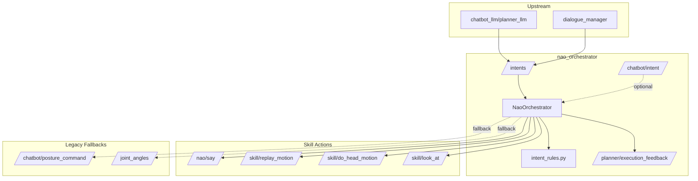

# Orchestration

# NAO Orchestrator

## Overview

`nao_orchestrator` is a lifecycle-managed ROS2 node that serves as the downstream intent dispatcher for the ROS4HRI stack on NAO robots. It receives normalized intents from the dialogue system, deduplicates them, and dispatches them to NAO-specific skill endpoints.

The orchestrator is intentionally **downstream-only** — it does not participate in dialogue management, prompt construction, or user-turn ingestion. Those responsibilities belong to `dialogue_manager` and `chatbot_llm` upstream.

## Architecture



## Key Components

### `NaoOrchestrator` (orchestrator.py)

A ROS2 lifecycle node that manages intent subscriptions, deduplication, and skill dispatch. Key responsibilities:

- **Lifecycle management**: Implements `configure`, `activate`, `deactivate`, `cleanup`, and `shutdown` transitions
- **Intent ingestion**: Subscribes to `/intents` (canonical) and optionally `/chatbot/intent` (legacy bridge)
- **Deduplication**: Suppresses duplicate intents within a configurable time window
- **Plan execution**: Executes structured plans when present in `Intent.data`
- **Skill dispatch**: Routes intents to NAO action servers with fallback mechanisms
- **Diagnostics**: Publishes runtime statistics to `/diagnostics`

### `intent_rules.py`

Pure Python helpers for intent normalization and routing:

| Function | Purpose |
|----------|---------|
| `parse_intent_data()` | Parse JSON payloads from `Intent.data` |
| `normalize_legacy_intent()` | Convert old `/chatbot/intent` strings to canonical form |
| `normalize_incoming_intent()` | Normalize custom/legacy labels to HRI standard intents |
| `resolve_say_text()` | Extract speech text for `/nao/say` dispatch |
| `resolve_ack_text()` | Resolve acknowledgement text without forcing speech dispatch |
| `parse_execution_plan()` | Extract structured plan steps from intent data |
| `validate_execution_plan()` | Validate plan steps before execution |
| `classify_motion_target()` | Map motion intents to execution paths (replay, head, look_at) |
| `make_intent_signature()` | Build stable dedupe keys for intent suppression |

## Intent Handling Flow

### 1. Ingestion

```python
# Canonical path (primary)
_on_intent(msg: Intent) → normalize_incoming_intent() → _handle_intent()

# Legacy bridge (optional, disabled by default)
_on_legacy_intent(msg: String) → normalize_legacy_intent() → _handle_intent()
```

### 2. Deduplication

Before processing, intents are deduplicated using a signature-based window:

```python
signature = make_intent_signature(intent_name, data)
# Returns: "perform_motion::{\"object\":\"stand\"}"

if _is_duplicate(signature):
    return  # Ignored within dedupe_window_sec
```

### 3. Routing Decision

```python
def _handle_intent(intent_name, data, source):
    # Priority 1: Structured plan execution
    if has_valid_plan(data):
        return _handle_planned_intent(...)

    # Priority 2: Speech intents (only if dispatch_speech_intents=True)
    if intent_name in (GREET, SAY):
        if dispatch_speech_intents:
            return _dispatch_say(...)
        return  # Ignored: speech owned by dialogue_manager

    # Priority 3: Motion dispatch
    if intent_name == PERFORM_MOTION:
        return _dispatch_motion_payload(...)

    # Priority 4: KB query observation
    if intent_name in KB_QUERY_INTENTS:
        return  # Logged but not dispatched

    # Priority 5: Unhandled
    log_warning(...)
```

## Structured Plan Execution

When `Intent.data` contains a `plan` field, the orchestrator executes steps in order:

### Supported Step Types

| Type | Description | Required Fields |
|------|-------------|-----------------|
| `say` | Dispatch speech | `text` or `object` |
| `skill` | Execute named skill | `name`, `args` |
| `look_at` | Gaze control | `policy: "reset"` or `target_frame` |
| `noop` | Explicit no-op | None |

### Plan Validation

```python
envelope = validate_execution_plan(intent_name, data)
# Returns:
# {
#   'plan_id': 'plan-42',
#   'steps': [...],
#   'errors': [...],
#   'has_explicit_plan': True,
#   'communication_policy': {...}
# }
```

### Execution Feedback

All plan executions publish structured feedback to `/planner/execution_feedback`:

```json
{
  "intent": "perform_motion",
  "plan_id": "plan-42",
  "status": "running|completed|failed",
  "event_type": "plan_accepted|step_started|step_succeeded|step_failed|plan_completed",
  "step": {"id": "step_1", "type": "skill", ...},
  "reason": "error message if failed",
  "blocking": true,
  "timestamp_sec": 1699876543.123
}
```

## Skill Dispatch

### Action Clients

| Action | Purpose | Fallback |
|--------|---------|----------|
| `/nao/say` | Text-to-speech | None |
| `/skill/replay_motion` | Full-body motion | `/chatbot/posture_command` topic |
| `/skill/do_head_motion` | Head yaw/pitch | `/joint_angles` topic |
| `/skill/look_at` | Gaze tracking | Head motion reset |

### Motion Classification

```python
route, payload = classify_motion_target(PERFORM_MOTION, {'object': 'stand'})
# route: 'replay_motion' | 'head_motion' | 'look_at_reset' | 'unsupported'

# Replay motions: stand, standinit, sit, kneel, crouch
# Head motions: head_center, head_look_left, head_look_right, head_look_up, head_look_down
# Look-at: look_at_reset, look_reset, gaze_reset, reset_gaze
```

### Fallback Behavior

When action servers are unavailable, the orchestrator falls back to legacy topics:

```python
# Replay motion fallback
if not replay_motion_client.wait_for_server():
    if fallback_to_posture_topic:
        publish_to(posture_command_topic, motion_name)

# Head motion fallback
if not head_motion_client.wait_for_server():
    if fallback_to_joint_angles_topic:
        publish_to(joint_angles_topic, JointAnglesWithSpeed)
```

## Configuration

### Parameters (config/00-defaults.yml)

| Parameter | Default | Description |
|-----------|---------|-------------|
| `intent_topic` | `/intents` | Primary intent subscription |
| `enable_legacy_intent_bridge` | `false` | Enable `/chatbot/intent` subscription |
| `legacy_intent_topic` | `/chatbot/intent` | Legacy bridge topic |
| `nao_say_action` | `/nao/say` | Speech action server |
| `dispatch_speech_intents` | `false` | Allow GREET/SAY dispatch |
| `replay_motion_action` | `/skill/replay_motion` | Motion replay action |
| `head_motion_action` | `/skill/do_head_motion` | Head motion action |
| `look_at_action` | `/skill/look_at` | Gaze action |
| `dedupe_window_sec` | `0.8` | Duplicate suppression window |
| `default_greeting` | `"Hello! Nice to meet you."` | Fallback greeting text |

### Timeouts

| Parameter | Default | Description |
|-----------|---------|-------------|
| `nao_say_wait_sec` | `0.2` | Say action server wait |
| `nao_say_result_timeout_sec` | `8.0` | Say result timeout |
| `replay_motion_wait_sec` | `0.2` | Replay action server wait |
| `replay_motion_result_timeout_sec` | `12.0` | Replay result timeout |
| `head_motion_wait_sec` | `0.2` | Head motion server wait |
| `head_motion_result_timeout_sec` | `6.0` | Head motion result timeout |
| `look_at_wait_sec` | `0.2` | Look-at server wait |
| `look_at_result_timeout_sec` | `8.0` | Look-at result timeout |

## Legacy Intent Mapping

The orchestrator maintains backward compatibility with the old `mission_controller` intent labels:

| Legacy Label | Canonical Intent | Notes |
|--------------|------------------|-------|
| `posture_stand`, `__intent_stand__` | `perform_motion` | `object: "stand"` |
| `posture_sit`, `__intent_sit__` | `perform_motion` | `object: "sit"` |
| `posture_kneel`, `__intent_kneel__` | `perform_motion` | `object: "kneel"` |
| `head_center`, `__intent_head_center__` | `perform_motion` | `object: "head_center"` |
| `head_look_left/right/up/down` | `perform_motion` | Head motion variants |
| `__intent_say__` | `say` | Requires `object` field |
| `greet`, `__intent_greet__`, `__intent_hello__` | `greet` | Uses `default_greeting` |
| `identity`, `wellbeing`, `help` | `say` | Static responses |

## Diagnostics

The node publishes to `/diagnostics` every second with runtime statistics:

```
/nao_orchestrator:
  - state: active|inactive
  - intents_received: N
  - duplicates_ignored: N
  - plans_started: N
  - plans_succeeded: N
  - plans_failed: N
  - dispatched_say: N
  - dispatched_replay_motion: N
  - dispatched_head_motion: N
  - dispatched_look_at: N
  - dispatch_failures: N
  - last_intent: <intent_name>
  - last_route: <route_name>
  - last_plan_id: <plan_id>
  - last_plan_status: <status>
```

## Usage Examples

### Canonical Intent Dispatch

```bash
# Motion intent
ros2 topic pub --once /intents hri_actions_msgs/msg/Intent \
  "{intent: 'perform_motion', data: '{\"object\":\"stand\"}'}"

# Structured plan
ros2 topic pub --once /intents hri_actions_msgs/msg/Intent \
  "{intent: 'present_content', data: '{\"plan\":[{\"type\":\"say\",\"args\":{\"text\":\"Hello\"}},{\"type\":\"skill\",\"name\":\"perform_motion\",\"args\":{\"object\":\"stand\"}}]}'}"
```

### Legacy Bridge (for migration)

```bash
# Enable legacy bridge
ros2 run nao_orchestrator run_app --ros-args -p enable_legacy_intent_bridge:=true

# Publish legacy intent
ros2 topic pub --once /chatbot/intent std_msgs/msg/String "{data: 'posture_stand'}"
```

### Look-at Dispatch

```bash
# Reset gaze
ros2 topic pub --once /intents hri_actions_msgs/msg/Intent \
  "{intent: 'perform_motion', data: '{\"object\":\"look_at_reset\"}'}"

# Target frame
ros2 topic pub --once /intents hri_actions_msgs/msg/Intent \
  "{intent: 'perform_motion', data: '{\"plan\":[{\"type\":\"look_at\",\"args\":{\"target_frame\":\"face_1\"}}]}'}"
```

## Design Constraints

1. **Downstream-only**: The orchestrator must not grow dialogue or prompt ownership
2. **No KB prompting**: Knowledge-base queries are observed but not initiated
3. **Speech ownership**: Conversational speech intents are ignored by default (`dispatch_speech_intents: false`) because `dialogue_manager` owns TTS dispatch
4. **Action-first**: Skill actions are preferred; topic fallbacks exist only for migration compatibility

## Launch

```python
# nao_orchestrator.launch.py
ros2 launch nao_orchestrator nao_orchestrator.launch.py
```

The launch file creates a `LifecycleNode` and automatically transitions it to `active` state via a bootstrap script.
