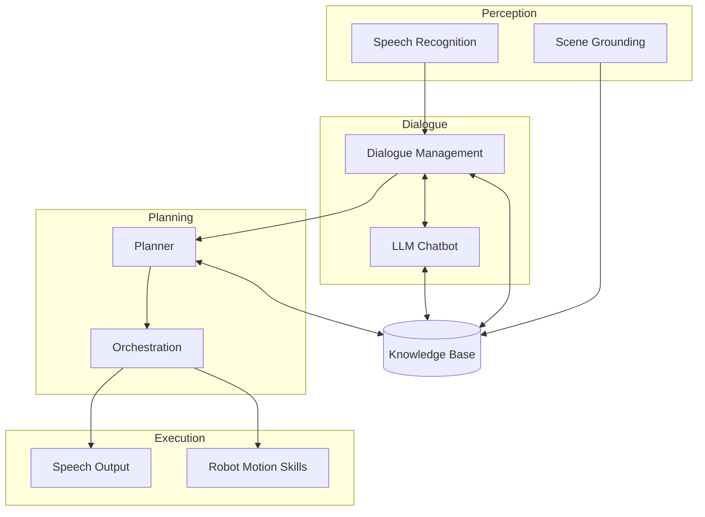

# nao-ros4hri-bridge — Wiki

# NAO ROS4HRI Bridge

A ROS 2 Jazzy workspace enabling natural human-robot interaction on NAO robots. The stack bridges speech input through dialogue management to robot action execution, with a neuro-symbolic knowledge base providing shared context across all components.

## What This Project Does

The NAO ROS4HRI Bridge lets operators interact with NAO robots through natural language. A typical interaction flows like this:

1. **Listen** — Capture audio and transcribe speech offline using Vosk ASR
2. **Understand** — Route transcribed speech through dialogue management to an LLM chatbot backend
3. **Plan** — Transform user intents into executable robot plans via the planner module
4. **Act** — Dispatch intents to NAO-specific skill endpoints (speech, motion, gaze)
5. **Remember** — Maintain symbolic scene state in KnowledgeCore for context-aware responses

The workspace mixes local robot-side runtime packages with fork-tracked upstream dialogue packages, plus optional external dependencies like KnowledgeCore and the NAO simulator.

## Architecture

The architecture separates concerns into four layers: perception ingests the world, dialogue manages the conversation, planning translates intent to action, and execution drives the robot. The Knowledge Base spans all layers as a shared symbolic memory.

## Key End-to-End Flows

### Voice Command Flow

When a user speaks to the robot, [Speech Recognition](speech-recognition.md) captures microphone input through GStreamer and transcribes it using Vosk. The transcription flows to [Dialogue Management](dialogue-management.md), which arbitrates between active sessions and routes the text to the [LLM Chatbot](llm-chatbot.md). The chatbot generates a response and extracts structured intents. These intents may trigger the [Planner](planner.md) to generate executable plans, which [Orchestration](orchestration.md) dispatches to skill endpoints. [Speech Output](speech-output.md) and [Robot Motion Skills](robot-motion-skills.md) execute the resulting actions on the NAO hardware.

### Scene Awareness Flow

Detectors produce raw perception outputs. [Scene Grounding](scene-grounding.md) normalizes these backend-specific messages, assigns stable entity identifiers, and updates transient facts in the Knowledge Base. Downstream consumers like the chatbot query this symbolic state through `/kb/query` or subscribe to `/scene/summary` for a stable view of the world.

### Knowledge Integration

The [Knowledge Base](knowledge-base.md) provides RDF-based storage with OWL2 RL reasoning. All modules interact with it through `kb_skills` — a client library exposing ROS 2 service interfaces. This centralizes symbolic reasoning and keeps detector integration modular.

## Getting Started

The workspace uses a layered Docker image strategy optimized for development velocity. Two profiles are available:

| Profile | Base | Use Case |
|---------|------|----------|
| `overlay` | `iiia:nao` | Incremental builds on validated runtime |
| `full` | `ros:jazzy-ros-base` | Complete rebuild from upstream |

For simulator testing and real-robot validation, use the launch profiles in [nao_chatbot](launch-profiles.md). This package composes migrated HRI components into ready-to-run configurations.

## Module Navigation

The stack is organized into functional domains:

- **Perception**: [Speech Recognition](speech-recognition.md) handles offline ASR; [Scene Grounding](scene-grounding.md) bridges detectors to symbolic state
- **Dialogue**: [Dialogue Management](dialogue-management.md) tracks sessions and routes speech; [LLM Chatbot](llm-chatbot.md) provides the backend
- **Planning**: [Planner](planner.md) transforms requests to plans; [Orchestration](orchestration.md) dispatches intents to skills
- **Execution**: [Speech Output](speech-output.md) and [Robot Motion Skills](robot-motion-skills.md) drive NAO hardware; [Interaction Skills](interaction-skills.md) defines the interface layer
- **Knowledge**: [Knowledge Base](knowledge-base.md) provides symbolic storage and reasoning
- **Infrastructure**: [Launch Profiles](launch-profiles.md) for deployment; [Build & Deployment](build-deployment.md) for CI/CD; [Knowledge Tools](knowledge-tools.md) for code intelligence