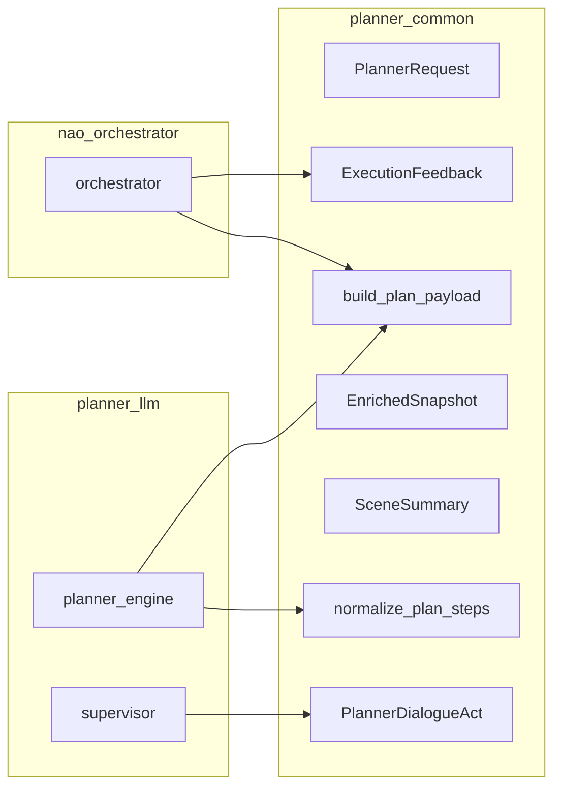

# Planner — planner_common

# Planner Common Module

Shared contract helpers and data structures for the NAO ROS4HRI planner stack. This module provides type-safe dataclasses, JSON normalization utilities, and payload builders used by both the `planner_llm` and `nao_orchestrator` packages.

## Purpose

The `planner_common` package serves as the **contract layer** between planner components:

- Defines the canonical data structures for planner requests, plan steps, execution feedback, and dialogue acts
- Normalizes incoming JSON payloads from external sources (LLM outputs, ROS messages, scene data)
- Builds well-formed output payloads for inter-node communication
- Provides defensive parsing that handles missing or malformed data gracefully

## Architecture



## Data Structures

### PlannerRequest

Immutable dataclass representing a normalized planner ingress payload. Created via `from_payload()`:

```python
from planner_common import PlannerRequest

# Accepts JSON string or dict
request = PlannerRequest.from_payload('{"user_text":"find the cup"}')

# Auto-generates IDs when missing
assert request.request_id.startswith('request_')
assert request.goal_id.startswith('goal_')
assert request.request_kind == 'new_goal'  # default
```

**Key fields:**
| Field | Type | Description |
|-------|------|-------------|
| `request_id` | `str` | Unique request identifier (auto-generated if missing) |
| `goal_id` | `str` | Goal identifier (auto-generated if missing) |
| `request_kind` | `str` | One of `PLANNER_REQUEST_KINDS` |
| `user_text` | `str` | Raw user input text |
| `scene_targets` | `tuple[str, ...]` | Target objects from scene |
| `grounded_context` | `dict` | Normalized context envelope |
| `dialogue_context` | `tuple[str, ...]` | Prior dialogue turns |

### ExecutionFeedback

Normalized feedback payload from planner/executor to supervisor:

```python
from planner_common import ExecutionFeedback

feedback = ExecutionFeedback.from_payload({
    'goal_id': 'goal_1',
    'plan_id': 'plan_1',
    'status': 'failed',
    'step': {'id': 'step_2', 'type': 'skill', 'name': 'perform_motion'},
    'blocking': True,
    'unmet_preconditions': ['cup_visible']
})

assert feedback.event_type == 'step_failed'  # inferred from status
assert feedback.step_id == 'step_2'
```

### PlannerDialogueAct

Planner-initiated dialogue acts for user interaction:

```python
from planner_common import build_dialogue_act_payload, PlannerDialogueAct

payload = build_dialogue_act_payload(
    goal_id='goal_8',
    act='ask_clarification',
    await_user_response=True,
    text_hint='Which cup do you mean?',
    slots_needed=['target_object']
)

act = PlannerDialogueAct.from_payload(payload)
assert act.act == 'ask_clarification'
```

Valid acts: `acknowledge`, `progress_update`, `ask_clarification`, `ask_for_help`, `explain_failure`, `notify_completion`, `notify_cancellation`.

### EnrichedSnapshot & EnrichedEntity

World model snapshot from the World Model Enrichment (WME) node:

```python
from planner_common import EnrichedSnapshot

snapshot = EnrichedSnapshot.from_payload(json_data)
for entity in snapshot.entities:
    if entity.is_plan_relevant:
        print(f"Plan-relevant: {entity.label} (risk: {entity.risk_tags})")
```

### SceneSummary & SceneObject

Grounded scene data from `/scene/summary`:

```python
from planner_common import SceneSummary

summary = SceneSummary.from_payload(scene_json)
for obj in summary.objects:
    print(f"{obj.label}: {obj.entity_id} @ ({obj.center_x}, {obj.center_y})")
```

## Normalization Functions

### normalize_plan_steps

Converts raw plan step lists into the orchestrator-expected structure, filtering invalid step types:

```python
from planner_common import normalize_plan_steps

steps = normalize_plan_steps([
    {'type': 'say', 'args': {'text': 'hello'}},
    {'type': 'invalid_type'},  # filtered out
    {'type': 'skill', 'name': 'grasp', 'on_failure': 'replan'}
])

# Result structure:
# {
#   'id': 'step_1',        # auto-generated if missing
#   'type': 'say',
#   'name': '',
#   'args': {'text': 'hello'},
#   'requires': [],
#   'on_failure': 'fail',
#   'retry_budget': 0
# }
```

Valid step types: `noop`, `say`, `skill`, `look_at`.

### normalize_grounded_context

Ensures the grounded context envelope has all required sections:

```python
from planner_common import normalize_grounded_context

context = normalize_grounded_context({
    'knowledge_snapshot': {'cup': True},
    'world_model_text': 'cup visible'
    # scene_summary and world_model_snapshot auto-filled as {}
})
```

### normalize_communication_policy

Normalizes plan communication flags:

```python
from planner_common import normalize_communication_policy

policy = normalize_communication_policy({'emit_progress': True})
# Returns: {'emit_acknowledge': False, 'emit_progress': True,
#           'emit_completion': True, 'emit_failure': True}
```

## Payload Builders

### build_plan_payload

Constructs the planner result envelope used by `planner_engine._build_decision()`:

```python
from planner_common import build_plan_payload, PlannerRequest

request = PlannerRequest.from_payload({'goal_id': 'goal_1', 'scene_targets': ['cup']})

payload = build_plan_payload(
    request=request,
    steps=[{'type': 'look_at', 'name': 'look_at', 'args': {'target_frame': 'cup_frame'}}],
    validation_status='draft',
    status='executing',
    communication_policy={'emit_progress': True}
)

# payload['plan'] contains the normalized plan structure
# payload['grounded_context'] contains normalized context
# payload['scene_targets'] inherited from request
```

### build_execution_feedback_payload

Builds feedback payloads for orchestrator-to-supervisor communication:

```python
from planner_common import build_execution_feedback_payload

payload = build_execution_feedback_payload(
    intent='raw_user_input',
    source='nao_orchestrator',
    plan_context={'goal_id': 'goal_1', 'plan_id': 'plan_1'},
    status='failed',
    reason='cup left the scene',
    blocking=True,
    unmet_preconditions=['cup_visible']
)
```

### build_world_model_text

Renders a bounded text block for LLM prompt injection:

```python
from planner_common import build_world_model_text

text = build_world_model_text(snapshot, max_chars=2400, max_entities=12)
# Produces:
# Current world model context:
# - observer: myself
# - backend: emorobcare_cv
# - active plan: plan_1 (running)
# - entities:
#   - cup_1, Cup, state=current, plan-relevant, risk=visible_now
```

## JSON Parsing Utilities

### parse_json_object

Safely parses JSON strings or dicts:

```python
from planner_common import parse_json_object

parse_json_object('{"a": 1}')      # {'a': 1}
parse_json_object({'a': 1})        # {'a': 1}
parse_json_object('invalid')        # {}
parse_json_object(None)             # {}
```

### extract_json_object

Extracts JSON from LLM model output, handling fenced code blocks:

```python
from planner_common import extract_json_object

# Handles fenced output
extract_json_object('```json\n{"plan": {"plan_id": "plan_7"}}\n```')
# {'plan': {'plan_id': 'plan_7'}}

# Handles embedded JSON
extract_json_object('Some text {"goal": "find"} more text')
# {'goal': 'find'}
```

## Coercion Utilities

### coerce_bool

Normalizes boolean representations:

```python
from planner_common import coerce_bool

coerce_bool(True)       # True
coerce_bool('true')     # True
coerce_bool('1')        # True
coerce_bool('yes')      # True
coerce_bool('false')    # False
coerce_bool(0)          # False
```

### coerce_str_list

Converts strings, tuples, and lists to clean string lists:

```python
from planner_common import coerce_str_list

coerce_str_list('cup')              # ['cup']
coerce_str_list(['cup', 'bottle'])  # ['cup', 'bottle']
coerce_str_list(('a', 'b'))         # ['a', 'b']
coerce_str_list(None)                # []
```

### truncate_text

Clamps text with ellipsis:

```python
from planner_common import truncate_text

truncate_text('hello world', 5)  # 'hell…'
truncate_text('hi', 10)          # 'hi'
```

## ID Generation

Timestamp-based IDs for traceability:

```python
from planner_common import make_plan_id, make_goal_id, make_runtime_id

plan_id = make_plan_id()      # 'plan_1698765432123'
goal_id = make_goal_id()      # 'goal_1698765432123'
custom_id = make_runtime_id('task')  # 'task_1698765432123'
```

## Constants

```python
from planner_common import (
    PLANNER_REQUEST_KINDS,   # ('new_goal', 'goal_update', 'clarification_answer', 'cancel_request')
    SUPERVISOR_STATUSES,      # ('idle', 'planning', 'executing', 'blocked', ...)
    PLANNER_DIALOGUE_ACTS,   # ('acknowledge', 'progress_update', 'ask_clarification', ...)
    PLAN_STEP_TYPES,         # ('noop', 'say', 'skill', 'look_at')
    PLAN_FAILURE_POLICIES,   # ('fail', 'continue', 'replan', 'clarify', 'ask_user', 'ignore')
)
```

## Usage in Other Packages

### planner_llm

The planner engine uses this module for:
- `PlannerRequest.from_payload()` to parse incoming requests
- `extract_json_object()` to parse LLM model output
- `normalize_plan_steps()` to sanitize plan structures
- `build_plan_payload()` to construct decision outputs
- `normalize_communication_policy()` for plan flags

The supervisor uses:
- `build_dialogue_act_payload()` for user interactions
- `PlannerDialogueAct.from_payload()` to parse dialogue acts

### nao_orchestrator

The orchestrator uses:
- `ExecutionFeedback.from_payload()` to parse feedback
- `build_execution_feedback_payload()` to construct feedback messages

## Design Principles

1. **Immutability**: All dataclasses are frozen; modifications require creating new instances
2. **Defensive parsing**: Missing fields get sensible defaults, invalid types are filtered
3. **No ROS dependencies**: Pure Python for easy testing and reuse
4. **Timestamp IDs**: Millisecond precision for local traceability
5. **Bounded output**: Text functions enforce character limits for LLM context windows
