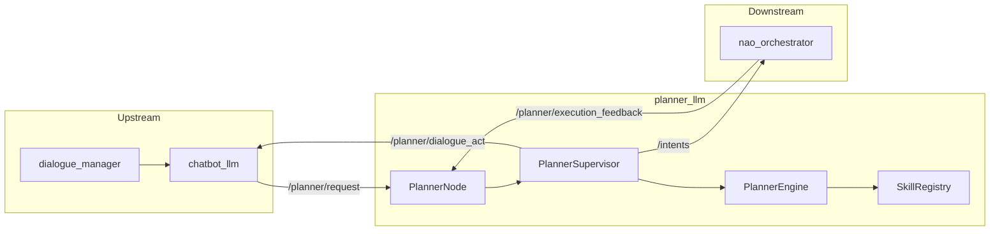
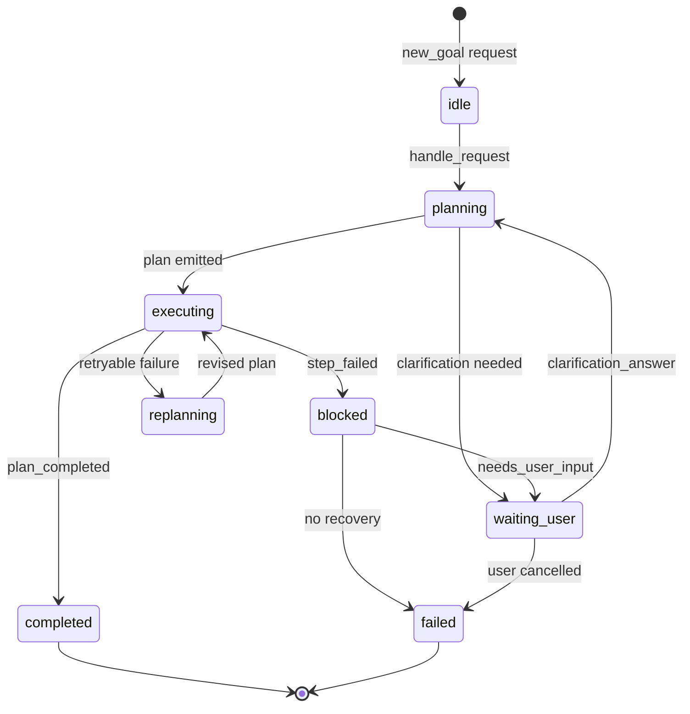

# Planner — planner_llm

# planner_llm

A ROS2 supervisory node that transforms user requests into executable robot plans. It tracks goals over time, manages replanning after execution failures, and coordinates dialogue with the user when clarification is needed.

## Architecture



The node receives enriched planner requests from `chatbot_llm`, maintains goal state across execution turns, and emits either executable plans to `nao_orchestrator` or dialogue acts back to the dialogue layer.

## Core Components

### PlannerNode

The ROS2 node entry point (`planner_node.py`). Handles all topic subscriptions and publications:

- **Subscribes to:**
  - `/planner/request` — PlannerRequest messages from chatbot_llm
  - `/planner/execution_feedback` — Execution status from nao_orchestrator
  - `/world_model/enriched_snapshot` — Structured world model data
  - `/world_model/enriched_text` — Textual world model context

- **Publishes:**
  - `/intents` — Executable plan envelopes
  - `/planner/dialogue_act` — Planner-initiated dialogue acts

The node delegates all planning logic to `PlannerSupervisor` and only handles ROS2 message serialization.

### PlannerSupervisor

Goal-keyed state machine that manages multi-turn planning sessions. Key responsibilities:

- **Goal lifecycle:** Tracks `idle` → `planning` → `executing` → `completed/failed/cancelled` transitions
- **Replanning:** Automatically generates revised plans when execution feedback indicates retryable failures
- **Clarification flow:** Emits dialogue acts instead of intents when user input is needed
- **Goal supersession:** Marks previous goals as superseded when a new goal replaces them

State is keyed by `goal_id`, allowing concurrent goal tracking (though typically one active goal at a time).

### PlannerEngine

Pure planning logic that produces `PlannerDecision` objects. Two planning modes:

1. **Rule-based planning:** Fast-path for simple, single-intent requests (e.g., `head_look_left`, `posture_stand`). No LLM call required.

2. **LLM-based planning:** For multi-step or ambiguous requests. Constructs a prompt with:
   - User request and normalized intents
   - World model context
   - Execution feedback (if replanning)
   - Skill registry manifest
   - Allowed step types and motion objects

The engine validates LLM output against the skill registry, filtering unsupported skills and falling back to clarification if the output is invalid.

### SkillRegistry

Loads planner-facing skill metadata from two sources:

1. **JSON overlay:** `config/skill_registry.json` — explicit skill definitions
2. **Package exports:** Skill manifests embedded in `package.xml` files of skill packages

The registry exposes:
- `step_types`: Allowed step types (`noop`, `say`, `skill`, `look_at`)
- `allowed_skill_names`: Valid skill names and aliases
- `supports_step()`: Validates a step against registered skills
- `filter_supported_steps()`: Removes invalid steps from a plan

### Provider Adapters

LLM backend adapters implementing `BasePlannerProvider`:

- **OllamaPlannerProvider:** Local Ollama models via `/api/chat`
- **OpenAICompatiblePlannerProvider:** OpenAI-compatible endpoints (WatsonOW, etc.) via `/v1/chat/completions`

Both adapters handle authentication, timeout, and response parsing. Provider selection is configured via the `provider` parameter.

## Data Contracts

### Planner Request (Input)

Received on `/planner/request` as `hri_actions_msgs/msg/Intent` with JSON in `Intent.data`:

```json
{
  "request_id": "turn_123",
  "goal_id": "goal_123",
  "request_kind": "new_goal",
  "user_text": "look left and then sit down",
  "normalized_intents": ["head_look_left"],
  "ack_text": "I will do that.",
  "ack_mode": "say",
  "scene_targets": [],
  "dialogue_context": [],
  "grounded_context": { ... },
  "planner_mode": "multi_step",
  "interaction_mode": "default",
  "dialogue_turn_id": "dialogue_123"
}
```

Key fields:
- `goal_id`: Supervisor key; reuse for replans and clarification answers
- `request_kind`: `new_goal`, `clarification_answer`, `update`, or `cancel_request`
- `normalized_intents`: Best-effort hints; `user_text` is authoritative
- `planner_mode`: `multi_step` forces LLM planning even for simple intents

### Executable Plan (Output)

Published on `/intents` when a plan is ready for execution:

```json
{
  "goal_id": "goal_123",
  "plan": {
    "plan_id": "plan_123",
    "plan_version": 2,
    "status": "replanning",
    "validation_status": "draft",
    "retry_budget": 1,
    "communication_policy": {
      "emit_acknowledge": false,
      "emit_progress": false,
      "emit_completion": true,
      "emit_failure": true
    },
    "steps": [
      {
        "id": "step_1",
        "type": "skill",
        "name": "perform_motion",
        "args": {"object": "head_look_left"},
        "requires": [],
        "on_failure": "replan",
        "retry_budget": 0
      }
    ]
  }
}
```

### Dialogue Act (Output)

Published on `/planner/dialogue_act` when the planner needs user interaction:

```json
{
  "goal_id": "goal_123",
  "plan_id": "plan_123",
  "plan_version": 2,
  "act": "ask_clarification",
  "priority": "normal",
  "await_user_response": true,
  "reason": "missing target object",
  "text_hint": "Which cup do you mean?",
  "slots_needed": ["target_object"],
  "context": {
    "scene_targets": ["cup"],
    "status": "waiting_user"
  }
}
```

Dialogue act types:
- `ask_clarification`: Ambiguous or incomplete request
- `ask_for_help`: Execution blocked, needs user intervention
- `explain_failure`: Cannot continue safely
- `notify_completion`: Goal finished successfully
- `notify_cancellation`: Goal cancelled by user

## Supervisor State Machine



State transitions are driven by:
- **Requests:** `new_goal`, `clarification_answer`, `cancel_request`
- **Feedback:** `plan_accepted`, `step_started`, `step_succeeded`, `step_failed`, `plan_completed`, `plan_invalid`

## Configuration

Parameters in `config/00-defaults.yml`:

| Parameter | Default | Description |
|-----------|---------|-------------|
| `planner_request_topic` | `/planner/request` | Incoming request topic |
| `intent_topic` | `/intents` | Outgoing plan topic |
| `planner_feedback_topic` | `/planner/execution_feedback` | Execution feedback topic |
| `planner_dialogue_act_topic` | `/planner/dialogue_act` | Dialogue act topic |
| `skill_registry_path` | `""` | Optional override for skill registry |
| `provider` | `ollama` | LLM provider (`ollama`, `openai`, `watsonow`) |
| `model` | `gpt-oss:120b-cloud` | Model identifier |
| `base_url` | `http://127.0.0.1:11434` | Provider endpoint |
| `temperature` | `0.1` | LLM temperature |
| `max_tokens` | `800` | Max response tokens |
| `timeout_sec` | `20.0` | Request timeout |
| `default_retry_budget` | `1` | Default retries per plan |
| `auto_replan` | `true` | Auto-replan on retryable failures |

## Skill Registry

The skill registry defines the abstract execution surface available to the planner. Skills are mapped to robot adapters by `robot_adapter_mapping`:

```json
{
  "name": "perform_motion",
  "aliases": ["motion"],
  "category": "embodiment",
  "params": ["object", "speed", "relative", "yaw", "pitch"],
  "required_params": ["object"],
  "retryable": true,
  "can_request_clarification": true,
  "timeout_hint": 10.0,
  "safety_flags": ["motion"],
  "robot_adapter_mapping": "nao_orchestrator.perform_motion"
}
```

The planner should never reference raw robot topics or NAOqi APIs directly—only skills in the registry.

## Testing

Local smoke test:

```bash
ros2 launch nao_chatbot nao_chatbot_planner_local.launch.py
```

Publish fixture messages:

```bash
ros2 run planner_llm publish_fixture request
ros2 run planner_llm publish_fixture feedback
```

Unit tests:

```bash
colcon build --packages-select planner_common planner_llm
pytest src/planner_common/test/test_contracts.py src/planner_llm/test/test_planner_engine.py
```

## Key Design Decisions

1. **Supervisor owns goal state:** The planner is not stateless—it tracks goal lifecycle across multiple turns and feedback events.

2. **Rule-based fast path:** Simple motions bypass the LLM entirely, reducing latency and cost for common operations.

3. **Skill registry as abstraction layer:** The planner reasons over abstract skills, not robot-specific APIs. This isolates planning logic from hardware changes.

4. **Dialogue acts for user interaction:** When the planner needs clarification or must report failure, it emits dialogue acts rather than speaking directly. The dialogue layer owns final phrasing.

5. **Retry budget delegation:** The planner sets retry budgets per plan, but execution feedback determines actual retry counts. This allows downstream components to influence replanning behavior.
