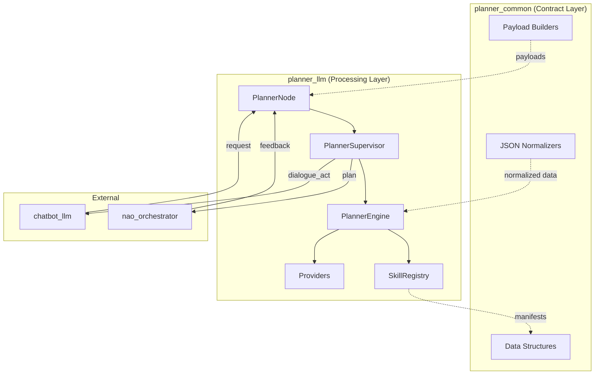

# Planner

# Planner

The Planner module transforms natural language user requests into executable robot plans, managing the full lifecycle from request interpretation through execution monitoring and replanning.

## Sub-modules

| Module | Purpose |
|--------|---------|
| [planner_llm](planner-llm.md) | ROS2 supervisory node handling request processing, goal tracking, and replanning |
| [planner_common](planner-common.md) | Shared data structures, JSON normalization, and payload builders |

## Architecture

## How the Sub-modules Work Together

**planner_common** defines the contract — all data structures that flow through the system (`PlannerRequest`, `PlanStep`, `ExecutionFeedback`, `DialogueAct`) are declared here, along with normalization utilities that handle malformed external data. This ensures `planner_llm` and `nao_orchestrator` share a consistent schema without tight coupling.

**planner_llm** implements the processing logic. `PlannerNode` receives requests and feedback, delegating to `PlannerSupervisor` for state management. The supervisor tracks active goals, handles replanning triggers, and coordinates with `PlannerEngine` for plan generation. `SkillRegistry` loads skill manifests at startup and provides capability information to the engine.

## Key Workflows

**Request → Plan Flow**
1. `chatbot_llm` publishes a `PlannerRequest` (normalized by planner_common)
2. `PlannerNode` receives it via `/planner/request`
3. `PlannerSupervisor.handle_request()` evaluates the goal state
4. `PlannerEngine` generates a plan using skill rules or LLM providers
5. Resulting intents publish to `nao_orchestrator`

**Execution Feedback Loop**
1. `nao_orchestrator` publishes `ExecutionFeedback` on failure/completion
2. `PlannerNode` routes to `PlannerSupervisor.handle_feedback()`
3. Supervisor decides: replan, request clarification, or mark complete
4. Clarification requests flow back to `chatbot_llm` via `/planner/dialogue_act`

**Skill Loading**
At node initialization, `SkillRegistry` discovers skill manifests from installed packages, parsing YAML into structured `SkillDefinition` objects using planner_common's coercion utilities. This allows the planner to reason about available robot capabilities without hardcoding them.