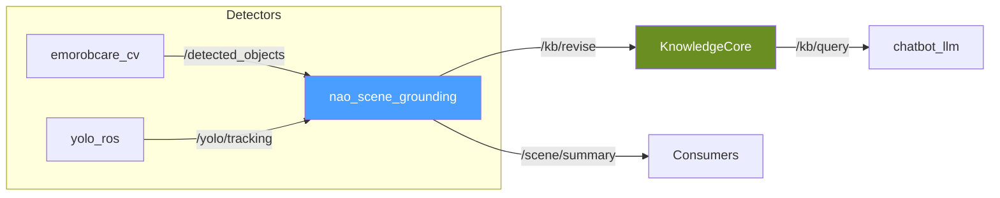

# Scene Grounding

# Scene Grounding Module

## Overview

`nao_scene_grounding` bridges detector outputs to the symbolic scene state used by the NAO ROS4HRI stack. It normalizes backend-specific detection messages into a shared internal format, assigns stable entity identifiers, and refreshes transient facts in KnowledgeCore for downstream consumers like `chatbot_llm`.

The module keeps detector integration modular—detector packages own inference, scene grounding owns detector-to-KB translation, and downstream nodes read through the stable `/scene/summary` topic or `/kb/query` path.

## Architecture



## Data Flow

1. **Ingestion** — The node subscribes to a detector-specific topic based on `detector_backend` parameter
2. **Normalization** — Backend adapters convert detector messages into `ObjectObservation` instances
3. **Filtering** — Observations are filtered by `allowed_labels` and `min_detection_score`
4. **Identity Stabilization** — Tracker-less detections are matched against recent tracked objects to reuse entity IDs
5. **KB Refresh** — Transient facts are pushed to KnowledgeCore via `/kb/revise` with configurable lifespan
6. **Summary Publication** — A compact JSON summary is published to `/scene/summary`

## Key Components

### `NaoSceneGrounding` Node

**File:** `scene_grounding_node.py`

The main ROS2 node that orchestrates the grounding pipeline. It maintains local tracking state, handles housekeeping for stale objects, and manages the KnowledgeCore mutation client.

**Core responsibilities:**
- Subscribe to detector topics based on configured backend
- Parse and normalize incoming detections
- Maintain `_TrackedObject` state for identity persistence
- Publish scene summaries only when content changes
- Expire stale objects based on `local_stale_after_sec`

### Detector Adapters

**File:** `detector_adapters.py`

Backend-specific adapters that translate detector messages into the normalized `ObjectObservation` format.

#### `ObjectObservation`

```python
@dataclass(frozen=True)
class ObjectObservation:
    entity_id: str       # Stable identifier (e.g., "detected_tomato_123")
    label: str            # Normalized label (e.g., "tomato")
    kb_class: str         # KnowledgeBase class (e.g., "Tomato")
    score: float          # Detection confidence
    tracker_id: str       # Tracker ID if available, empty otherwise
    source: str           # Backend name (e.g., "emorobcare_cv")
    center_x: float       # Bounding box center X
    center_y: float       # Bounding box center Y
```

#### `EmorobcareDetectionAdapter`

Handles `emorobcare_cv_msgs/msg/ObjectDetections` messages. Computes bounding box centers from `x1, y1, x2, y2` coordinates. Does not receive tracker IDs from this backend.

#### `YoloRosDetectionAdapter`

Handles `yolo_msgs/msg/DetectionArray` messages. Extracts tracker IDs from `detection.id` and center coordinates from `bbox.center.position`.

### Identity Matching

**File:** `identity_matching.py`

Provides identity stabilization for tracker-less detector backends. When a new detection arrives without a tracker ID, the module attempts to match it against recently seen objects with the same label within a configurable distance threshold.

```python
def reconcile_observation_entity_ids(
    observations: list[ObjectObservation],
    tracked_objects: Iterable[TrackedObservationLike],
    *,
    now_sec: float,
    max_match_distance_px: float,
    max_match_age_sec: float,
) -> list[ObjectObservation]
```

**Matching criteria:**
- Same normalized label
- Same KB class
- Same source backend
- Within `max_match_distance_px` of a tracked object
- Tracked object seen within `max_match_age_sec`

## Configuration

### Default Parameters

**File:** `config/00-defaults.yml`

| Parameter | Default | Description |
|-----------|---------|-------------|
| `detector_backend` | `emorobcare_cv` | Backend adapter to use |
| `detector_topic` | `/detected_objects` | Input topic for detections |
| `summary_topic` | `~/summary` | Output topic for scene summary |
| `min_detection_score` | `0.35` | Minimum confidence threshold |
| `allowed_labels` | `bottle,cup,book,...` | Comma-separated allowed labels |
| `label_class_overrides` | `{}` | JSON mapping of label → KB class |
| `entity_prefix` | `detected` | Prefix for generated entity IDs |
| `observer_name` | `myself` | Observer name for KB facts |
| `knowledge_enabled` | `true` | Whether to push KB facts |
| `knowledge_revise_service_name` | `/kb/revise` | KB mutation service |
| `knowledge_lifespan_sec` | `4.0` | Fact lifespan in KB |
| `knowledge_refresh_interval_sec` | `1.0` | Min interval between KB updates |
| `local_stale_after_sec` | `4.5` | Local object expiry time |
| `fallback_match_distance_px` | `64.0` | Max distance for ID matching |
| `fallback_match_max_age_sec` | `2.0` | Max age for ID matching |

### Label to KB Class Mapping

Default mappings are defined in `DEFAULT_LABEL_CLASS_MAP`:

```python
DEFAULT_LABEL_CLASS_MAP = {
    'backpack': 'Backpack',
    'book': 'Book',
    'bottle': 'Bottle',
    'cell phone': 'CellPhone',
    'chair': 'Chair',
    'cup': 'Cup',
    # ... additional mappings
}
```

Override via `label_class_overrides` parameter:

```yaml
label_class_overrides: >
  {
    "cell phone": "CellPhone",
    "cup": "DrinkingCup"
  }
```

## Entity ID Generation

Entity IDs are generated from either tracker IDs or bounding box centers:

```python
def build_entity_id(
    *,
    entity_prefix: str,    # "detected"
    label: str,            # "tomato"
    tracker_id: str,       # "12" or empty
    center_x: float,
    center_y: float,
) -> str
```

**With tracker ID:** `detected_tomato_12`  
**Without tracker ID:** `detected_tomato_30_40` (using center coordinates)

## Usage

### Launch with Main Stack

**Simulator + emorobcare detection:**
```bash
ros2 launch nao_chatbot nao_chatbot_sim.launch.py \
  start_object_detection:=true \
  start_scene_grounding:=true \
  object_detection_backend:=emorobcare_cv
```

**Real robot + emorobcare detection:**
```bash
ros2 launch nao_chatbot nao_chatbot_robot.launch.py \
  start_object_detection:=true \
  start_scene_grounding:=true \
  object_detection_backend:=emorobcare_cv \
  nao_ip:=<robot_ip>
```

### Standalone Debugging

Run the grounding node without the full stack:

```bash
# Terminal 1: Start detector
ros2 run emorobcare_cv_object_detection object_detector_node

# Terminal 2: Start grounding bridge
ros2 run nao_scene_grounding start_node --ros-args \
  -p detector_backend:=emorobcare_cv \
  -p detector_topic:=/detected_objects \
  -p summary_topic:=/scene/summary

# Terminal 3: Monitor output
ros2 topic echo /scene/summary
```

**Disable KB integration for isolated testing:**
```bash
ros2 run nao_scene_grounding start_node --ros-args \
  -p knowledge_enabled:=false
```

## Output Topics

### `/scene/summary`

**Type:** `std_msgs/msg/String` (JSON)

```json
{
  "observer": "myself",
  "backend": "emorobcare_cv",
  "objects": [
    {
      "entity_id": "detected_tomato_512_377",
      "label": "tomato",
      "kb_class": "Tomato",
      "score": 0.88,
      "tracker_id": "",
      "source": "emorobcare_cv",
      "center_x": 512.0,
      "center_y": 377.0,
      "last_seen_sec": 10.352
    }
  ]
}
```

### KnowledgeCore Facts

The node writes transient facts via `/kb/revise`:

```
myself sees detected_tomato_123
detected_tomato_123 rdf:type Tomato
```

Facts have a configurable lifespan and are refreshed on repeated observations before expiry.

## Integration Points

### Dependencies

| Package | Purpose |
|---------|---------|
| `rclpy` | ROS2 Python client |
| `std_msgs` | Standard message types |
| `kb_skills` | KnowledgeCore mutation client |
| `emorobcare_cv_msgs` | Emorobcare detector messages (optional) |
| `yolo_msgs` | YOLO detector messages (optional) |

### Downstream Consumers

- `chatbot_llm` reads grounded scene through `/kb/query` + `knowledge_snapshot` path
- Future VLM consumers can read `/scene/summary` directly

## Tuning for Noisy Detections

When small objects cause ID churn:

1. **Raise `min_detection_score`** — Filter low-confidence detections first
2. **Adjust `fallback_match_distance_px`** — Increase matching radius for nearby detections
3. **Tune `knowledge_lifespan_sec`** — Shorter lifespan reduces stale object persistence
4. **Adjust `local_stale_after_sec`** — Should be ≥ `knowledge_lifespan_sec`

## Debug Checklist

1. **Verify package discovery:**
   ```bash
   ros2 pkg list | grep -E 'emorobcare_cv|nao_scene_grounding'
   ```

2. **Check node presence:**
   ```bash
   ros2 node list | grep -E 'object_detector|nao_scene_grounding'
   ```

3. **Verify topic flow:**
   ```bash
   ros2 topic hz /detected_objects
   ros2 topic echo /scene/summary
   ```

4. **Check detector dependencies:**
   ```bash
   python3 -c "import ultralytics"
   ```

If detector packages exist in `src/` but don't appear in `ros2 pkg list`, rebuild the workspace or overlay image.
