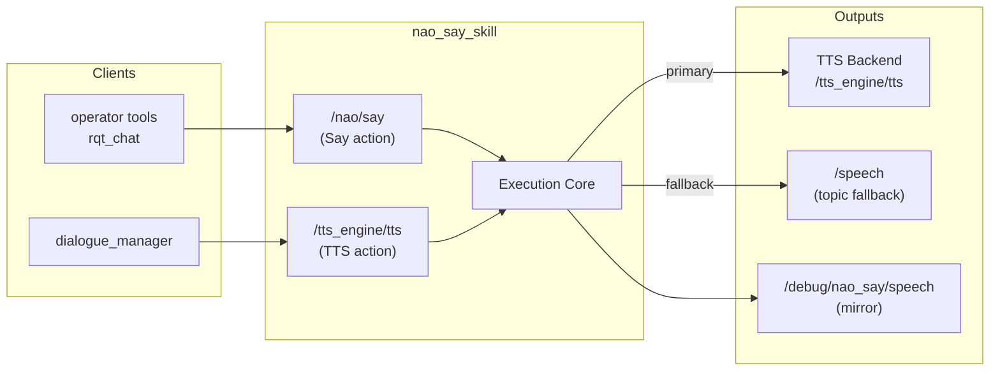

# Speech Output

# Speech Output Module (nao_say_skill)

## Overview

`nao_say_skill` is a lifecycle-managed ROS 2 node that provides NAO-specific speech execution. It serves as the robot-side execution hook for speech requests, exposing two action interfaces:

- **`/nao/say`** — NAO-specific speech action endpoint (`communication_skills/action/Say`)
- **`/tts_engine/tts`** — Compatibility TTS action for `dialogue_manager` (`tts_msgs/action/TTS`)

The module does **not** own the canonical `/skill/say` endpoint — that responsibility remains with `dialogue_manager`. This package handles the actual speech execution on the robot.

## Architecture



## Execution Flow

### Primary Path (TTS Backend)

When a downstream TTS action is configured via `tts_backend_action_name`:

1. Goal received at `/nao/say` or `/tts_engine/tts`
2. Goal validated (active state, no concurrent execution, non-empty text)
3. Debug topic mirror published
4. Debug TTS action dispatched (fire-and-forget to `/debug/say`)
5. Goal forwarded to configured TTS backend
6. Feedback forwarded back to original goal handle
7. Result returned on completion

### Fallback Paths

When TTS backend is unavailable or fails:

| Condition | Behavior |
|-----------|----------|
| No `tts_backend_action_name` configured | Falls back to `/speech` topic |
| TTS server unavailable | Falls back to `/speech` topic |
| TTS goal rejected/aborted | Falls back to `/speech` topic |
| No `/speech` subscribers | Logs warning, still mirrors to debug topic |

## Key Components

### NaoSaySkill Class

**File:** `nao_say_skill/skill_impl.py`

The main lifecycle node class that manages all speech execution.

#### Lifecycle Transitions

| Transition | Actions |
|------------|---------|
| `configure` | Creates action servers, publishers, TTS clients, diagnostics timer |
| `activate` | Sets `_is_active = True`, enables goal acceptance |
| `deactivate` | Sets `_is_active = False`, blocks new goals |
| `shutdown` | Destroys all servers, clients, publishers, timers |

#### Thread Safety

- `_execution_lock` (`threading.Lock`) ensures only one speech goal executes at a time
- `ReentrantCallbackGroup` allows concurrent action server callbacks
- Goals received during execution are rejected with "another goal is running"

#### Core Methods

| Method | Purpose |
|--------|---------|
| `execute_say_callback` | Handles `/nao/say` action goals |
| `execute_tts_callback` | Handles `/tts_engine/tts` action goals |
| `_run_execution` | Unified execution logic for both action types |
| `_forward_tts_goal` | Forwards goal to downstream TTS backend |
| `_publish_speech_topic` | Fallback publication to `/speech` topic |
| `_publish_debug_speech` | Mirror to debug topic |
| `_dispatch_debug_tts` | Fire-and-forget dispatch to debug TTS action |

### Goal Metadata Extraction

Turn IDs are extracted from goal metadata for tracing:

```python
# Priority order for turn ID extraction:
# 1. group_id with "turn:" prefix → extracts "abc123" from "turn:abc123"
# 2. person_id with "turn:" prefix
# 3. group_id or person_id as plain identifier
# 4. First 32 chars of input text (for TTS goals)
# 5. "unknown" as fallback
```

### Diagnostics

Published to `/diagnostics` every 1 second:

| Field | Description |
|-------|-------------|
| `state` | `active` or `inactive` |
| `say_action_name` | Configured `/nao/say` action name |
| `tts_action_name` | Compatibility TTS action name |
| `tts_backend_action_name` | Downstream TTS backend (or fallback indicator) |
| `speech_topic_subscribers` | Current subscriber count for `/speech` |
| `goals_started/succeeded/failed` | Runtime statistics |
| `last_message` | Most recent utterance (truncated to 120 chars) |

## Configuration

### Parameters

**File:** `config/00-defaults.yml`

| Parameter | Default | Description |
|-----------|---------|-------------|
| `say_action_name` | `/nao/say` | NAO-specific speech action endpoint |
| `tts_action_name` | `/tts_engine/tts` | Compatibility TTS action for dialogue_manager |
| `tts_backend_action_name` | `""` | Downstream TTS action server (empty = topic fallback) |
| `debug_tts_action_name` | `/debug/say` | Debug TTS action for operator tools |
| `speech_topic` | `/speech` | Direct robot speech topic fallback |
| `debug_speech_topic` | `/debug/nao_say/speech` | Debug mirror topic |
| `default_language` | `en-US` | Default TTS language |
| `default_volume` | `1.0` | Default TTS volume (0.0–1.0) |
| `tts_server_wait_sec` | `0.5` | Timeout for TTS backend availability check |
| `debug_tts_server_wait_sec` | `0.1` | Best-effort timeout for debug TTS |
| `fallback_to_speech_topic` | `true` | Enable `/speech` topic fallback |
| `also_publish_debug_topic` | `true` | Mirror successful requests to debug topic |
| `forward_debug_tts_action` | `true` | Forward utterances to debug TTS action |
| `fallback_to_debug_topic` | `true` | Publish to debug topic if TTS unavailable |

### Loop Prevention

The node validates action names to prevent feedback loops:

- If `tts_backend_action_name` matches `tts_action_name`, the backend client is disabled
- If `debug_tts_action_name` overlaps with active TTS routes, debug forwarding is disabled

## Launch

### Standalone

```bash
ros2 launch nao_say_skill nao_say_skill.launch.py
```

### With Simulator Stack

```bash
ros2 launch nao_chatbot nao_chatbot_sim.launch.py
```

### On Real Robot

```bash
ros2 launch nao_chatbot nao_chatbot_robot.launch.py nao_ip:=<robot_ip>
```

### Lifecycle Bootstrap

The launch file includes a bash script that automatically transitions the node through lifecycle states:

1. `unconfigured` → `configure` → `inactive`
2. `inactive` → `activate` → `active`

Timeout is configurable (default 30 seconds).

## Integration Notes

### With dialogue_manager

`dialogue_manager` sends speech requests via `/tts_engine/tts`. This node acts as the compatibility layer, forwarding to the NAO-specific execution path.

### With Operator Tools

Tools like `rqt_chat` can expose their own TTS server on `/debug/say`. This runs in parallel to the canonical speech path without conflicts.

### With Expressive Face

When running with the simulator, disable `expressive_face` TTS to avoid multiple `/tts_engine/tts` servers causing unexpected goal routing.

### Topic Subscriber Warning

If no node subscribes to `/speech` at runtime:
- The utterance is still mirrored to debug channels
- A warning is logged: `SPEECH_TOPIC_NO_SUBSCRIBERS`
- Robot will not actually speak

## Testing

**File:** `test/test_nao_say_skill_unit.py`

Unit tests cover:
- Turn ID extraction from goal metadata
- Boolean parameter parsing from string variants
- Edge cases in identifier handling

Runtime forwarding is exercised through launch/integration smoke tests rather than mocked end-to-end TTS responses.