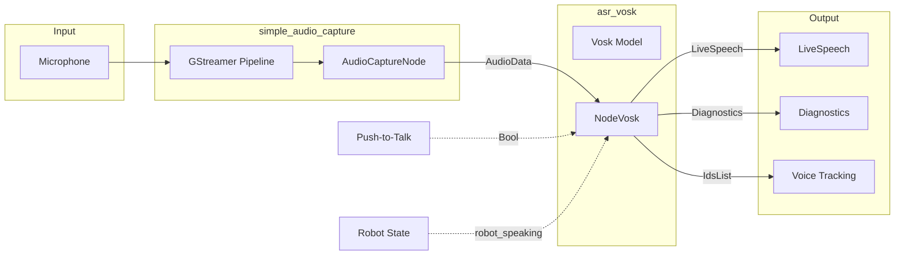

# Speech Recognition

# Speech Recognition Module

The Speech Recognition module provides offline, real-time automatic speech recognition (ASR) for ROS2-based robotic systems. It consists of two packages: `simple_audio_capture` for microphone input and `asr_vosk` for speech recognition using the Vosk engine.

## Architecture Overview



## Package: asr_vosk

### Purpose

`asr_vosk` is a ROS2 lifecycle node that performs offline speech recognition using Vosk models. It subscribes to raw audio data and publishes recognized speech as `hri_msgs/LiveSpeech` messages following the ROS4HRI convention.

### Key Components

#### NodeVosk Class (`node_vosk.py`)

The main lifecycle node implementing speech recognition with the following responsibilities:

- **Model Loading**: Loads Vosk models from filesystem paths
- **Audio Processing**: Processes incoming `AudioData` messages through the Vosk recognizer
- **Hypothesis Filtering**: Applies configurable filters to reject low-quality or filler utterances
- **Listening State Management**: Controls when ASR is active based on push-to-talk and robot-speaking signals

#### Lifecycle States

| State | Description |
|-------|-------------|
| Unconfigured | Initial state after construction |
| Inactive | Configured but not processing audio |
| Active | Fully operational, processing audio |

#### Listening State Logic

The node only processes audio when `listening` is `true`. This is determined by:

```python
listening = operator_listening_enabled and not robot_speaking
```

Where:
- `operator_listening_enabled` is set by `start_listening` parameter or push-to-talk topic
- `robot_speaking` comes from `/robot_speaking` subscription (prevents echo)

### Published Topics

| Topic | Message Type | Description |
|-------|--------------|-------------|
| `/humans/voices/anonymous_speaker/speech` | `hri_msgs/LiveSpeech` | Recognized speech (configurable) |
| `/humans/voices/tracked` | `hri_msgs/IdsList` | Active voice IDs (always `["anonymous_speaker"]`) |
| `/humans/voices/anonymous_speaker/audio` | `audio_common_msgs/AudioData` | Forwarded audio data |
| `/humans/voices/anonymous_speaker/is_speaking` | `std_msgs/Bool` | Voice activity indicator |
| `/diagnostics` | `diagnostic_msgs/DiagnosticArray` | Runtime status |

### Subscribed Topics

| Topic | Message Type | Description |
|-------|--------------|-------------|
| `microphone_topic` | `audio_common_msgs/AudioData` | Audio input (default: `/laptop/microphone0`) |
| `audio/voice_detected` | `std_msgs/Bool` | Voice activity detection |
| `/robot_speaking` | `std_msgs/Bool` | Robot speaking state |
| `push_to_talk_topic` | `std_msgs/Bool` | Push-to-talk control (when enabled) |

### Hypothesis Filtering

Final hypotheses pass through a filter chain before publication:

1. **Character threshold** (`min_final_chars`): Rejects hypotheses shorter than N characters
2. **Word threshold** (`min_final_words`): Rejects hypotheses with fewer than N words
3. **Confidence threshold** (`min_final_confidence`): Rejects hypotheses below confidence level
4. **Filler filtering** (`ignore_single_token_fillers`): Rejects single-token fillers (uh, um, hmm, etc.)

```python
def _should_publish_final(self, text, confidence):
    # Filter chain applied in order
    if len(normalized_text) < self.min_final_chars:
        return False, 'min_final_chars'
    if len(tokens) < self.min_final_words:
        return False, 'min_final_words'
    if confidence < self.min_final_confidence:
        return False, 'min_final_confidence'
    if single_token_filler:
        return False, 'single_token_filler'
    return True, ''
```

### Dynamic Parameter Updates

The `microphone_topic` parameter can be changed at runtime. The node destroys the old subscription and creates a new one:

```python
def on_parameter_change(self, params):
    if param.name == "microphone_topic":
        self._replace_audio_subscription(new_topic)
```

### Configuration Parameters

| Parameter | Type | Default | Description |
|-----------|------|---------|-------------|
| `audio_rate` | int | 16000 | Audio sample rate in Hz |
| `model` | string | `/models/vosk-model-small-en-us-0.15` | Path to Vosk model |
| `microphone_topic` | string | `/laptop/microphone0` | Input audio topic |
| `start_listening` | bool | true | Start listening on activation |
| `output_speech_topic` | string | `/humans/voices/anonymous_speaker/speech` | Output topic |
| `speech_locale` | string | `en_US` | Locale metadata for LiveSpeech |
| `publish_partials` | bool | false | Publish incremental hypotheses |
| `min_final_chars` | int | 2 | Minimum characters for final |
| `min_final_words` | int | 1 | Minimum words for final |
| `min_final_confidence` | float | 0.0 | Minimum confidence [0-1] |
| `ignore_single_token_fillers` | bool | true | Filter single-token fillers |
| `single_token_fillers_csv` | string | `uh,um,hmm,huh,erm,ah,eh` | Filler tokens |
| `debug_log_results` | bool | false | Log filtering decisions |
| `push_to_talk_enabled` | bool | false | Require explicit enable signal |
| `push_to_talk_topic` | string | `/asr_vosk/push_to_talk` | PTT control topic |

---

## Package: simple_audio_capture

### Purpose

`simple_audio_capture` captures audio from a microphone using GStreamer and publishes it as ROS2 messages. It serves as the audio source for `asr_vosk`.

### Key Components

#### AudioCaptureNode Class (`audio_capture_node.py`)

A standard ROS2 node (not lifecycle-managed) that:

- Initializes a GStreamer pipeline with configurable source
- Publishes raw and timestamped audio data
- Publishes audio configuration info

### GStreamer Pipeline

The node creates a minimal pipeline:

```
[source] -> [appsink]
```

Where `source` is configurable (`pulsesrc` or `alsasrc`). The pipeline runs in a dedicated thread using a GLib main loop.

### Published Topics

| Topic | Message Type | Description |
|-------|--------------|-------------|
| `audio_topic` | `audio_common_msgs/AudioData` | Raw audio chunks |
| `{audio_topic}_stamped` | `audio_common_msgs/AudioDataStamped` | Timestamped audio |
| `/audio_info` | `audio_common_msgs/AudioInfo` | Audio configuration (latched) |

### Configuration Parameters

| Parameter | Type | Default | Description |
|-----------|------|---------|-------------|
| `source_type` | string | `pulsesrc` | GStreamer source element |
| `device` | string | "" | Device identifier (optional) |
| `format` | string | `wave` | Audio format label |
| `sample_format` | string | `S16LE` | PCM sample format |
| `sample_rate` | int | 16000 | Sample rate in Hz |
| `channels` | int | 1 | Number of channels |
| `depth` | int | 16 | Bit depth |
| `chunk_size` | int | 2048 | Bytes per published chunk |
| `audio_topic` | string | `/laptop/microphone0` | Output topic name |

### Source Element Resolution

The node attempts to resolve the configured source element with fallback:

```python
def _resolve_source_factory(self, configured_source):
    for candidate in (configured_source, 'pulsesrc', 'alsasrc'):
        factory = Gst.ElementFactory.find(candidate)
        if factory:
            return candidate, factory, tried
    return configured_source, None, tried
```

---

## Usage

### Launching ASR Standalone

```bash
ros2 launch asr_vosk asr_vosk.launch.py \
  model:=/models/vosk-model-small-en-us-0.15 \
  microphone_topic:=/laptop/microphone0
```

### Launching Audio Capture Standalone

```bash
ros2 launch simple_audio_capture audio_capture.launch.py \
  audio_topic:=/laptop/microphone0
```

### Model Requirements

Vosk models are not included in the repository. Provide models via a mounted path:

```bash
# Download a model
wget https://alphacephei.com/vosk/models/vosk-model-small-en-us-0.15.zip
unzip vosk-model-small-en-us-0.15.zip -d /models/

# Launch with model path
ros2 launch asr_vosk asr_vosk.launch.py model:=/models/vosk-model-small-en-us-0.15
```

### Push-to-Talk Mode

When `push_to_talk_enabled:=true`, the node requires an explicit `Bool(true)` message on the push-to-talk topic before processing audio:

```bash
# Enable listening
ros2 topic pub /asr_vosk/push_to_talk std_msgs/Bool "{data: true}" --once

# Disable listening
ros2 topic pub /asr_vosk/push_to_talk std_msgs/Bool "{data: false}" --once
```

---

## Diagnostics

The `asr_vosk` node publishes diagnostic status every second containing:

| Key | Value |
|-----|-------|
| `Module name` | `asr_vosk` |
| `Current lifecycle state` | Active/Inactive/Unconfigured |
| `Model` | Model path |
| `Currently listening` | true/false |
| `Push-to-talk enabled` | true/false |
| `Operator listening enabled` | true/false |
| `Last recognised sentence` | Most recent final hypothesis |
| `Last recognised confidence` | Confidence score |
| `Dropped final hypotheses` | Count of filtered results |
| `Last drop reason` | Why the last hypothesis was rejected |

---

## Testing

Both packages include unit tests that use stub modules to avoid ROS2 and GStreamer dependencies:

```bash
# Run asr_vosk tests
pytest src/asr_vosk/test/

# Run simple_audio_capture tests
pytest src/simple_audio_capture/test/
```

Key test coverage includes:
- Model loading success/failure paths
- Hypothesis filtering logic
- Microphone topic parameter changes
- Push-to-talk and robot-speaking state interactions
- Confidence extraction from Vosk results
