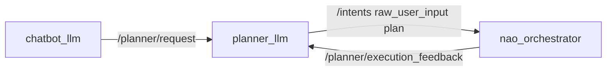
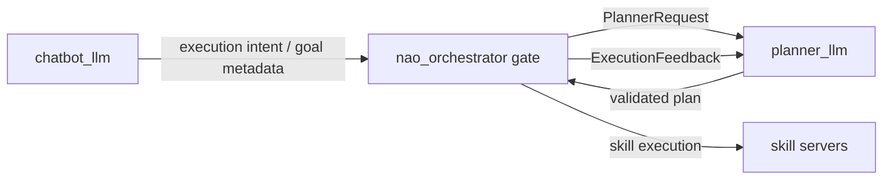

# `nao_orchestrator` Planner-Gate Handoff

## Why this pass remains

The current demo path is intentionally direct:

That is acceptable for the demo cleanup because it preserves the narrow chatbot
contract and keeps planning in `planner_llm`. The next architecture pass should
move the planner gate closer to `nao_orchestrator` so execution admission,
active-goal ownership, and cancellation are centralized in the deterministic
executor.

## Target shape

## Ownership rules

- `chatbot_llm` keeps producing only `verbal_ack`, route metadata, and goal
  text. It does not synthesize plans.
- `nao_orchestrator` becomes the active-goal gate: reject, cancel, supersede, or
  submit planner requests using deterministic state.
- `planner_llm` remains the only component that chooses abstract steps.
- `dialogue_manager` remains the speaking owner for chatbot responses and
  planner dialogue acts.
- No new `.msg`, `.srv`, or `.action` files should be added unless the existing
  intent/topic contracts cannot express the gate cleanly.

## Proposed implementation steps

1. Add a small planner-gate module inside `nao_orchestrator` that accepts
   execution-oriented incoming intents and emits `PlannerRequest` payloads.
2. Move goal id, parent/supersede, cancellation, and active-plan admission checks
   from chatbot-side handoff assumptions into the gate.
3. Keep `chatbot_llm` planner handoff behind a compatibility flag while the gate
   is validated, then disable direct handoff in the demo profile once stable.
4. Add tests for new-goal, cancel, supersede, clarification-answer, and duplicate
   active goal behavior.
5. Validate with the same live-container launch profiles and rqt log markers.

## Non-goals

- Do not put LLM calls inside `nao_orchestrator`.
- Do not make the orchestrator speak directly.
- Do not hardcode demo interactions in the gate.
- Do not replace `planner_common` contracts with package-local copies.

## Why it was not included in this final demo pass

The immediate demo risk was model availability and lifecycle readiness. Preflight
and failure-mode cleanup are safer, smaller changes for tomorrow. Moving the
planner gate changes active-goal ownership and deserves its own validation pass
after the demo stack is stable.
