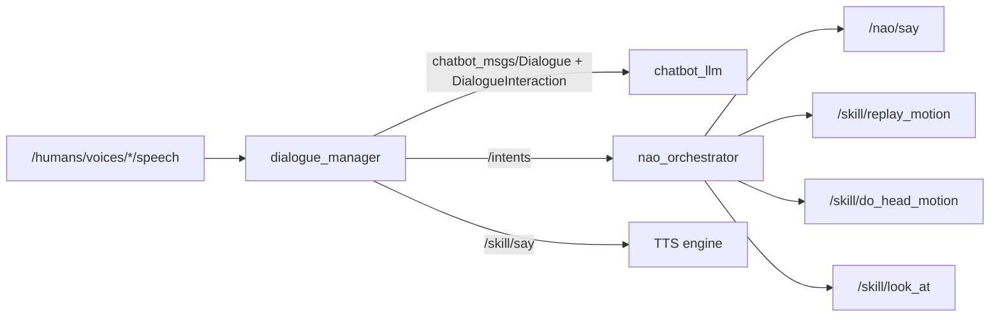
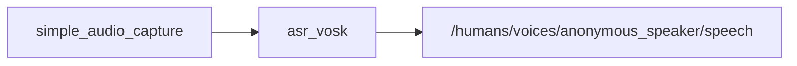

# Node Interactions Map

Last updated: 2026-03-13

This map reflects the active migrated stack.

## Active Nodes

| Node | Package | Role |
| --- | --- | --- |
| `dialogue_manager` | `dialogue_manager` | Canonical communication-skill runtime and dialogue tracking |
| `chatbot_llm` | `chatbot_llm` | Backend dialogue service/action provider |
| `nao_orchestrator` | `nao_orchestrator` | Consumes `/intents` and dispatches robot actions |
| `nao_say_skill` | `nao_say_skill` | Robot-specific speech execution |
| `nao_look_at` | `nao_look_at` | Scaffolded `look_at` lifecycle node |
| `replay_motion_skill_server` | `nao_replay_motion` | Replay-motion execution |
| `head_motion_skill_server` | `nao_replay_motion` | Transitional head-motion execution |
| `nao_posture_bridge_node` | `nao_replay_motion` | Transitional posture topic bridge |
| `asr_vosk` | `asr_vosk` | Transitional ASR lifecycle node |
| `simple_audio_capture` | `simple_audio_capture` | Laptop microphone capture |

## Main Runtime Graph

## ASR Isolation Graph

## Transitional Notes

- `nao_orchestrator` can still subscribe to `/chatbot/intent` while older
  producers exist.
- `nao_replay_motion` still exposes `/skill/do_posture` as a compatibility
  adapter onto `/skill/replay_motion`.
- `nao_look_at` is scaffolded and intentionally limited until the RViz and
  interaction-simulator work is completed.
