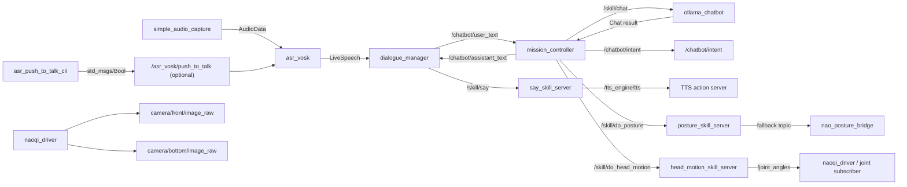

# Node Interactions And Module Map

Last updated: 2026-03-09

This document maps runtime nodes to internal modules and external dependencies.

## Runtime Node Map

| Node name | Package | Executable | Launch gate |
|---|---|---|---|
| `dialogue_manager` | `dialogue_manager` | `dialogue_manager_node` | always |
| `mission_controller` | `nao_chatbot` | `mission_controller_node` | always |
| `ollama_chatbot` | `nao_chatbot` | `ollama_chatbot_node` | `chat_skill_server_enabled` |
| `asr_vosk` | `asr_vosk` | `asr_vosk` (lifecycle) | `asr_vosk_enabled` |
| `simple_audio_capture` | `simple_audio_capture` | `audio_capture_node` | `asr_audio_capture_enabled` |
| `asr_push_to_talk_cli` | `nao_chatbot` | `asr_push_to_talk_cli` | manual operator utility |
| `posture_skill_server` | `nao_skill_servers` | `posture_skill_server_node` | `posture_skill_server_enabled` |
| `head_motion_skill_server` | `nao_skill_servers` | `head_motion_skill_server_node` | `head_motion_skill_server_enabled` |
| `say_skill_server` | `nao_skill_servers` | `say_skill_server_node` | `say_skill_server_enabled` |
| `nao_posture_bridge` | `nao_skill_servers` | `nao_posture_bridge_node` | `posture_bridge_enabled` |
| `naoqi_driver` | `naoqi_driver` | launch include | `start_naoqi_driver` |

## Node Interaction Graph

## `nao_chatbot` Internal Module Relationships

### Mission path (`mission_controller_node`)

- Entry module:
  - `nao_chatbot/mission_controller.py`
- Uses:
  - `chat_skill_client.py` (`/skill/chat` client)
  - `posture_skill_client.py` (`/skill/do_posture` client)
  - `head_motion_skill_client.py` (`/skill/do_head_motion` client)
  - `intent_rules.py` (rule intent detect + fallback response)
- External dependencies:
  - `communication_skills/action/Chat`
  - `nao_skills/action/DoPosture`
  - `nao_skills/action/DoHeadMotion`

### Chat skill server path (`ollama_chatbot_node`)

- Entry module:
  - `nao_chatbot/ollama_chatbot.py` -> `chat_skill_server.py`
- Core execution pipeline:
  - `chat_config.py`
  - `chat_goal_codec.py`
  - `chat_turn_engine.py`
  - `chat_history.py`
  - `chat_prompts.py`
  - `prompt_pack.py`
  - `ollama_transport.py`
  - `skill_catalog.py`

See also:

- `ollama_chatbot_architecture.md`

### ASR path (`asr_vosk` lifecycle node)

- Entry module:
  - `asr_vosk/node_vosk.py`
- Input:
  - `audio_common_msgs/AudioData` from `simple_audio_capture`
- Optional input:
  - `std_msgs/Bool` on `/asr_vosk/push_to_talk`
- Output:
  - `hri_msgs/LiveSpeech`
- Behavior:
  - defaults to final-only publishing in app launch surfaces
  - can gate listening with push-to-talk
  - filters low-quality/filler finals before publish

### Dialogue bridge path (`dialogue_manager_node`)

- Entry module:
  - `dialogue_manager/nao_dialogue_manager.py`
- Supporting modules:
  - `dialogue_manager/nao_asr_utils.py`
  - `dialogue_manager/say_skill_client.py`
- Behavior:
  - consumes final `LiveSpeech` text by default
  - buffers and merges consecutive ASR finals for a short holdoff window
  - ignores overlapping user speech while an assistant turn is pending

### Execution servers path (`nao_skill_servers`)

- `nao_skill_servers/posture_skill_server.py`
- `nao_skill_servers/head_motion_skill_server.py`
- `nao_skill_servers/say_skill_server.py`
- `src/nao_skill_servers/src/nao_posture_bridge_node.cpp`

## Per-Node Background Workers / Subprocess-Like Activity

| Node | Worker/process behavior |
|---|---|
| `asr_vosk` | ROS2 lifecycle node (`Unconfigured -> Inactive -> Active`) |
| `dialogue_manager` | ROS callbacks + user-turn holdoff timer |
| `simple_audio_capture` | Dedicated GStreamer loop thread |
| `ollama_chatbot` | Performs outbound HTTP calls to Ollama |
| `say_skill_server` | Calls downstream `/tts_engine/tts` action |
| `head_motion_skill_server` | Publishes `JointAnglesWithSpeed` to `/joint_angles` |
| `posture_skill_server` | Calls NAOqi posture or topic fallback |
| `nao_posture_bridge` | Executes posture commands from fallback topic |
| `naoqi_driver` | Publishes camera and robot-state topics |

## Where To Update This Map

Update this document when any of the following changes:

- Launch-node wiring in `nao_chatbot_stack.launch.py`
- New executable nodes in package setup/CMake files
- Topic/action contracts between nodes
- Internal module ownership of a node execution path
