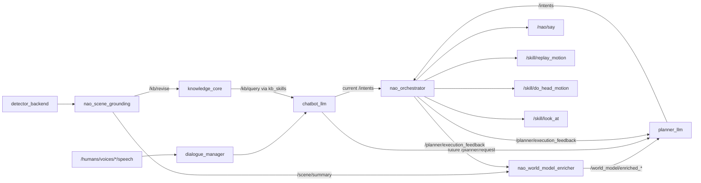

# Node Interactions Map

Last updated: 2026-04-02

This is now the short architecture map for the active stack.

For detailed runtime contracts and examples, see
[demo_status_and_contracts.md](./demo_status_and_contracts.md).
For the thesis-facing next-stage architecture, see
[thesis_planning_handoff.md](./thesis_planning_handoff.md).
For launch behavior, see [launch_profiles.md](./launch_profiles.md).

## Active Nodes

| Node | Package | Role |
| --- | --- | --- |
| `dialogue_manager` | `dialogue_manager` | entry point for speech/text dialogue |
| `chatbot_llm` | `chatbot_llm` | grounded response and intent generation |
| `knowledge_core` | upstream package | symbolic world state |
| `nao_scene_grounding` | `nao_scene_grounding` | detector-to-KB bridge and `/scene/summary` publisher |
| `nao_world_model_enricher` | `nao_world_model_enricher` | planner-facing short-horizon world model and enrichment summaries |
| `planner_llm` | `planner_llm` | request-to-plan generation and bounded replanning |
| `nao_orchestrator` | `nao_orchestrator` | deterministic intent execution |
| `nao_say_skill` | `nao_say_skill` | robot speech execution |
| `nao_replay_motion` | `nao_replay_motion` | motion and posture execution |
| `nao_look_at` | `nao_look_at` | upstream-style gaze execution |
| `asr_vosk` | `asr_vosk` | transitional ASR path |

## Main Runtime Graph

```mermaid
graph LR
    speech["/humans/voices/*/speech"] --> dm["dialogue_manager"]
    dm --> chatbot["chatbot_llm"]
    detector["detector_backend"] --> grounding["nao_scene_grounding"]
    grounding -->|/kb/revise| kb["knowledge_core"]
    kb -->|/kb/query via kb_skills| chatbot
    grounding -->|/scene/summary| wme["nao_world_model_enricher"]
    wme -->|/world_model/enriched_*| planner["planner_llm"]
    chatbot -->|current /intents| orch["nao_orchestrator"]
    chatbot -->|future /planner/request| planner
    planner -->|/intents| orch["nao_orchestrator"]
    orch -->|/planner/execution_feedback| planner
    orch -->|/planner/execution_feedback| wme
    orch --> say["/nao/say"]
    orch --> motion["/skill/replay_motion"]
    orch --> head["/skill/do_head_motion"]
    orch --> look["/skill/look_at"]
```

## Architecture Notes

- `chatbot_llm` stays detector-agnostic and only consumes grounded symbolic state.
- `nao_scene_grounding` is the semantic bridge from raw detections into the KB.
- `nao_orchestrator` remains downstream-only and should evolve into the
  deterministic validation and execution layer for future planner work.
- planner-facing execution feedback is published separately so `planner_llm` and
  `nao_world_model_enricher` can react without taking over skill dispatch.
- `kb_skills` is the intended long-term boundary for both KB reads and future KB
  mutations.
