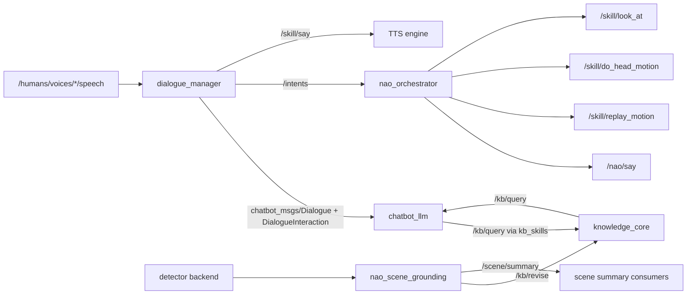
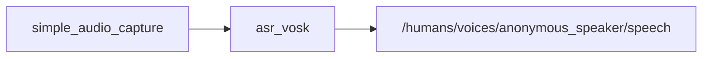

# Node Interactions Map

Last updated: 2026-03-22

This map reflects the active migrated stack.

## Active Nodes

| Node | Package | Role |
| --- | --- | --- |
| `dialogue_manager` | `dialogue_manager` | Canonical communication-skill runtime and dialogue tracking |
| `chatbot_llm` | `chatbot_llm` | Backend dialogue service/action provider |
| `nao_orchestrator` | `nao_orchestrator` | Consumes `/intents` and dispatches robot actions |
| `nao_say_skill` | `nao_say_skill` | Robot-specific speech execution |
| `nao_look_at` | `nao_look_at` | Scaffolded `look_at` lifecycle node |
| `nao_scene_grounding` | `nao_scene_grounding` | Detector-to-KB bridge and compact scene summary publisher |
| `replay_motion_skill_server` | `nao_replay_motion` | Replay-motion execution |
| `head_motion_skill_server` | `nao_replay_motion` | Transitional head-motion execution |
| `nao_posture_bridge_node` | `nao_replay_motion` | Transitional posture topic bridge |
| `asr_vosk` | `asr_vosk` | Transitional ASR lifecycle node |
| `simple_audio_capture` | `simple_audio_capture` | Laptop microphone capture |

## Main Runtime Graph

```mermaid
graph LR
    Speech["/humans/voices/*/speech"] --> DM["dialogue_manager"]
    DM -->|chatbot_msgs/Dialogue + DialogueInteraction| CB["chatbot_llm"]
    CB -->|"/kb/query via kb_skills"| KB["knowledge_core"]
    DM -->|/intents| ORCH["nao_orchestrator"]
    DET["detector backend"] --> SG["nao_scene_grounding"]
    SG -->|/kb/revise| KB["knowledge_core"]
    SG -->|/scene/summary| SCENE["scene summary consumers"]
    KB -->|/kb/query| CB
    ORCH --> SAY["/nao/say"]
    ORCH --> RM["/skill/replay_motion"]
    ORCH --> HM["/skill/do_head_motion"]
    ORCH --> LA["/skill/look_at"]
    DM -->|/skill/say| TTS["TTS engine"]
```

## ASR Isolation Graph

```mermaid
graph LR
    MIC["simple_audio_capture"] --> ASR["asr_vosk"]
    ASR --> SPEECH["/humans/voices/anonymous_speaker/speech"]
```

## Transitional Notes

- `nao_orchestrator` can still subscribe to `/chatbot/intent` while older
  producers exist.
- `kb_skills` is the dedicated local package boundary for KnowledgeCore reads
  today and future KB writes/revisions later; `chatbot_llm` decides when to use
  it, while `nao_orchestrator` remains downstream-only.
- `nao_replay_motion` still exposes `/skill/do_posture` as a compatibility
  adapter onto `/skill/replay_motion`.
- `nao_look_at` is scaffolded and intentionally limited until the RViz and
  interaction-simulator work is completed.
- detector backends are intentionally pluggable; the current launch surface can
  start either `emorobcare_cv_object_detection` or `yolo_ros`, both funneled
  into the same `nao_scene_grounding` contract.
