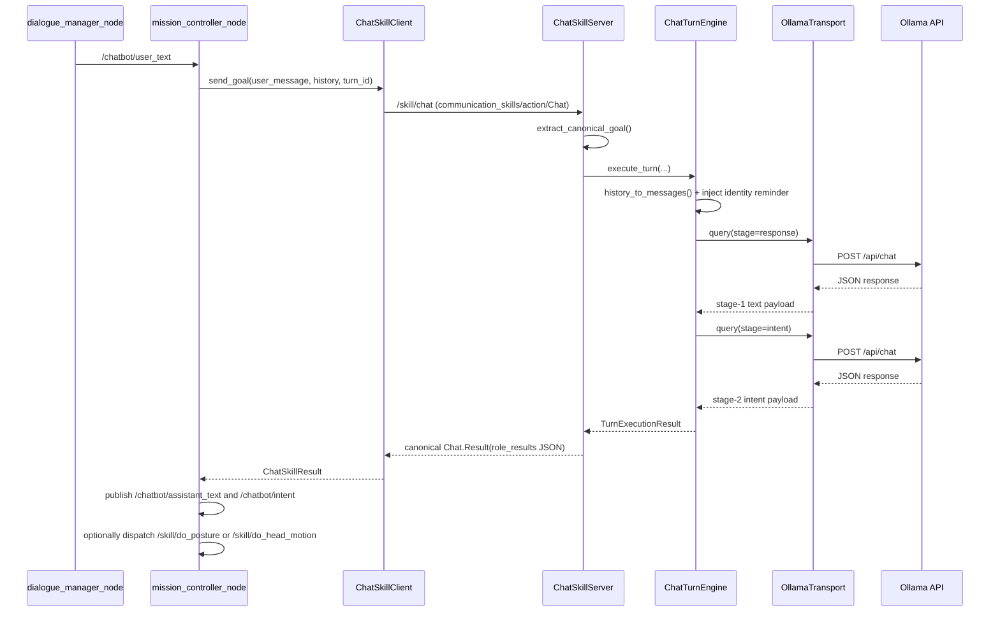
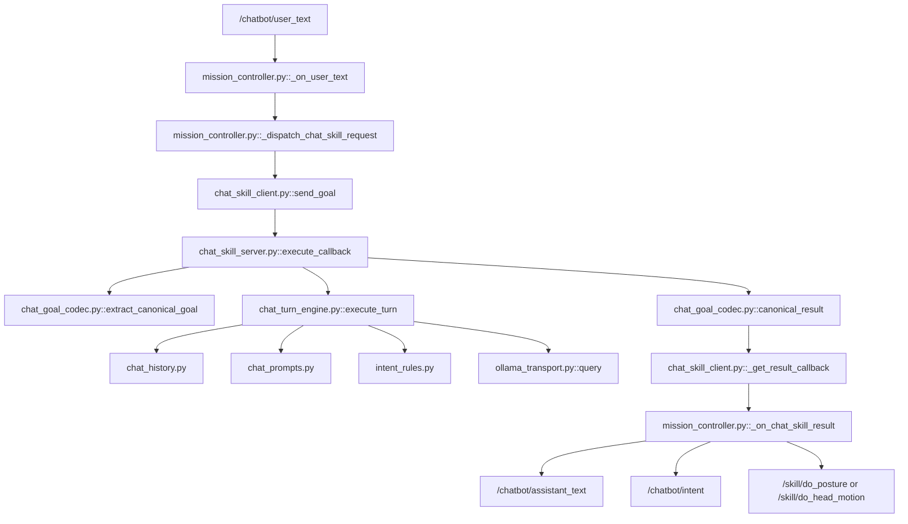

# Ollama Chatbot Architecture

Last updated: 2026-03-09

This document describes the active `/skill/chat` backend used by the stack launched from:

- `src/nao_chatbot/launch/nao_chatbot_stack.launch.py`
- `src/nao_chatbot/launch/nao_chatbot_skills.launch.py`
- `src/nao_chatbot/launch/nao_chatbot_skills_asr.launch.py`

It focuses on the real runtime path between:

- `mission_controller_node`
- `chat_skill_client.py`
- `ollama_chatbot_node`
- `chat_skill_server.py`
- `chat_turn_engine.py`
- `ollama_transport.py`
- `skill_catalog.py`

## Runtime Ownership

| Runtime node / module | File | Responsibility |
|---|---|---|
| `mission_controller_node` | `src/nao_chatbot/nao_chatbot/mission_controller.py` | Receives `/chatbot/user_text`, dispatches `/skill/chat`, publishes `/chatbot/assistant_text` and `/chatbot/intent`, and triggers motion skills |
| Chat action client | `src/nao_chatbot/nao_chatbot/chat_skill_client.py` | Encodes canonical `communication_skills/action/Chat` goals and parses results |
| `ollama_chatbot_node` | `src/nao_chatbot/nao_chatbot/ollama_chatbot.py` | Node entrypoint for the chat backend action server |
| Chat action server | `src/nao_chatbot/nao_chatbot/chat_skill_server.py` | Owns `/skill/chat`, config, action lifecycle, server-side tracing, and result shaping |
| Turn engine | `src/nao_chatbot/nao_chatbot/chat_turn_engine.py` | Two-stage turn policy: response generation, then intent extraction |
| Goal/result codec | `src/nao_chatbot/nao_chatbot/chat_goal_codec.py` | Extracts canonical goal payload and builds canonical result payload |
| Config loader | `src/nao_chatbot/nao_chatbot/chat_config.py` | Declares node parameters and computes effective runtime config |
| Prompt pack loader | `src/nao_chatbot/nao_chatbot/prompt_pack.py` | Loads optional YAML prompt/schema overrides |
| Prompt builders | `src/nao_chatbot/nao_chatbot/chat_prompts.py` | Builds stage-1 response prompt and stage-2 intent prompt |
| History codec | `src/nao_chatbot/nao_chatbot/chat_history.py` | Converts serialized history to Ollama messages and back |
| Ollama transport | `src/nao_chatbot/nao_chatbot/ollama_transport.py` | Performs HTTP requests to Ollama `/api/chat` and `/api/tags` |
| Skill catalog | `src/nao_chatbot/nao_chatbot/skill_catalog.py` | Extracts compact skill descriptions from package manifests for prompt injection |
| Rules fallback | `src/nao_chatbot/nao_chatbot/intent_rules.py` | Detects fallback intents and rule-based responses |

## End-to-End Sequence

## Active Call Graph

## Detailed Execution Path

### 1. User text enters mission control

`src/nao_chatbot/nao_chatbot/mission_controller.py`

- `_on_user_text()` receives a `std_msgs/String` payload from `dialogue_manager_node`
- decodes structured payloads via `_decode_text_payload()`
- deduplicates near-identical inputs using `dedupe_window_sec`
- in backend mode, computes a rule fallback intent and calls `_dispatch_chat_skill_request()`

### 2. Client builds the canonical chat goal

`src/nao_chatbot/nao_chatbot/chat_skill_client.py`

- `send_goal()` creates `communication_skills/action/Chat.Goal`
- serializes this JSON into `goal.role.configuration`:
  - `user_message`
  - `conversation_history`
  - `turn_id`
- submits the goal asynchronously
- traces progress through:
  - `_goal_response_callback()`
  - `_get_result_callback()`

The client does not talk to Ollama directly. It only speaks the canonical action interface.

### 3. Server boots with config, prompt pack, and optional skill catalog

`src/nao_chatbot/nao_chatbot/chat_skill_server.py`

On startup, `ChatSkillServer.__init__()`:

- calls `declare_chat_parameters()` and `load_chat_config()`
- optionally builds prompt-time skill inventory with `build_skill_catalog_text()`
- constructs `OllamaTransport`
- constructs `ChatTurnEngine`
- serves `/skill/chat` as `communication_skills/action/Chat`

This is the boundary between ROS action handling and model execution policy.

### 4. Goal decoding and server-side gating

`src/nao_chatbot/nao_chatbot/chat_skill_server.py`
`src/nao_chatbot/nao_chatbot/chat_goal_codec.py`

- `goal_callback()` rejects empty requests and serial overlap
- `execute_callback()` acquires a lock, extracts canonical fields with `extract_canonical_goal()`, and delegates to `ChatTurnEngine.execute_turn()`

Canonical extracted fields are:

- `user_text`
- `history`
- `user_id`
- `turn_id`

### 5. Turn engine stage 1: verbal response generation

`src/nao_chatbot/nao_chatbot/chat_turn_engine.py`

Core stage-1 steps:

- `history_to_messages()` converts serialized history to Ollama-style message dicts
- `_inject_identity_reminder()` optionally injects identity/system reminders
- `_query_response()` builds a stage-1 prompt with:
  - `build_response_prompt()`
  - prompt-pack overrides from `prompt_pack.py`
  - optional persona prompt file
  - optional skill catalog text
- `OllamaTransport.query()` sends the request to Ollama

Expected stage-1 output:

- `verbal_ack`

If stage 1 fails:

- `llm_with_rules_fallback` mode drops to rules
- pure `llm` mode returns the configured fallback response path

### 6. Turn engine stage 2: intent extraction

`src/nao_chatbot/nao_chatbot/chat_turn_engine.py`

If stage 1 produced a spoken response:

- `_query_intent()` builds a second prompt with `build_intent_prompt()`
- Ollama is called again, usually with `intent_model`
- `_resolve_intent()` normalizes the returned structure

Expected stage-2 payload:

- `user_intent.type`
- optional `object`, `recipient`, `input`, `goal`
- optional `intent_confidence`

If stage 2 fails:

- `llm_with_rules_fallback` falls back to `detect_intent(user_text)`
- `llm` returns `fallback`

### 7. Result shaping back into ROS action output

`src/nao_chatbot/nao_chatbot/chat_goal_codec.py`

`canonical_result()` serializes a JSON result payload into `Chat.Result.role_results` containing:

- `success`
- `assistant_response`
- `verbal_ack`
- `updated_history`
- `intent`
- `intent_source`
- `intent_confidence`
- `user_intent`
- `turn_id`

### 8. Mission controller becomes execution authority again

`src/nao_chatbot/nao_chatbot/mission_controller.py`

`_on_chat_skill_result()`:

- updates cached conversation history
- publishes `/chatbot/assistant_text`
- publishes `/chatbot/intent`
- optionally dispatches:
  - `/skill/do_posture`
  - `/skill/do_head_motion`

This is an important design point:

- `ollama_chatbot_node` decides language response and structured intent
- `mission_controller_node` decides what to execute in the robot/runtime graph

## Prompt and Schema Sources

### Config precedence

`src/nao_chatbot/nao_chatbot/chat_config.py`

Effective precedence is:

1. built-in defaults
2. prompt pack file
3. explicit ROS parameters

### Prompt pack content

`src/nao_chatbot/nao_chatbot/prompt_pack.py`
`src/nao_chatbot/config/chat_prompt_pack.yaml`

The prompt pack contributes:

- `system_prompt`
- `response_prompt_addendum`
- `intent_prompt_addendum`
- `environment_description`
- `response_schema`
- `intent_schema`

### Prompt builders

`src/nao_chatbot/nao_chatbot/chat_prompts.py`

There are two distinct prompt builders:

- `build_response_prompt()`
- `build_intent_prompt()`

This matches the two-stage LLM flow.

## Skill Catalog Injection

`src/nao_chatbot/nao_chatbot/skill_catalog.py`

When enabled, the server:

- loads `package.xml` from allowlisted packages
- parses embedded `<skill content-type="yaml">` blocks
- extracts compact descriptors:
  - `skill_id`
  - `default_interface_path`
  - `datatype`
  - `description`
  - input parameter names
- injects a compact rendered summary into both response and intent prompts

Default allowlist:

- `communication_skills`
- `nao_skills`

This means the model sees skill interfaces, not implementation modules.

## Ollama Transport Boundaries

`src/nao_chatbot/nao_chatbot/ollama_transport.py`

The transport layer is intentionally narrow:

- one method for chat queries: `query()`
- one method for observability: `log_model_inventory()`

It knows about:

- Ollama URL
- timeout
- context window
- temperature/top-p
- optional JSON `format`

It does not know about:

- ROS actions
- prompts
- intents
- history encoding

That separation is good and should be preserved.

## Practical Debug Points

If `/skill/chat` is behaving unexpectedly, check in this order:

1. `mission_controller.py`
   - did `_dispatch_chat_skill_request()` run?
2. `chat_skill_client.py`
   - was the goal accepted?
3. `chat_skill_server.py`
   - did `extract_canonical_goal()` decode the user message/history correctly?
4. `chat_turn_engine.py`
   - did stage 1 return `verbal_ack`?
   - did stage 2 return `user_intent.type`?
5. `ollama_transport.py`
   - did the model request fail, time out, or return empty content?
6. `mission_controller.py::_on_chat_skill_result()`
   - was the intent published/executed or ignored as stale?

## Design Notes

- The active chat stack is action-first and ROS4HRI-friendly.
- `mission_controller` remains the execution authority for robot skills.
- `ollama_chatbot_node` is a pure backend action server, not a robot-control node.
- The two-stage response/intent split is deliberate and visible in both tracing and code boundaries.
