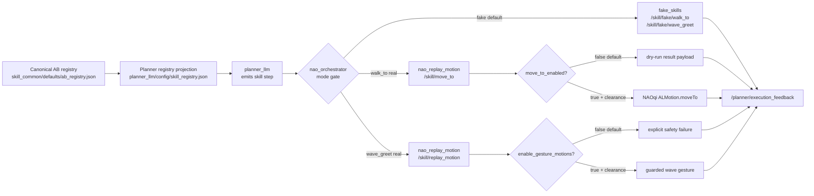

# Fake-To-Real Skill Promotion: Walk And Wave

**Date:** 2026-07-01
**Docs pass:** 2026-07-02
**Branch context:** `refactor/deslop_repo` with nested `chatbot_llm` consolidated onto the current split turn-engine refactor.
**Scope:** Promote the first narrow fake-skill seams toward real NAO execution without pretending that semantic navigation is solved.

## Core Claim

`walk_to` and `wave_greet` should not jump directly from fake AB=1 skills to broad semantic robot capabilities. The safe promotion path is narrower:

- `move_to` is the real local locomotion primitive: bounded body-relative `x_m`, `y_m`, `theta_rad` through NAOqi `ALMotion.moveTo`.
- `walk_to` remains the planner-facing skill name, but real mode only accepts local displacement arguments.
- Semantic target navigation such as `walk_to cup_1` remains fake/research until localization, path planning, target grounding, and safety envelopes exist.
- `wave_greet` can be routed to a guarded replay-motion gesture alias, but real arm movement remains disabled by default.

## Seam Map



The important seam is the mode gate in `nao_orchestrator`: planner-visible
skill names remain stable, but real execution can only cross into NAOqi through
small, explicit AB=0 motor interfaces. This lets Neural Workbench and the
planner compare fake traces, dry-run traces, and real traces without confusing
semantic navigation with local motion.

## Implemented Seams

| Seam | Status | Notes |
| --- | --- | --- |
| `nao_skills/action/MoveTo` | Implemented | New action with local displacement, speed, dry-run, feedback, and structured result payload. |
| `nao_replay_motion:/skill/move_to` | Implemented | Action server validates bounds and dry-run; real `ALMotion.moveTo` requires `move_to_enabled:=true`. |
| `nao_replay_motion` gesture alias | Implemented, guarded | `wave_greet` resolves to `wave`; arm gesture execution requires `enable_gesture_motions:=true`. |
| `nao_orchestrator walk_to` | Implemented | `walk_to_execution_mode=fake|real`; real mode rejects semantic targets without local movement fields. |
| `nao_orchestrator wave_greet` | Implemented | `wave_greet_execution_mode=fake|real`; real mode dispatches replay-motion gesture alias. |
| Integrated stack launch | Implemented | Exposes `walk_to_execution_mode`, `wave_greet_execution_mode`, `move_to_enabled`, `move_to_dry_run_default`, and local bounds. |

## File Map

| File | Role |
| --- | --- |
| `src/nao_skills/action/MoveTo.action` | AB=0 local locomotion action interface. |
| `src/nao_replay_motion/nao_replay_motion/replay_motion_skill_server.py` | Owns `/skill/move_to`, NAOqi `ALMotion.moveTo`, dry-run payloads, and guarded wave alias execution. |
| `src/nao_orchestrator/nao_orchestrator/orchestrator.py` | Owns planner-step mode gating, fake fallback, body-relative argument validation, and execution feedback payload normalization. |
| `src/nao_chatbot/nao_chatbot/stack_launch.py` | Exposes operator flags in sim/robot stack profiles. |
| `src/Neural-Wokbench/src/skill_common/skill_common/defaults/ab_registry.json` | Canonical AB source of truth for `move_to`, `walk_to`, `wave_greet`, and decomposition notes. |
| `docs/architecture/ab_registry_input.json` | Architecture mirror of the canonical AB registry. |
| `src/planner_llm/config/skill_registry.json` | Planner-facing registry projection. |

## Runtime Contract Slice

`walk_to` in real mode accepts:

```json
{
  "type": "skill",
  "name": "walk_to",
  "args": {
    "x_m": 0.20,
    "y_m": 0.0,
    "theta_rad": 0.0,
    "speed_fraction": 0.35,
    "dry_run": true
  }
}
```

`walk_to` in real mode rejects:

```json
{
  "type": "skill",
  "name": "walk_to",
  "args": {"target": "cup_1"}
}
```

The rejection is intentional: `cup_1` requires grounding, localization,
path/segment planning, obstacle checks, local motion execution, and post-motion
verification. That is AB>=2 navigation decomposition work, not the local
`MoveTo` primitive.

## Operator-Gated Runtime Commands

Dry-run local locomotion validation:

```bash
ros2 launch nao_chatbot nao_chatbot_robot.launch.py \
  walk_to_execution_mode:=real \
  move_to_enabled:=false \
  move_to_dry_run_default:=true
```

Real local locomotion, only with robot-side clearance:

```bash
ros2 launch nao_chatbot nao_chatbot_robot.launch.py \
  walk_to_execution_mode:=real \
  move_to_enabled:=true \
  move_to_dry_run_default:=false \
  move_to_max_x_m:=0.25 \
  move_to_max_y_m:=0.10 \
  move_to_max_theta_rad:=0.35
```

Wave gesture promotion, only with arm clearance:

```bash
ros2 launch nao_chatbot nao_chatbot_robot.launch.py \
  wave_greet_execution_mode:=real \
  enable_gesture_motions:=true
```

## AB-Level Interpretation

- AB=0 interface: `MoveTo` local displacement, `ReplayMotion` gesture/posture names, `DoHeadMotion` joint goals.
- AB=1 runtime skill: `walk_to` can use `MoveTo` only when local metric arguments are supplied; otherwise fake skill remains the truthful validation endpoint.
- AB=2 proposal: semantic navigation to named objects/people/places should decompose into grounding, localization, route/path decision, local movement segments, perception checks, and recovery.

## Workbench Interpretation

For Neural Workbench, this promotion is useful because it creates three
distinct trace classes for the same planner-visible skill:

| Trace class | Execution surface | What uncertainty it measures |
| --- | --- | --- |
| Fake scenario | `/skill/fake/walk_to` | symbolic plan choice, scenario policy, and recovery behavior. |
| Real-route dry-run | `/skill/move_to` with `dry_run=true` | argument grounding, local-motion admissibility, mode gating, and payload consistency. |
| Physical real route | `/skill/move_to` with `move_to_enabled=true` | robot-side movement execution under operator-approved safety bounds. |

That split gives the entropy/trace-selection workbench a more semantically
correct basis: uncertainty about "can I make a local movement?" is not mixed
with uncertainty about "can I navigate to a named object?"

## Validation Added

- `nao_replay_motion` unit tests cover `MoveTo` validation bounds and wave alias separation.
- `nao_orchestrator` unit tests cover body-relative `MoveTo` payload creation, rejection of semantic-only targets, and dry-run result summarization.
- Registry consistency check covers the canonical AB registry, planner
  projection, and architecture mirror.

## Remaining Live Tests

1. Rebuild interfaces and packages after adding `nao_skills/action/MoveTo`.
2. Confirm `/skill/move_to` action server appears with `ros2 action list`.
3. Send a dry-run `MoveTo` goal and verify success payload.
4. Run a planner JSON step for `walk_to` with `x_m` only and verify orchestrator dispatches `/skill/move_to` in real mode.
5. Keep target-only `walk_to cup_1` rejected in real mode until semantic navigation exists.
6. Only test real `ALMotion.moveTo` with physical clearance and operator supervision.

## Design Risk Register

| Risk | Mitigation |
| --- | --- |
| Planner emits `walk_to` with only a semantic target | Real mode rejects with a clear reason; fake mode remains available for research traces. |
| Robot moves unexpectedly during validation | Default `move_to_enabled=false` and `move_to_dry_run_default=true`. |
| Wave arm motion hits environment | Default `enable_gesture_motions=false`; real mode is opt-in. |
| Registry overclaims semantic navigation | Document `MoveTo` as body-relative only and keep semantic navigation as AB=2 proposal. |
