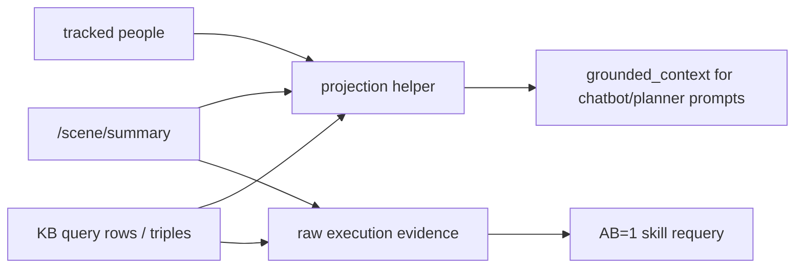

# Planner Grounding + MoE Ownership Contract (2026-06-01)

Updated: 2026-06-03

## Goal

Formalize how grounded context flows through planner seams without blurring ownership across `chatbot_llm`, `planner_llm`, `nao_orchestrator`, and AB=1 skills.

The active contract is compact by default: the LLM receives a task-relevant scene graph, while raw `/scene/summary`, KB triples, coordinates, recency, detector metadata, and action result payloads remain available to execution-time skill seams.

## Contract Decisions

1. Planner ingress (`/planner/request`) carries compact `grounded_context`.
2. `grounded_context.entities` is the LLM-facing visible world.
3. Relations are filtered to prioritized semantic predicates, not all RDF facts.
4. Planner egress (`/intents`) stays plan-centric and carries only lightweight `context_ref` lineage.
5. AB=1 skills own live world-state resolution at execution time through AB=0 seams such as `/scene/summary`, `/kb/query`, tracked-person feeds, and skill-local service/action checks.
6. `state_t0` remains a disabled-by-default debug/planner detail behind `grounded_context_include_state_t0`.
7. Removed request seams stay removed: no planner request `requested_plan`, no planner request `interaction_mode`.

## Why This Matches ROS4HRI Ownership

- `chatbot_llm` owns user-facing grounding assembly and planner handoff.
- `planner_llm` owns task decomposition, validation, retry, replanning, and dialogue-act intent.
- `nao_orchestrator` owns deterministic dispatch/feedback, not global world modeling.
- AB=1 skills remain execution experts and can specialize by evidence type: object-centric, people-centric, navigation-centric, report-centric.

This gives a practical MoE pattern without introducing a separate coordinator node.

## Compact Grounded Context

```json
{
  "grounded_context": {
    "entities": [
      {
        "id": "cup_cbmg",
        "label": "cup",
        "kind": "object",
        "class": "Cup",
        "visible": true,
        "relations": [
          {"predicate": "dbp:color", "object": "blue"},
          {"predicate": "oro:isOn", "object": "table_1"}
        ]
      }
    ]
  }
}
```

Entity fields:

- `id`: stable symbolic handle used by planner/skills.
- `label`: readable class/name hint, separate from `id`.
- `kind`: `object` or `person`.
- `class`: compact KB/detector class.
- `visible`: current scene visibility.
- `relations`: bounded semantic relation list for facts not already represented by `class`.

Relation policy:

- Use `class` as the canonical entity type. Do not repeat the same type as `{"predicate":"rdf:type"}`.
- Keep an `rdf:type` relation only when it adds distinct KB type information not already represented by `class`.
- Include user-meaningful simulator/KB predicates when present: `dbp:name`, `dbp:color`, `oro:isAt`, `oro:isOn`, `oro:contains`, `foaf:knows`.
- Drop non-prompt details such as `source`, `backend`, coordinates, confidence scores, raw detector provenance, and `last_seen_*`.
- Do not emit `counts`; planners and prompts should reason over the visible `entities` array directly.
- Preserve exact triples in skill-local/raw execution contexts when needed.

## Projection Pipeline



Projection rules:

1. Prefer structured scene and KB rows.
2. Use text-derived hydration only when no structured entities exist.
3. Keep anonymous people anonymous; do not invent personal names.
4. Keep IDs and labels separate.
5. Bound relation count per entity to keep prompt size manageable.

## Planner Request Shape

```json
{
  "request_id": "turn_123",
  "goal_id": "goal_turn_123",
  "parent_goal_id": "",
  "supersedes_goal_id": "",
  "request_kind": "new_goal",
  "goal_text": "look around and report what is visible",
  "normalized_intents": ["inspect_scene"],
  "scene_targets": [],
  "dialogue_context": [],
  "grounded_context": {
    "entities": []
  },
  "planner_mode": "default",
  "dialogue_turn_id": "role:turn"
}
```

The planner request does not carry plan hints. The planner must plan from goal text, normalized intents, scene targets, compact grounded context, execution feedback, and the registered skill manifest.

## Planner Output Shape

```json
{
  "plan": {
    "goal_id": "goal_turn_123",
    "plan_id": "plan_123",
    "plan_version": 1,
    "status": "planning",
    "validation_status": "draft",
    "retry_budget": 1,
    "scene_targets": [],
    "context_ref": {
      "captured_at_sec": 0.0,
      "observer": "",
      "backend": ""
    },
    "communication_policy": {
      "emit_acknowledge": false,
      "emit_progress": false,
      "emit_completion": true,
      "emit_failure": true
    },
    "communication_policy_source": "planner_engine:plan",
    "steps": []
  }
}
```

`failure_reason` is omitted for successful/draft plans and present only for failed, invalid, or terminal blocked outputs.

## Scan and Report Result Rule

The planner must not fabricate a perceptual report from prompt context.

Correct:

```json
{
  "steps": [
    {"type": "skill", "name": "scan", "args": {}, "requires": [], "on_failure": "replan", "retry_budget": 0},
    {"type": "skill", "name": "report_result", "args": {}, "requires": ["step_1"], "on_failure": "fail", "retry_budget": 0}
  ]
}
```

Incorrect:

```json
{
  "steps": [
    {"type": "skill", "name": "scan", "args": {}, "requires": [], "on_failure": "replan", "retry_budget": 0},
    {"type": "skill", "name": "report_result", "args": {"summary_text": "I can see one cup."}, "requires": ["step_1"], "on_failure": "fail", "retry_budget": 0}
  ]
}
```

The scan skill owns fresh perception. `report_result` with empty args lets the orchestrator reuse the latest live skill result.

## MoE-by-AB Practical Pattern

1. Planner chooses AB=1 skills and passes compact targets (`scene_targets`, `look_at`/`navigate_to` args).
2. Each AB=1 skill performs evidence resolution against its own AB=0 sources.
3. Execution feedback publishes the evidence summary and structured result payload.
4. Replanning uses feedback plus a fresh ingress context, not stale copies from old planner output.

This keeps seams deterministic and allows each skill to specialize without turning the planner output into a world-model transport channel.
