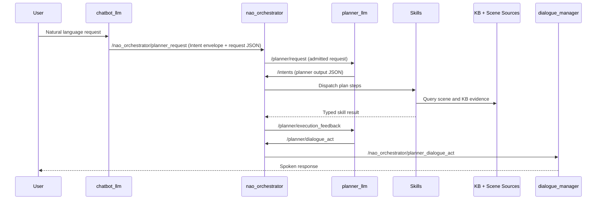
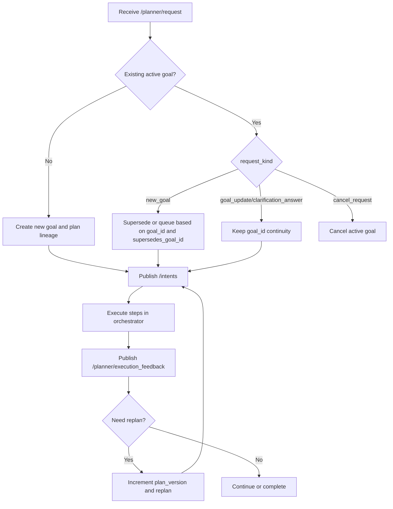

# Supervisor Walkthrough: End-to-End User -> Planner Dialogue Flow

Date: 2026-06-01  
Audience: Supervisor review + TFM memory draft alignment  
Scope: Runtime flow, payload contracts, and replanning behavior from user utterance to dialogue relay.

---

## 1) Purpose

This document is the supervisor-facing and thesis-facing contract walkthrough for the active planner stack. It is intentionally payload-first: every seam includes the JSON shape plus field semantics.

Companion references:

- `docs/contracts.md`
- `docs/current_workflow.md`
- `docs/plans/planner_grounding_moe_contract_2026-06-01.md`
- `docs/plans/planner_replan_lineage_adr.md`

---

## 2) End-to-End Runtime Flow



Ownership rule:

- `planner_llm` owns planning and dialogue-act intent.
- `nao_orchestrator` owns deterministic admission, dispatch, and feedback publication.
- Skills own live world interaction and evidence collection.

---

## 3) Contract Map (Tracked Seams)

| Contract | Channel | Producer | Consumer |
|---|---|---|---|
| Chatbot turn output | internal turn result JSON | `chatbot_llm` | `chatbot_llm` handoff path |
| Planner request transport envelope | `/nao_orchestrator/planner_request` and `/planner/request` (`Intent`) | `chatbot_llm` then `nao_orchestrator` | `nao_orchestrator`, `planner_llm` |
| Knowledge snapshot | `grounded_context.knowledge_snapshot` | `chatbot_llm` | `planner_llm` |
| Scene summary | `grounded_context.scene_summary` | `chatbot_llm` (from scene source) | `planner_llm` |
| State T0 | `grounded_context.state_t0` | `chatbot_llm` | `planner_llm` |
| Planner request | `Intent.data` on `/planner/request` | `chatbot_llm`, admitted by `nao_orchestrator` | `planner_llm` |
| Planner output | `Intent.data` on `/intents` | `planner_llm` | `nao_orchestrator` |
| Execution feedback | `/planner/execution_feedback` (`String`) | `nao_orchestrator` | `planner_llm` |
| Planner dialogue act | `/planner/dialogue_act` (`String`) | `planner_llm` | `nao_orchestrator` and relay to `dialogue_manager` |

---

## 4) Contract A: `chatbot_llm` Turn JSON Output

```json
{
  "verbal_ack": "Okay, I will do that.",
  "route": "execution",
  "confidence": 0.82,
  "user_intent": {
    "type": "look_at",
    "goal": "look at the person",
    "goal_text": "look at the person",
    "scene_targets": ["person"],
    "request_kind": "new_goal",
    "interaction_mode": "speech"
  }
}
```

Variables:

- `verbal_ack`: immediate optional acknowledgement text.
- `route`: `dialogue | knowledge_query | execution`.
- `confidence`: route/intent confidence in `[0.0, 1.0]`.
- `user_intent.type`: normalized intent label.
- `user_intent.goal` / `goal_text`: planner-facing objective text.
- `user_intent.scene_targets`: compact target labels.
- `user_intent.request_kind`: request transition class.
- `user_intent.interaction_mode`: interaction channel metadata.

---

## 5) Contract B: Planner Request Transport Envelope (`Intent`)

Transport-level envelope shape (as serialized for traces/debug tooling):

```json
{
  "intent": "planner_request",
  "source": "user_123",
  "modality": "speech",
  "confidence": 0.82,
  "priority": 128,
  "data": {
    "request_id": "turn_123",
    "goal_id": "goal_turn_123",
    "request_kind": "new_goal",
    "goal_text": "look at the person",
    "normalized_intents": ["look_at"],
    "scene_targets": ["person"],
    "dialogue_context": [],
    "requested_plan": [],
    "grounded_context": {
      "knowledge_snapshot": {},
      "scene_summary": {},
      "state_t0": {}
    },
    "planner_mode": "default",
    "interaction_mode": "speech",
    "dialogue_turn_id": "role:turn"
  }
}
```

Variables:

- `intent`: planner ingress label, normally `planner_request`.
- `source`: upstream speaker/agent id.
- `modality`: `speech` in the current stack.
- `confidence`: planner handoff confidence.
- `priority`: deterministic planner priority (`128` default in chatbot adapter).
- `data`: planner request contract payload.

---

## 6) Contract C: Knowledge Snapshot (`grounded_context.knowledge_snapshot`)

```json
{
  "schema_version": "knowledge_snapshot_v2",
  "captured_at_sec": 1777040000.0,
  "references": [
    {"normalized_name": "person", "id": "person_1", "type": "Person"},
    {"normalized_name": "cup", "id": "cup_1", "type": "Cup"}
  ],
  "counts": {"entities": 2, "people": 1, "objects": 1}
}
```

Variables:

- `schema_version`: version guard for downstream consumers.
- `captured_at_sec`: capture timestamp.
- `references[]`: compact symbolic entities with `normalized_name`, `id`, `type`.
- `counts`: aggregate cardinalities used for quick reasoning checks.

---

## 7) Contract D: Scene Summary (`grounded_context.scene_summary`)

```json
{
  "schema_version": "scene_summary_v2",
  "observer": "myself",
  "backend": "emorobcare_cv",
  "captured_at_sec": 1777040000.0,
  "objects": [
    {
      "entity_id": "detected_cup_320_240",
      "label": "cup",
      "kb_class": "Cup",
      "score": 0.91,
      "tracker_id": "",
      "source": "emorobcare_cv",
      "center_x": 320.0,
      "center_y": 240.0,
      "last_seen_sec": 1777040000.0
    }
  ],
  "people": [
    {
      "id": "person_1",
      "label": "person",
      "type": "Person",
      "source": "emorobcare_cv",
      "score": 0.88,
      "center_x": 210.0,
      "center_y": 180.0,
      "last_seen_sec": 1777040000.0
    }
  ]
}
```

Variables:

- `observer`, `backend`, `captured_at_sec`: provenance and timing metadata.
- `objects[]`: current object detections.
- `people[]`: current person detections.
- Policy: people and objects remain separated.

---

## 8) Contract E: State T0 (`grounded_context.state_t0`)

```json
{
  "schema_version": "state_t0_v2",
  "observer": "myself",
  "backend": "emorobcare_cv",
  "captured_at_sec": 1777040000.0,
  "entity_counts": {"entities": 2, "people": 1, "objects": 1},
  "entities": [
    {
      "normalized_name": "cup",
      "id": "cup_1",
      "type": "Cup",
      "kind": "object",
      "source": "emorobcare_cv",
      "last_seen_sec": 1777040000.0
    },
    {
      "normalized_name": "person",
      "id": "person_1",
      "type": "Person",
      "kind": "person",
      "source": "emorobcare_cv",
      "last_seen_sec": 1777040000.0
    }
  ]
}
```

Variables:

- `entity_counts`: deterministic totals used for lightweight checks.
- `entities[]`: canonical T0 set for planner pre/postcondition reasoning.
- `kind`: explicit disambiguation (`person` vs `object`).

---

## 9) Contract F: Planner Request (`Intent.data` on `/planner/request`)

```json
{
  "request_id": "turn_123",
  "goal_id": "goal_turn_123",
  "parent_goal_id": "",
  "supersedes_goal_id": "",
  "request_kind": "new_goal",
  "goal_text": "look at the person and report completion",
  "normalized_intents": ["look_at"],
  "scene_targets": ["person"],
  "dialogue_context": ["assistant:Okay, I will do that."],
  "requested_plan": [],
  "grounded_context": {
    "knowledge_snapshot": {
      "schema_version": "knowledge_snapshot_v2",
      "captured_at_sec": 1777040000.0,
      "references": [{"normalized_name": "person", "id": "person_1", "type": "Person"}],
      "counts": {"entities": 1, "people": 1, "objects": 0}
    },
    "scene_summary": {
      "schema_version": "scene_summary_v2",
      "observer": "myself",
      "backend": "emorobcare_cv",
      "captured_at_sec": 1777040000.0,
      "objects": [],
      "people": [{"id": "person_1", "label": "person", "type": "Person", "source": "emorobcare_cv", "score": 0.9, "center_x": 183.0, "center_y": 219.0, "last_seen_sec": 1777040000.0}]
    },
    "state_t0": {
      "schema_version": "state_t0_v2",
      "observer": "myself",
      "backend": "emorobcare_cv",
      "captured_at_sec": 1777040000.0,
      "entity_counts": {"entities": 1, "people": 1, "objects": 0},
      "entities": [{"normalized_name": "person", "id": "person_1", "type": "Person", "kind": "person", "source": "emorobcare_cv", "last_seen_sec": 1777040000.0}]
    }
  },
  "planner_mode": "default",
  "interaction_mode": "speech",
  "dialogue_turn_id": "role:turn"
}
```

Variables:

- Identification and lineage: `request_id`, `goal_id`, `parent_goal_id`, `supersedes_goal_id`.
- Transition control: `request_kind`.
- Planning objective: `goal_text`, `normalized_intents`, `scene_targets`.
- Context: `dialogue_context`, `requested_plan`, `grounded_context`.
- Runtime mode: `planner_mode`, `interaction_mode`, `dialogue_turn_id`.

Guardrail:

- Legacy fields like `goal_token`, `world_model_snapshot`, `world_model_text` are removed from the active seam.

---

## 10) Contract G: Planner Output (`Intent.data` on `/intents`)

```json
{
  "grounded_context": {
    "knowledge_snapshot": {},
    "scene_summary": {},
    "state_t0": {}
  },
  "plan": {
    "goal_id": "goal_turn_123",
    "plan_id": "plan_123",
    "plan_version": 2,
    "status": "planning",
    "validation_status": "draft",
    "failure_reason": "",
    "user_facing_reason": "",
    "replan_hint": "",
    "retry_budget": 1,
    "scene_targets": ["person"],
    "communication_policy": {
      "emit_acknowledge": false,
      "emit_progress": false,
      "emit_completion": true,
      "emit_failure": true
    },
    "communication_policy_source": "planner_engine:plan",
    "steps": [
      {
        "id": "step_1",
        "type": "look_at",
        "name": "look_at",
        "args": {"target_frame": "person_1"},
        "requires": [],
        "on_failure": "replan",
        "retry_budget": 0
      }
    ]
  }
}
```

Variables:

- Plan lineage: `goal_id`, `plan_id`, `plan_version`.
- Plan status: `status`, `validation_status`, `failure_reason`, `user_facing_reason`, `replan_hint`.
- Resilience: `retry_budget`.
- Traceability and communication: `scene_targets`, `communication_policy`, `communication_policy_source`.
- Execution content: `steps[]` with `id`, `type`, `name`, `args`, `requires`, `on_failure`, `retry_budget`.

---

## 11) Contract H: Planner Execution Feedback (`/planner/execution_feedback`)

```json
{
  "goal_id": "goal_turn_123",
  "plan_id": "plan_123",
  "plan_version": 2,
  "intent": "raw_user_input",
  "source": "planner_llm",
  "event_type": "step_succeeded",
  "status": "succeeded",
  "reason": "",
  "validation_status": "valid",
  "replan_hint": "",
  "retry_budget": 1,
  "blocking": false,
  "unmet_preconditions": [],
  "needs_user_input": false,
  "scene_targets": ["person"],
  "validation_errors": [],
  "timestamp_sec": 1777040000.0,
  "result_summary": "Look-at completed for person_1",
  "result_payload": {
    "skill": "look_at",
    "target": "person_1",
    "target_kind": "people",
    "target_found": true,
    "summary_text": "Look-at completed for person_1",
    "confidence_policy": "grounded_current_observation"
  },
  "step": {
    "id": "step_1",
    "type": "look_at",
    "name": "look_at",
    "retry_budget": 0,
    "on_failure": "replan",
    "requires": []
  }
}
```

Variables:

- Plan lineage and provenance: `goal_id`, `plan_id`, `plan_version`, `intent`, `source`.
- Event state: `event_type`, `status`, `reason`, `validation_status`, `replan_hint`.
- Replanning controls: `retry_budget`, `blocking`, `needs_user_input`.
- Evidence: `result_summary`, `result_payload`.
- Step trace: `step` metadata.

---

## 12) Contract I: Planner Dialogue Act (`/planner/dialogue_act`)

```json
{
  "goal_id": "goal_turn_123",
  "plan_id": "plan_123",
  "plan_version": 2,
  "act": "ask_clarification",
  "priority": "normal",
  "await_user_response": true,
  "reason": "missing target object",
  "text_hint": "Which person should I look at?",
  "slots_needed": ["target"],
  "context": {
    "scene_targets": ["person"],
    "status": "waiting_user"
  }
}
```

Variables:

- Lineage: `goal_id`, `plan_id`, `plan_version`.
- Dialogue control: `act`, `priority`, `await_user_response`.
- Rationale: `reason`, `text_hint`, `slots_needed`.
- Context: compact state needed by the relay/dialogue layer.

Allowed `act` values:

- `acknowledge`
- `progress_update`
- `ask_clarification`
- `ask_for_help`
- `explain_failure`
- `notify_completion`
- `notify_cancellation`

---

## 13) Replanning and Join Semantics



Current policy summary:

1. Single active-goal queue model.
2. `goal_id` keeps goal continuity.
3. `plan_id` + `plan_version` encode plan lineage.
4. Mid-join when active `step_id` is present in the new plan.
5. Front-join from first pending step when mid-join cannot be resolved.
6. Duplicate suppression compares `goal_id`, `plan_id`, `plan_version`.

---

## 14) Live Supervisor Demo Script

1. Trigger one command and show chatbot output (`route=execution`).
2. Show transport envelope on `/nao_orchestrator/planner_request`.
3. Show admitted request on `/planner/request` with full grounded context.
4. Show planner output on `/intents` and highlight lineage fields.
5. Run one success and one failure/clarification path.
6. Show execution feedback payload and resulting dialogue act payload.
7. Close with ownership map: planner plans, orchestrator dispatches, skills provide live evidence.

---

## 15) Contract Clarifications (2026-06-01)

### `plan.communication_policy`

- `emit_acknowledge`: allow a planner-owned acknowledgement dialogue act on `plan_accepted`.
- `emit_progress`: allow planner-owned progress dialogue acts on `step_started`.
- `emit_completion`: allow planner-owned completion dialogue acts on `plan_completed`.
- `emit_failure`: allow planner-owned failure/help dialogue acts on execution failures.
- `communication_policy_source`: trace field showing where the final policy was resolved (for example `planner_engine:plan`).

Important: these flags control planner dialogue-act emission only. They do not directly dispatch robot skills.

### `on_failure` versus `retry_budget`

- `on_failure` is step-level behavior (`fail`, `continue`, `replan`, `clarify`, `ask_user`, `ignore`).
- `retry_budget` is plan-level remaining replan budget consumed on failed replans.
- Effective behavior is the combination:
  - if `on_failure=fail`, execution fails immediately.
  - if `on_failure=replan` and `retry_budget>0`, supervisor may replan.
  - if `on_failure=replan` but `retry_budget==0`, supervisor escalates to a user-facing help/clarification path.

Budget source:

- initial value: planner node parameter `default_retry_budget` (launch sets this per profile).
- on replans: decremented from execution feedback and capped so model output cannot increase remaining retries.

### Why `requested_plan` exists

- `requested_plan` is a compatibility ingress hint for non-chatbot or legacy callers that may provide structured steps.
- In current chatbot flow it is intentionally empty most of the time (`[]`).
- Planner still receives it because the contract stays stable across callers and enables controlled fallback behavior when needed.

### Duplicate completion guard

- Runtime fix: when a plan already speaks its result in the terminal step (`say` or `report_result`), supervisor suppresses extra `notify_completion`.
- This prevents the two-utterance completion loop (`report_result` speech + chatbot-rendered completion) observed in live logs.
