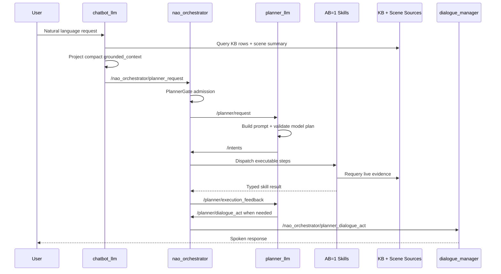
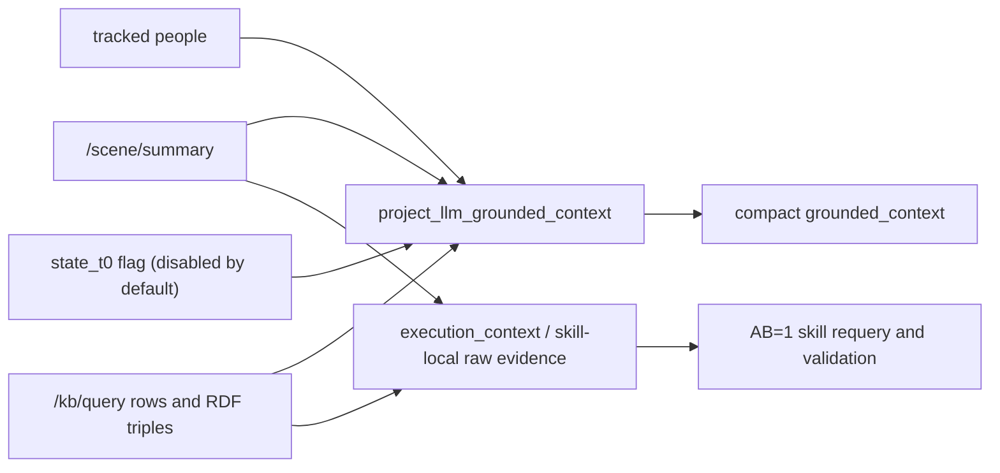
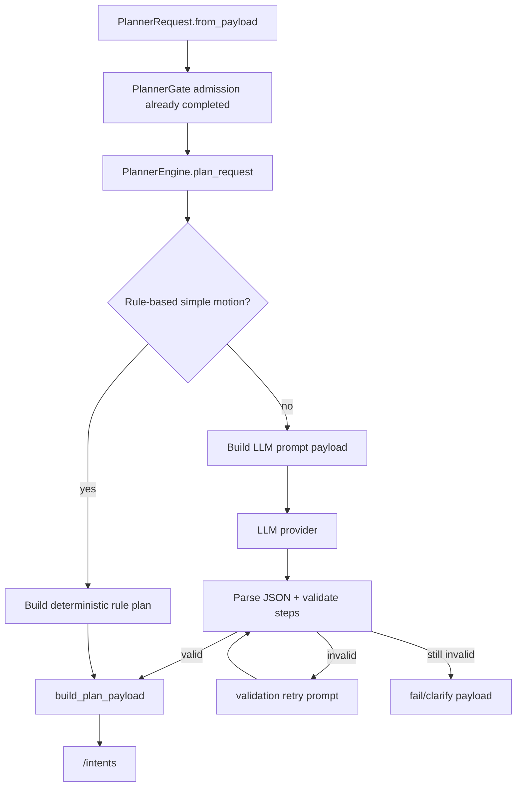
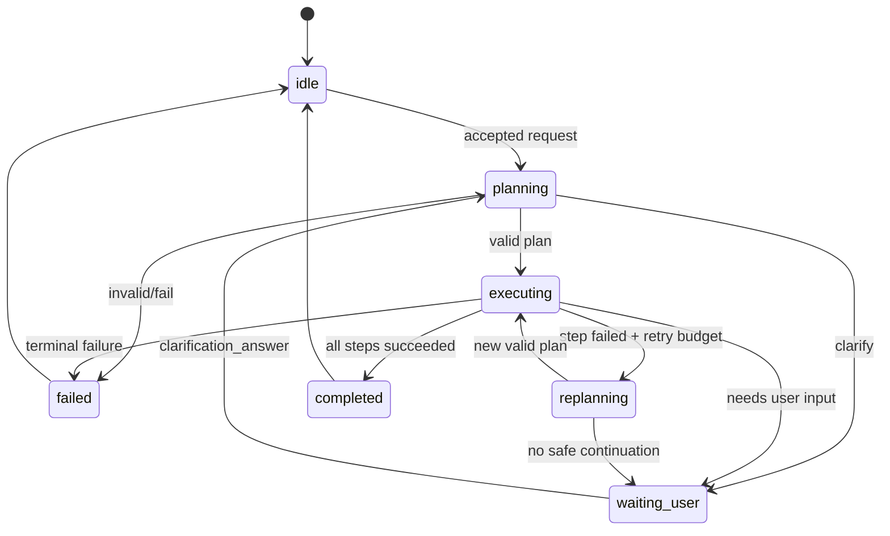
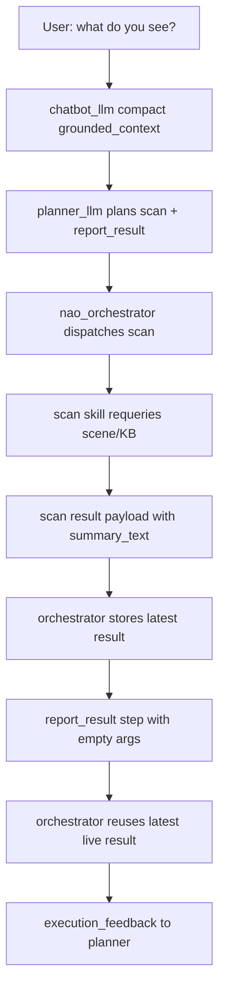
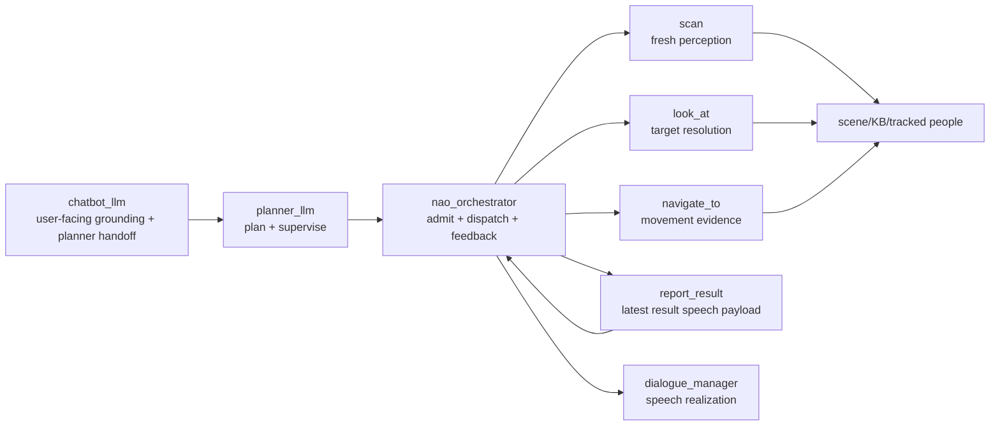
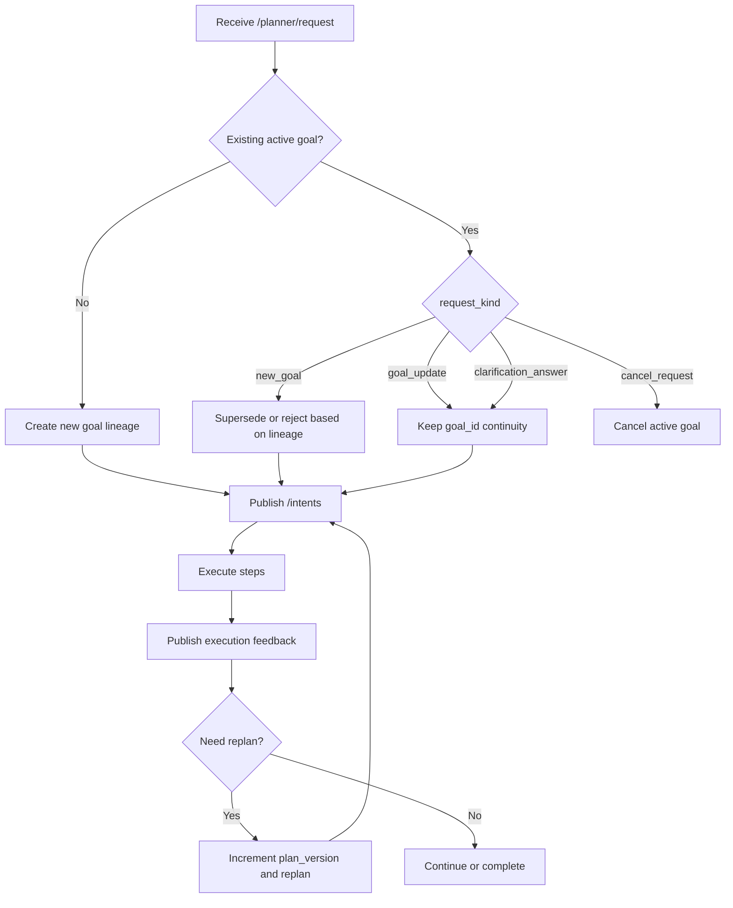

# End-to-End User to Planner Dialogue Flow

## 1) Purpose

This document is the supervisor-facing and thesis-facing walkthrough for the active planner stack. It is payload-first, but it now separates two world-state views:

- canonical LLM `grounded_context`: compact `entities[]` scene graph shared by `chatbot_llm` and `planner_llm`.
- execution evidence: live skill-local data from `/scene/summary`, KB triples, tracked people, action results, and detector metadata.

The design follows the current neurosymbolic planning pattern used by SayPlan, ProgPrompt, RePLan, and scene-graph replanning work: pass only the task-relevant symbolic subgraph to the LLM, keep symbolic validation outside the LLM, and let execution skills refresh live evidence before claiming results.

Companion references:

- `docs/contracts.md`
- `docs/current_workflow.md`
- `docs/plans/planner_grounding_moe_contract_2026-06-01.md`
- `docs/plans/planner_replan_lineage_adr.md`

---

## 2) End-to-End Runtime Flow



Ownership rule:

- `chatbot_llm` owns user-facing interpretation and compact grounding projection.
- `planner_llm` owns planning, validation, retry, replan, and dialogue-act intent.
- `nao_orchestrator` owns deterministic admission, dispatch, and feedback publication.
- AB=1 skills own live world interaction and evidence collection.
- `dialogue_manager` owns speech realization.

---

## 3) Contract Map

| Contract | Channel | Producer | Consumer |
|---|---|---|---|
| Chatbot turn output | internal turn result JSON | `chatbot_llm` | `chatbot_llm` handoff path |
| Canonical LLM grounding | `grounded_context.entities[]` | `chatbot_llm` via `planner_common` projection helper | `chatbot_llm`, `nao_orchestrator`, `planner_llm` |
| Planner request envelope | `/nao_orchestrator/planner_request`, `/planner/request` | `chatbot_llm`, admitted by `nao_orchestrator` | `planner_llm` |
| Planner output | `/intents` | `planner_llm` | `nao_orchestrator` |
| Execution feedback | `/planner/execution_feedback` | `nao_orchestrator` | `planner_llm` |
| Planner dialogue act | `/planner/dialogue_act` | `planner_llm` | `nao_orchestrator` relay to `dialogue_manager` |
| Raw scene/KB evidence | `/scene/summary`, `/kb/query`, skill action results | scene/KB/skills | skill-local execution paths |

Removed request seams:

- Legacy fields such as `goal_token`, `world_model_snapshot`, and `world_model_text` remain removed.
- Planner request contracts do not carry planner-owned `ack_mode` or raw planner `ack_text`.
- `requested_plan` and `interaction_mode` are not part of the normalized shared planner request contract.

---

## 4) Chatbot Turn Output

```json
{
  "verbal_ack": "Okay, I will do that.",
  "route": "execution",
  "confidence": 0.82,
  "user_intent": {
    "type": "look_at",
    "goal": "look at the person",
    "goal_text": "look at the person",
    "scene_targets": ["person"],
    "request_kind": "new_goal"
  }
}
```

Variables:

- `verbal_ack`: optional immediate acknowledgement text.
- `route`: `dialogue | knowledge_query | execution`.
- `confidence`: route/intent confidence in `[0.0, 1.0]`.
- `user_intent.type`: normalized intent label.
- `user_intent.goal` / `goal_text`: planner-facing objective text.
- `user_intent.scene_targets`: compact target labels or entity IDs.
- `user_intent.request_kind`: request transition class.

---

## 5) Compact Grounded Context

The LLM-facing world state is a concise scene graph, not a raw RDF dump. Raw KB snapshots and `/scene/summary` payloads remain source seams, but they are projected into this single `grounded_context` object before entering chatbot or planner prompts.

```json
{
  "grounded_context": {
    "entities": [
      {
        "id": "cup_jrjic",
        "label": "cup",
        "kind": "object",
        "class": "Cup",
        "visible": true,
        "relations": [
          {"predicate": "dbp:color", "object": "blue"},
          {"predicate": "oro:isOn", "object": "table_1"}
        ]
      },
      {
        "id": "anonymous_person_ehfbf",
        "label": null,
        "kind": "person",
        "class": "Human",
        "visible": true,
        "relations": []
      }
    ]
  }
}
```

Policy:

- `id` is the stable entity handle.
- `label` is the human-readable class/name hint and may be `null` for anonymous people.
- `kind` is `object` or `person`.
- `class` is the compact semantic class.
- `visible` is the current visual grounding flag.
- `relations` only carries prioritized semantic predicates for LLM reasoning when they add information beyond `class`.

Prioritized predicates:

- Use `class` as the canonical entity type. Do not duplicate the same value as `rdf:type`.
- Keep `rdf:type` only when it adds distinct KB type information not already represented by `class`.
- Include user-meaningful simulator/KB predicates when present: `dbp:name`, `dbp:color`, `oro:isAt`, `oro:isOn`, `oro:contains`, `foaf:knows`.
- Drop noisy/default prompt relations such as provenance, detector score, coordinates, backend, source, and `last_seen_*`.
- Do not emit `counts`; prompts should inspect the visible `entities` list directly.
- Keep raw triples available to skill-local execution paths when a skill needs exact RDF.

---

## 6) Grounding Projection Pipeline



Rules:

1. Backend seams stay intact: `/scene/summary`, `/kb/query`, `/kb/revise`, tracked people, and skill action results are not rewritten by the projection.
2. The compact projection is deterministic and JSON-native.
3. Text-derived hydration is fallback-only when no structured scene/KB entities exist.
4. Optional `state_t0` is available only for specialised planner/debug paths; default LLM prompts use `entities[]`.
5. The compact projection drops detector coordinates, scores, backend provenance, and recency unless a later prompt path explicitly requests richer grounding.

---

## 7) Planner Request Envelope

Transport-level envelope shape as serialized in the `Intent.data` field:

```json
{
  "request_id": "turn_123",
  "goal_id": "goal_turn_123",
  "parent_goal_id": "",
  "supersedes_goal_id": "",
  "request_kind": "new_goal",
  "goal_text": "look at the person and report completion",
  "normalized_intents": ["look_at"],
  "scene_targets": ["person"],
  "dialogue_context": ["assistant:Okay, I will do that."],
  "grounded_context": {
    "entities": [
      {
        "id": "anonymous_person_ehfbf",
        "label": null,
        "kind": "person",
        "class": "Human",
        "visible": true,
        "relations": []
      }
    ]
  },
  "planner_mode": "default",
  "dialogue_turn_id": "role:turn"
}
```

Variables:

- Identification and lineage: `request_id`, `goal_id`, `parent_goal_id`, `supersedes_goal_id`.
- Transition control: `request_kind`.
- Planning objective: `goal_text`, `normalized_intents`, `scene_targets`.
- Context: `dialogue_context`, `grounded_context`.
- Runtime mode: `planner_mode`, `dialogue_turn_id`.

The planner receives this compact payload plus execution feedback, skill registry, allowed step types, allowed skill names, and output contract. `PlannerRequest.from_payload` is the shared normalization seam, so legacy or transport-only fields outside that dataclass are dropped before planner use.

---

## 8) Planner LLM Internals



Planner prompt payload contains:

- `request`: compact planner request.
- `goal_id`, `plan_version`.
- `grounded_context.entities[]` as the active LLM world-state context.
- `execution_feedback` during replans.
- `skill_registry`, `allowed_step_types`, `allowed_skill_names`, `allowed_motion_objects`.
- `output_contract`.

Planner prompt payload does not contain:

- raw `user_text` in normal operation.
- `requested_plan` or `interaction_mode`.
- full RDF dumps.
- removed request seams.

---

## 9) Planner Output

```json
{
  "plan": {
    "goal_id": "goal_turn_123",
    "plan_id": "plan_123",
    "plan_version": 2,
    "status": "planning",
    "validation_status": "draft",
    "user_facing_reason": "",
    "replan_hint": "",
    "retry_budget": 1,
    "scene_targets": ["person"],
    "context_ref": {
      "captured_at_sec": 0.0,
      "observer": "",
      "backend": ""
    },
    "communication_policy": {
      "emit_acknowledge": false,
      "emit_progress": false,
      "emit_completion": true,
      "emit_failure": true
    },
    "communication_policy_source": "planner_engine:plan",
    "steps": [
      {
        "id": "step_1",
        "type": "skill",
        "name": "scan",
        "args": {},
        "requires": [],
        "on_failure": "replan",
        "retry_budget": 0
      },
      {
        "id": "step_2",
        "type": "skill",
        "name": "report_result",
        "args": {},
        "requires": ["step_1"],
        "on_failure": "fail",
        "retry_budget": 0
      }
    ]
  }
}
```

Variables:

- Plan lineage: `goal_id`, `plan_id`, `plan_version`.
- Plan state: `status`, `validation_status`, `user_facing_reason`, `replan_hint`.
- Failure detail: `failure_reason` is omitted unless there is an actual failure, invalid output, or terminal blocked condition.
- Resilience: `retry_budget`.
- Traceability: `scene_targets`, `context_ref`.
- Communication: `communication_policy`, `communication_policy_source`.
- Execution content: `steps[]` with `id`, `type`, `name`, `args`, `requires`, `on_failure`, `retry_budget`.

---

## 10) Communication Policy

`communication_policy` is planner dialogue-act permission, not direct speech execution.

- `emit_acknowledge`: allow a planner-owned acknowledgement dialogue act on plan acceptance.
- `emit_progress`: allow planner-owned progress dialogue acts on step start/progress.
- `emit_completion`: allow planner-owned completion dialogue acts on plan completion.
- `emit_failure`: allow planner-owned failure/help dialogue acts on execution failures.
- `communication_policy_source`: deterministic provenance showing where the final policy was resolved, usually `planner_engine:<mode>`.

Defaults come from `planner_common.normalize_communication_policy`. The planner may override policy flags in its JSON output; the shared contract normalizes them before supervisor use.

---

## 11) Supervisor Lifecycle



Supervisor responsibilities:

1. Track `goal_id`, `plan_id`, and `plan_version`.
2. Admit new plans and suppress duplicate plan versions.
3. Dispatch only executable steps through the orchestrator.
4. Consume execution feedback and decrement retry budget.
5. Ask for replans when failure policy and budget allow.
6. Emit planner dialogue acts for clarification, progress, completion, or failure according to `communication_policy`.

---

## 12) Scan and Report Evidence Flow



Critical guardrail:

- The planner must not prefill `report_result.args.summary_text` after `scan`.
- The scan step owns fresh perception.
- `report_result` with empty args tells the orchestrator to report the latest live skill result.
- `summary_text` is only allowed for known non-perception facts or already completed non-perception results.

This prevents a stale prompt snapshot from being mistaken for a fresh scan.

---

## 13) Execution Feedback

```json
{
  "goal_id": "goal_turn_123",
  "plan_id": "plan_123",
  "plan_version": 2,
  "intent": "raw_user_input",
  "source": "planner_llm",
  "event_type": "step_succeeded",
  "status": "succeeded",
  "reason": "",
  "validation_status": "valid",
  "replan_hint": "",
  "retry_budget": 1,
  "blocking": false,
  "unmet_preconditions": [],
  "needs_user_input": false,
  "scene_targets": ["person"],
  "validation_errors": [],
  "timestamp_sec": 1777040000.0,
  "result_summary": "Look-at completed for person_1",
  "result_payload": {
    "skill": "look_at",
    "target": "person_1",
    "target_kind": "people",
    "target_found": true,
    "summary_text": "Look-at completed for person_1",
    "confidence_policy": "grounded_current_observation"
  },
  "step": {
    "id": "step_1",
    "type": "skill",
    "name": "look_at",
    "retry_budget": 0,
    "on_failure": "replan",
    "requires": []
  }
}
```

Evidence fields:

- `result_summary`: compact human-readable evidence summary.
- `result_payload`: structured skill result.
- `scene_targets`: targets used for replan context.
- `blocking`, `needs_user_input`, `unmet_preconditions`: supervisor decision hints.

---

## 14) Planner Dialogue Act

```json
{
  "goal_id": "goal_turn_123",
  "plan_id": "plan_123",
  "plan_version": 2,
  "act": "ask_clarification",
  "priority": "normal",
  "await_user_response": true,
  "reason": "missing target object",
  "text_hint": "Which person should I look at?",
  "slots_needed": ["target"],
  "context": {
    "scene_targets": ["person"],
    "status": "waiting_user"
  }
}
```

Allowed `act` values:

- `acknowledge`
- `progress_update`
- `ask_clarification`
- `ask_for_help`
- `explain_failure`
- `notify_completion`
- `notify_cancellation`

Dialogue acts travel through `nao_orchestrator` to `dialogue_manager`. The planner does not speak directly.

---

## 15) Chatbot / Planner / Skill Ownership Map



Methodology:

1. Keep LLM context compact and semantically rich.
2. Keep raw sensor/KB evidence out of every prompt by default.
3. Validate planner output outside the LLM.
4. Require skills to requery live state before reporting execution success.
5. Use planner dialogue acts for coordination, not direct speech generation.

---

## 16) Replanning and Join Semantics



Current policy summary:

1. Single active-goal queue model.
2. `goal_id` keeps goal continuity.
3. `plan_id` + `plan_version` encode plan lineage.
4. Mid-join when active `step_id` is present in the new plan.
5. Front-join from first pending step when mid-join cannot be resolved.
6. Duplicate suppression compares `goal_id`, `plan_id`, and `plan_version`.

---

## 17) Live Supervisor Demo Script

1. Trigger one command and show chatbot output (`route=execution`).
2. Show compact `grounded_context` on the planner request.
3. Show admitted request on `/planner/request`.
4. Show planner output on `/intents` and highlight lineage fields.
5. Run one scan/report case and show that `report_result.args` is empty.
6. Run one failure/clarification path.
7. Show execution feedback payload and resulting dialogue act payload.
8. Close with ownership map: chatbot grounds, planner plans, orchestrator dispatches, skills provide live evidence, dialogue manager speaks.
