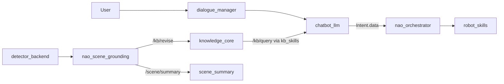
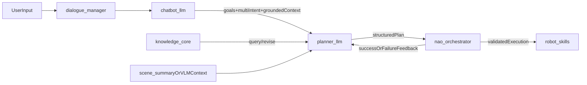

# Thesis Planning Handoff

Last updated: 2026-04-09

This document is the concise high-level brief for the current state of the
project and the next implementation direction. It is intended as the main
handoff note for planning with Codex and for shaping the master's thesis around
LLM-based planning for modular ROS4HRI robotic systems.

## One-Paragraph Summary

The stack already demonstrates a grounded dialogue loop in which perception is
converted into symbolic state before reaching the LLM: detector outputs are
normalized by `nao_scene_grounding`, written as transient facts into
`knowledge_core`, queried through `kb_skills`, and injected by `chatbot_llm`
into response generation plus direct-or-planner routing. `nao_orchestrator`
remains the deterministic downstream executor for robot skills, and a first
`planner_llm` scaffold is now live behind launch flags. The next stage is to
evolve this from grounded single-turn interaction into a modular planning
architecture where a planner layer can reason over multi-intent input, query
and revise the KB, generate executable plans, react to failures, and replan
through structured feedback from the orchestrator without tying the design to
NAO-specific logic.

## Where The Project Stands Now

### Live architecture

- `dialogue_manager` owns dialogue flow and speaking lifecycle.
- `chatbot_llm` owns grounded response generation and direct-or-planner routing.
- `knowledge_core` is the symbolic world-state store.
- `kb_skills` is the current read-side boundary for `/kb/query`.
- `nao_scene_grounding` bridges object detections into symbolic KB facts and
  publishes `/scene/summary`.
- `nao_world_model_enricher` now exists on the research branch as a short-horizon
  action-conditioned world model for planner-facing summaries.
- `planner_llm` now accepts `/planner/request` and produces executable
  `Intent.data.plan` envelopes for `nao_orchestrator`.
- `nao_orchestrator` consumes `/intents` and dispatches validated robot skills.

### Current grounded reasoning path



### What is already implemented

- Grounded object-aware dialogue through the KB, not direct raw CV prompting.
- A detector-to-KB bridge for transient symbolic scene facts.
- A compact `/scene/summary` output for debug and future consumers.
- Richer `Intent.data` payloads including `ack_text`, `ack_mode`,
  `scene_targets`, and optional `plan`.
- A planner scaffold with provider adapters, a planner-local launch profile,
  and planner feedback consumption on `/planner/execution_feedback`.
- A first world-model enricher runtime that can fuse `/scene/summary`, KB rows,
  and execution feedback into planner-facing snapshot/text outputs.
- A deterministic orchestrator that executes allowed downstream actions.

### Main current limitations

- `kb_skills` is still effectively read-only; write-side mutation helpers are
  placeholders.
- `nao_orchestrator` can execute simple structured plans, but it is not yet a
  full validator/replanner loop.
- Person permanence is not yet integrated cleanly; `hri_person_manager` is
  launched by the stack but not yet used as an explicit architectural seam in
  this repo.
- Runtime noise still exists around duplicate TTS action servers in some launch
  combinations.
- VLM/VLA work has a direction, but not yet an implemented bridge node.

## Thesis Direction

The thesis should focus on **LLM-based planning for modular robotic systems**
with NAO as the concrete experimental platform, while keeping the architecture
general enough that any ROS / ROS4HRI robot can expose its skills and symbolic
state in the same way.

### Core thesis idea

Use a hierarchical planning architecture where:

- perception is grounded into symbolic state
- the planner reasons over user goals, scene state, and robot capabilities
- a deterministic controller validates and executes plans
- execution feedback can trigger replanning, clarification, or cancellation

This is more interesting than a NAO-specific agent because the core question is
not "how to make NAO clever", but rather:

**how to design a reusable ROS4HRI-compatible planning architecture in which LLM
planning remains modular, inspectable, and safe across different robots.**

## Recommended Target Architecture

The recommended direction is a **hybrid planner architecture**.

- Keep `chatbot_llm` focused on dialogue, grounding, and multi-intent
  understanding.
- Introduce a distinct `planner_llm` layer for plan generation, KB interaction
  decisions, and replanning.
- Keep `nao_orchestrator` deterministic and validation-first.
- Keep all robot-specific execution behind skill interfaces so the planner can
  remain robot-agnostic as long as the robot exposes compatible skills.



## Main Research And Engineering Questions

### Planning

- How should multi-intent user input be segmented, prioritized, and turned into
  executable plans?
- When should the planner query the KB again during execution?
- When should the planner ask the user for clarification instead of assuming?
- When should planning stop, cancel, or fall back to deterministic behavior?

### Architecture

- What should remain in `chatbot_llm` versus move into `planner_llm`?
- What is the cleanest contract between planner and orchestrator?
- How should skill metadata be exposed so the planner remains robot-agnostic?
- How should failures be represented so replanning is structured rather than
  prompt-only?

### Grounding and perception

- How should `hri_person_manager` be incorporated for person permanence and
  identity consistency?
- Should person identity remain a KB/prompt concern, or also become part of
  `/scene/summary`?
- How should future VLM outputs be converted into grounded symbolic state
  instead of bypassing the KB?

## Next Implementation Shape

### 1. Stabilize the current runtime

- Remove duplicate `/tts_engine/tts` action server ambiguity.
- Keep launch defaults clean enough for reproducible planner experiments.
- Reduce log noise before adding more planning layers.

### 2. Formalize `kb_skills`

- Add write-side wrappers for revise, add, and remove operations.
- Treat `kb_skills` as the single KB boundary for both planners and tools.
- Keep low-level KnowledgeCore transport out of planner prompts and executor
  code.

### 3. Extend the planner scaffold

- Keep dialogue ownership in `chatbot_llm` while letting planner mode hand
  execution-oriented turns to `planner_llm`.
- Introduce a planner contract for structured plan generation.
- Extend the current `Intent.data.plan` shape into something that can support
  plan ids, step ids, preconditions, failure reasons, and replan hints.

### 4. Strengthen `nao_orchestrator`

- Move from simple sequential dispatch toward explicit validation and execution
  states.
- Emit structured success and failure feedback that the planner can consume.
- Preserve deterministic execution and safety boundaries.

### 5. Explore person permanence properly

- Treat `hri_person_manager` as a discovery-first integration spike.
- Inspect the actual installed topics and contracts before refactoring around
  them.
- Avoid overloading `nao_scene_grounding`, whose current identity matching is
  object persistence, not person recognition.

### 6. Prepare the VLM/VLA path

- Reuse the existing camera pipeline rather than building a second camera stack.
- Add a thin VLM bridge later, not a raw end-to-end VLA shortcut.
- Let VLM outputs enrich grounded state and planning context, while the
  orchestrator remains the execution gate.

## What Should Be Canonical Right Now

These docs are the most useful to keep as the main references:

- `docs/demo_status_and_contracts.md`
  - best source for the current grounded runtime and contracts
- `docs/launch_profiles.md`
  - best source for how to run the active stack
- `docs/nao_camera_vlm_research.md`
  - best source for the future camera/VLM/VLA direction
- `docs/thesis_planning_handoff.md`
  - best source for the thesis-facing architectural summary and next stage
- `docs/wme_planner_alignment.md`
  - best source for avoiding overlap between planner work and the upcoming world
    model enricher

## Docs That Overlap And Can Be Folded Later

These are still useful, but overlap enough that they can eventually be merged
or reduced once the new planning work begins:

- `docs/current_workflow.md`
  - overlaps with the runtime summary already captured in
    `demo_status_and_contracts.md`
- `docs/node_interactions_map.md`
  - overlaps with both the workflow and demo contract docs
- `docs/knowledge_core_integration_scope.md`
  - still valuable as migration and dependency context, but less useful as the
    main day-to-day planning reference

## Short Codex Prompt Seed

Use something close to this when giving Codex the current context:

```text
This repo already has a grounded ROS4HRI dialogue pipeline: perception is turned
into symbolic scene facts by nao_scene_grounding, stored in knowledge_core,
queried through kb_skills, and injected by chatbot_llm into both response and
intent generation. nao_orchestrator is a deterministic downstream executor. The
next thesis-focused stage is to add a modular LLM planner architecture with
multi-intent planning, KB query/revise loops, structured execution feedback,
replanning, and user clarification policies, while keeping the design general
enough for any ROS4HRI-compatible robot rather than NAO only.
```

## Bottom Line

The project is no longer about proving that an LLM can talk on top of a robot.
It is now about proving that grounded symbolic state, modular skill interfaces,
and deterministic execution can support a reusable LLM planning architecture for
robotic systems.
