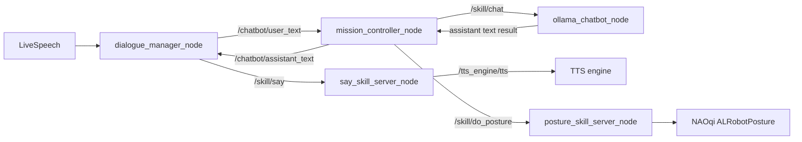

# NAO + ROS4HRI Migration Whiteboard Diagram

Date: 2026-02-26

This is the board-ready view of `old + transition + target` architecture.

## Legend

- `-->` topic pub/sub
- `==>` action goal/result
- `[canonical]` ROS4HRI-standard path

## Current Transition (What Is Running Now)

```text
/humans/voices/anonymous_speaker/speech (hri_msgs/LiveSpeech)
    --> [dialogue_manager_node] (package: dialogue_manager) [canonical]
        --> /chatbot/user_text (std_msgs/String)
        --> /chatbot/dialogue_state (std_msgs/String JSON)
        --> /speech (std_msgs/String) [compat publish/fallback path]
        ==> /skill/say (communication_skills/action/Say)
              |
              v
          [say_skill_server_node] (package: nao_posture_bridge)
              ==> /tts_engine/tts (tts_msgs/action/TTS)

/chatbot/user_text
    --> [mission_controller_node] (package: nao_chatbot)
        --> /chatbot/intent (std_msgs/String)
        --> /chatbot/assistant_text (std_msgs/String)
        ==> /skill/chat (communication_skills/action/Chat)
              |
              v
          [ollama_chatbot_node] (package: nao_chatbot)
              --> Ollama HTTP backend

Posture branch from mission_controller:
    ==> /skill/do_posture (nao_skills/action/DoPosture)
          |
          v
      [posture_skill_server_node] (package: nao_posture_bridge)
          direct --> NAOqi ALRobotPosture
          fallback --> /chatbot/posture_command (std_msgs/String)
                         |
                         v
                    [nao_posture_bridge_node] [fallback bridge]
                       --> NAOqi ALRobotPosture

Optional UI:
    [rqt_chat / rqt_gui_py_node] (reads/writes TTS/speech paths for operator visibility)
```

## Old vs Transition vs Target

```text
OLD (before migration)
- nao_rqt_bridge monolith owns speech I/O, partial dialogue state, and direct TTS
- topic-first backend path (/chatbot/backend/request|response)
- posture over /chatbot/posture_command only

TRANSITION (current)
- dialogue_manager package owns turn-taking + /chatbot/user_text forwarding
- canonical skill actions live:
  - /skill/chat -> communication_skills/action/Chat
  - /skill/say -> communication_skills/action/Say
  - /skill/do_posture -> nao_skills/action/DoPosture
- posture topic fallback path remains available when direct NAOqi is unavailable

TARGET (end state)
- keep canonical action interfaces only
- keep posture topic fallback only if direct NAOqi path is not reliable in deployment
```

## Mermaid: Transition

```mermaid
flowchart LR
    User["User / LiveSpeech\n/humans/voices/.../speech"] --> DM["dialogue_manager_node\n(canonical)"]
    DM -->|/chatbot/user_text| MC["mission_controller_node"]
    DM -->|/speech (compat)| Speech["/speech topic"]
    DM -->|/skill/say\ncommunication_skills/action/Say| SayServer["say_skill_server_node"]
    SayServer -->|/tts_engine/tts| TTS["tts_msgs/action/TTS"]

    MC -->|/skill/chat\ncommunication_skills/action/Chat| ChatServer["ollama_chatbot_node"]
    ChatServer -->|HTTP| Ollama["Ollama backend"]
    MC -->|/chatbot/assistant_text| DM

    MC -->|/skill/do_posture| PostureServer["posture_skill_server_node"]
    PostureServer -->|direct| NAOqi["NAOqi ALRobotPosture"]
    PostureServer -->|fallback /chatbot/posture_command| PostureBridge["nao_posture_bridge_node"]
    PostureBridge --> NAOqi

```

## Mermaid: Target


