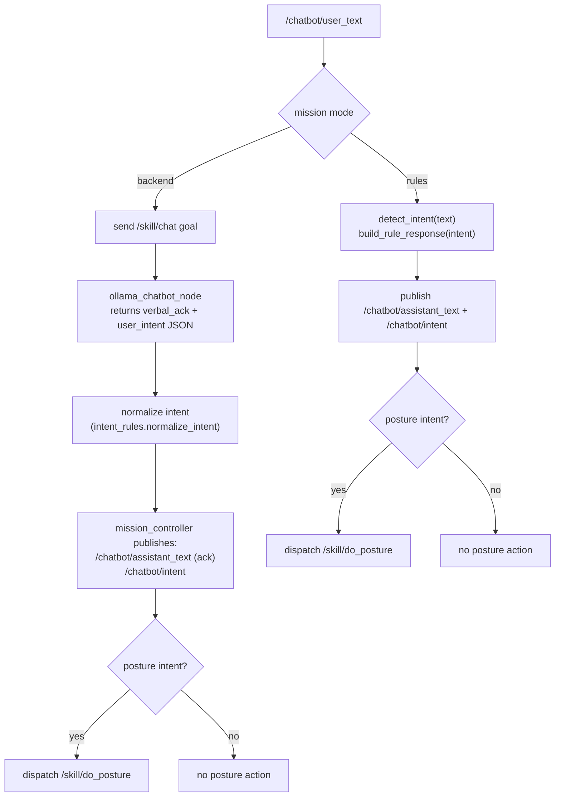

# NAO + ROS4HRI Backend Chatbot Whiteboard

Date: 2026-03-02

This board view reflects the current skills-first backend workflow, including:

- Ollama structured response (`verbal_ack` + `user_intent`)
- mission controller intent publication/execution
- say/posture skill routing and posture fallback bridge

## Legend

- `-->` topic pub/sub
- `==>` action goal/result
- `~~>` HTTP request/response
- `[canonical]` ROS4HRI-standard skill interface

## Current Backend Workflow (Skills + Intent + Ack)

```text
/humans/voices/anonymous_speaker/speech (hri_msgs/LiveSpeech)
    --> [dialogue_manager_node] [canonical]
        --> /chatbot/user_text (std_msgs/String)
        --> /speech (std_msgs/String) [compat/asr-guard]

/chatbot/user_text
    --> [mission_controller_node]
        ==> /skill/chat (communication_skills/action/Chat) [canonical]
              |
              v
          [ollama_chatbot_node]
              ~~> Ollama /api/chat
              <~~ JSON response:
                  {
                    "verbal_ack": "...",
                    "user_intent": {"type": "...", ...}
                  }
              ==> Chat.Result.role_results:
                  {
                    "assistant_response"/"verbal_ack",
                    "intent",
                    "user_intent",
                    "intent_source",
                    "intent_confidence",
                    "updated_history"
                  }
        --> /chatbot/assistant_text (std_msgs/String)  [from verbal_ack]
        --> /chatbot/intent (std_msgs/String)          [normalized intent]

Assistant speech branch:
    [dialogue_manager_node]
        ==> /skill/say (communication_skills/action/Say) [canonical]
              |
              v
          [say_skill_server_node]
              ==> /tts_engine/tts (tts_msgs/action/TTS)

Posture execution branch:
    [mission_controller_node]
        ==> /skill/do_posture (nao_skills/action/DoPosture)
              |
              v
          [posture_skill_server_node]
              direct --> NAOqi ALRobotPosture
              fallback --> /chatbot/posture_command (std_msgs/String)
                              |
                              v
                         [nao_posture_bridge_node]
                              --> NAOqi ALRobotPosture
```

## Mermaid: End-to-End Backend Flow

```mermaid
flowchart LR
    U["User Speech\n/humans/voices/.../speech"] --> DM["dialogue_manager_node"]
    DM -->|/chatbot/user_text| MC["mission_controller_node"]
    DM -->|/speech (compat)| Speech["/speech topic"]

    MC -->|Chat goal\n/skill/chat| CS["ollama_chatbot_node"]
    CS -->|HTTP /api/chat| OLL["Ollama backend"]
    OLL -->|JSON: verbal_ack + user_intent| CS
    CS -->|Chat.Result.role_results\nassistant_response/verbal_ack + intent + user_intent| MC

    MC -->|/chatbot/assistant_text| DM
    MC -->|/chatbot/intent| IntentTopic["/chatbot/intent"]

    DM -->|Say goal\n/skill/say| SAY["say_skill_server_node"]
    SAY -->|/tts_engine/tts| TTS["TTS engine"]

    MC -->|Posture goal\n/skill/do_posture| PS["posture_skill_server_node"]
    PS -->|direct| NAOQI["NAOqi ALRobotPosture"]
    PS -->|fallback /chatbot/posture_command| PB["nao_posture_bridge_node"]
    PB --> NAOQI
```

## Mermaid: Intent/Ack Decision Path


