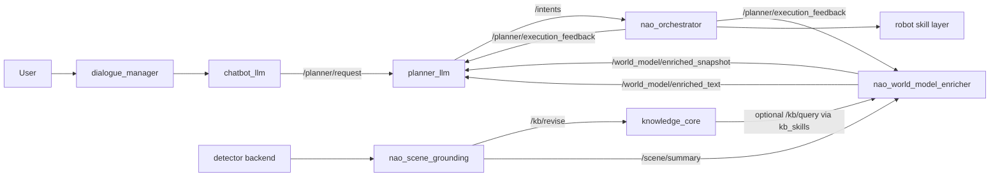

# WME And Planner Alignment

Last updated: 2026-04-09

This note is the handoff document for Codex work on the world model enricher
(`WME`). Its goal is to prevent duplicated effort while the planner, KB, and
orchestrator work is landing in this repo.

## Runtime Flow



## Current Implemented WME Ingestion By `planner_llm`

The current planner-facing ingestion path is:

- `planner_llm` subscribes to `/world_model/enriched_snapshot`
- `planner_llm` subscribes to `/world_model/enriched_text`
- `planner_llm` includes both payloads in its planning prompt alongside:
  - the normalized planner request
  - bounded dialogue context
  - grounded context already supplied by `chatbot_llm`
  - structured execution feedback when replanning

This means the planner is already wired for a layered world representation:

- symbolic KB-grounded context from `chatbot_llm`
- short-horizon action-conditioned context from `WME`
- execution-state context from `nao_orchestrator`

## What This Branch Is Establishing

The current planner-facing direction in this repo is:

- `kb_skills` becomes the canonical local boundary for both KB queries and KB
  mutations
- `nao_scene_grounding` stays the semantic owner of detector-derived grounded
  object facts, but now routes the KB transport through the shared mutation
  seam
- `nao_orchestrator` evolves from a pure dispatcher into a deterministic
  validator plus execution-feedback publisher for planner-driven plans
- future planner work should reason over grounded symbolic state and skill
  contracts, not bypass them

## Canonical Responsibilities

### `WME` should own

- world-model enrichment and aggregation
- consolidation of grounded scene signals
- optional fusion of `/scene/summary`, KB state, and future VLM-derived context
- person-aware enrichment once `hri_person_manager` integration is validated

### `WME` should not own

- direct robot execution
- plan validation rules for robot skills
- planner retry/replan policy
- raw KnowledgeCore transport duplicated outside `kb_skills`
- a second object-grounding identity layer that duplicates
  `nao_scene_grounding`

## Current Planner And Executor Contracts

### Shared world-state contract direction

The longer-term direction should be one normalized context envelope that every
LLM-facing node in this repo can consume, even if each role uses different
fields.

Recommended shape:

```json
{
  "grounded_context": {
    "knowledge_snapshot": {},
    "scene_summary": {},
    "world_model_snapshot": {},
    "world_model_text": ""
  }
}
```

Practical split:

- `chatbot_llm`
  - authoritative today for `knowledge_snapshot`
  - can keep using a bounded symbolic read from `kb_skills`
- `planner_llm`
  - should consume `knowledge_snapshot` plus `world_model_snapshot` and
    `world_model_text`
- future LLM/VLM helpers
  - should emit into this envelope rather than inventing parallel prompt-only
    context shapes

This keeps the nodes role-specific while making the context contract reusable.

### KB boundary

Use `kb_skills` for:

- `/kb/query`
- `/kb/revise` with `add`, `update`, and `remove` semantics

This means WME should use the same package boundary if it needs to write or
refresh symbolic facts.

### Plan envelope

`Intent.data.plan` is no longer just a list of loose steps. The direction is an
envelope with planner metadata plus executable steps.

Supported metadata fields:

- `plan_id`
- `validation_status`
- `failure_reason`
- `replan_hint`
- `retry_budget`
- `scene_targets`

Supported per-step fields:

- `id`
- `type`
- `name`
- `args`
- `requires`
- `on_failure`
- `retry_budget`

### Execution feedback

`nao_orchestrator` is being extended to publish structured execution feedback on:

- `/planner/execution_feedback`

The payload is JSON and is intended for planner-layer or WME consumers that need
to observe:

- accepted plans
- running steps
- failed steps
- validation failures
- completed plans

## Person Permanence Findings So Far

Current understanding:

- `hri_person_manager` is launched by the stack, but its source is not vendored
  in this repo
- the installed ROS4HRI message set already indicates person/face/body/voice
  matching through `IdsMatch`-style semantics
- `nao_scene_grounding` identity matching is object-centric and should stay that
  way for now

Recommended WME posture:

- treat person permanence as an additive ROS4HRI enrichment source
- do not replace `nao_scene_grounding` identity logic with person-manager logic
- prefer feeding person-manager identities into KB and higher-level scene/world
  summaries once the active topics are validated

## VLM And Future Enrichment Direction

The repo direction remains hierarchical:

- detector and ROS4HRI perception produce grounded observations
- WME may enrich or summarize that state
- planner uses symbolic state plus skills to generate plans
- orchestrator validates and executes actions

This means future VLM work should:

- reuse the existing camera path
- produce structured outputs rather than direct actions
- enrich KnowledgeCore and/or scene summaries
- avoid becoming an execution shortcut around the orchestrator

## Recommended WME Integration Points

Inputs WME can safely consume:

- `/scene/summary`
- KnowledgeCore state via `kb_skills`
- ROS4HRI human/person topics
- future VLM bridge outputs
- planner execution feedback when useful for world-state reconciliation

Outputs WME can safely produce:

- enriched symbolic facts written through `kb_skills`
- compact world-model summaries for planner consumption
- derived scene context that remains robot-agnostic

Outputs WME should avoid owning:

- direct `/nao/say`
- direct motion execution
- final skill validation
- planner-only failure or retry policy

## Avoiding Duplication With This Planner Work

To stay aligned with the current branch, WME should assume:

- planner/execution status belongs to `nao_orchestrator` plus the future planner
  layer
- KB transport belongs to `kb_skills`
- detector grounding belongs to `nao_scene_grounding`
- person permanence belongs to ROS4HRI person-management inputs plus later WME
  or KB fusion, not to detector fallback matching

## Short Prompt Seed For Codex

```text
This repo is formalizing a planner-facing architecture where kb_skills is the
canonical boundary for KnowledgeCore query and revise operations, nao_scene_grounding
stays the detector-to-KB bridge for object grounding, and nao_orchestrator is
growing into a deterministic plan validator that publishes execution feedback.
WME should focus on world-model enrichment and fusion across scene summaries,
KnowledgeCore, person-manager signals, and future VLM outputs without duplicating
planner logic, robot execution, or raw KB transport layers.
```
