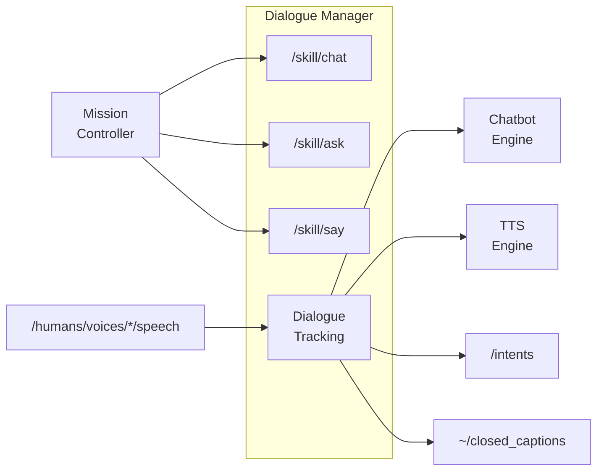

# dialogue_manager

A ROS2 lifecycle node that handles multi-modal communication between the robot and humans.

## Overview

The Dialogue Manager:
- Provides responses to human utterances using an external chatbot backend
- Sends responses to TTS for speech synthesis
- Exposes three high-level skills: `chat`, `ask`, and `say`
- Supports multi-modal expressions with synchronized gestures and expressions




## ROS API

All topics/services exist only in `active` state. Actions exist in both `configured` and `active` states but reject goals in the former.

### Parameters

| Parameter | Type | Default | Description |
|-----------|------|---------|-------------|
| `chatbot` | string | `"chatbot"` | Chatbot node FQN prefix. Empty = disabled |
| `enable_default_chat` | bool | `false` | Enable default chat while active |
| `default_chat_role` | string | `"__default__"` | Role for default chat |
| `default_chat_configuration` | string | `""` | Configuration for default chat |
| `chatbot_startup_timeout` | float | `30.0` | Max wait for chatbot startup (s) |
| `chatbot_response_timeout` | float | `5.0` | Max wait for chatbot response (s) |
| `multi_modal_expression_timeout` | float | `60.0` | Max expression duration (s) |
| `markup_action_timeout` | float | `10.0` | Default markup action timeout (s) |
| `markup_libraries` | string[] | `["config/00-default_markup_libraries.json"]` | Markup definition files |
| `disabled_markup_actions` | string[] | `["motion"]` | Markup actions to skip |

### Topics

#### Subscribed

| Topic | Type | Description |
|-------|------|-------------|
| `/humans/voices/tracked` | `hri_msgs/IdsList` | Tracked voice IDs |
| `/humans/voices/<id>/speech` | `hri_msgs/LiveSpeech` | User speech input |

#### Published

| Topic | Type | Description |
|-------|------|-------------|
| `~/closed_captions` | `hri_actions_msgs/ClosedCaption` | Captions for all speech |
| `~/robot_speech` | `std_msgs/String` | Current word being spoken |
| `~/currently_waiting_for_chatbot_response` | `std_msgs/Bool` | True while waiting for chatbot |
| `/intents` | `hri_actions_msgs/Intent` | Detected intents |
| `/diagnostics` | `diagnostic_msgs/DiagnosticArray` | Node diagnostics |

### Action Servers


| Action | Interface | Description |
|--------|-----------|-------------|
| `/skill/chat` | `communication_skills/Chat` | Start dialogue with defined role |
| `/skill/ask` | `communication_skills/Ask` | Ask question and get structured answers |
| `/skill/say` | `communication_skills/Say` | Speak multi-modal expression |

**Priority handling:** Goals are rejected if `meta.priority` ≤ any ongoing dialogue or expression.

### Action Clients

| Action | Interface | Description |
|--------|-----------|-------------|
| `<chatbot>/start_dialogue` | `chatbot_msgs/Dialogue` | Open dialogue channel |
| `tts_engine/tts` | `tts_msgs/TTS` | Text-to-speech |

### Service Clients

| Service | Interface | Description |
|---------|-----------|-------------|
| `<chatbot>/dialogue_interaction` | `chatbot_msgs/DialogueInteraction` | Send input, get response |

## Launch

```bash
ros2 launch dialogue_manager dialogue_manager.launch.py
```
